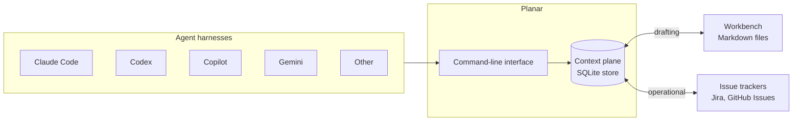
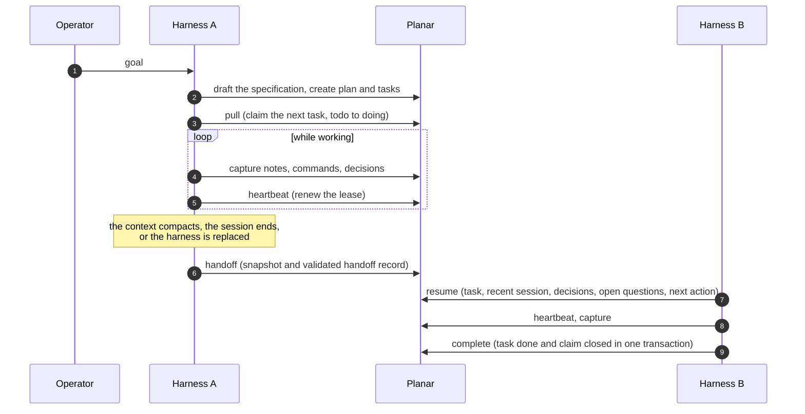

# Planar

*A context plane for long-running agents.*

Planar is a local, durable store for the state that long-running agent work
accumulates, together with the protocol agents use to read and extend that
state. The store holds specifications, plans, tasks, decisions, open questions,
test scenarios, and the sessions and handoff records that document how the work
proceeded. State is addressed by scope (repository, association, or global), not
by process. It therefore persists across context compaction, session
termination, and a change of model provider or agent harness, and an agent that
joins later can resume from it.

## Motivation

Work that spans many sessions or many agents tends to fail in three ways.

1. **State lives in a conversation.** When a context window is compacted or a
   session ends, decisions, their rationale, and the next intended step are lost
   or must be reconstructed.
2. **Ownership is implicit.** Concurrent agents have no shared record of who is
   working on what, so they duplicate effort or overwrite one another.
3. **Records diverge.** Plans written for agents and tickets kept in an issue
   tracker drift apart, and neither is reliably current.

Planar addresses these with a shared, versioned store and three explicit
synchronization protocols. It does not call models or supervise agents; it
records and coordinates the work of agents that do.

## Architecture



Agents interact with Planar only through its command-line interface, so any
harness that can run a command can participate. The store is a single SQLite
database whose schema, defined by ordered migrations, is the contract that all
participants write against. Three synchronization planes operate over it.

- **Coordination.** Leases and claims serialize concurrent agents on a task.
  Exactly one agent holds a claim at a time, and an abandoned claim expires
  after its time-to-live instead of blocking the task.
- **Drafting.** A workbench of Markdown files, kept in sync with the store in
  both directions, projects planning state for review and ingests the
  operator's edits.
- **Operational.** Adapters for Jira and GitHub Issues reconcile through
  explicit link records. Remote values arrive as proposals for an agent to
  verify; they are never applied silently.

## A long-running workflow



The figure follows one task across two harnesses, which may use different model
providers. Everything the second harness needs is in the store: the resume
packet contains the task state, recent session entries, open questions,
decisions made, and the next intended action. If the first agent stops without
handing off, its claim expires after the lease time-to-live, the task becomes
claimable again, and whatever it captured remains in the store.

## Using Planar from a harness

Planar is harness-agnostic. A harness needs only to run commands and read their
output; read commands accept `--json` for machine-readable results. The
installer additionally places the `planar` skill and the role agents into each
of six vendors it finds on the host, by presence marker: Claude Code
(`~/.claude/`), Codex (`$CODEX_HOME` or `~/.codex/`), Copilot (`~/.copilot/`),
Gemini CLI (`~/.gemini/settings.json`), Antigravity
(`~/.gemini/antigravity-cli/`) and OpenCode (`~/.config/opencode/`). Skills go to
`~/.claude/skills`, the shared `~/.agents/skills` (Codex, Copilot, Gemini CLI,
OpenCode) and `~/.gemini/antigravity-cli/skills`; agents go to each vendor's own
agents directory. The target table is in
[INSTALL.md](INSTALL.md#install-layout-reference). The role specifications under
[`agents/`](agents/) are vendor-neutral. For any other harness, the same
operations are available as plain commands. The role specifications and skills
are described in the [skill reference](docs/skill-reference.md).

With the skill installed there is no command to type. Ask for the outcome from
inside a project, and the harness loads the skill and dispatches the matching
`planar-<role>` agent:

```text
Draft a Planar spec for adding multi-currency checkout.
Review the spec for plan 42.
Orchestrate plan 42.
What needs my attention in this project?
```

In Claude Code, `/planar <request>` loads the skill explicitly. Applying an
ingest, closing a plan and archiving its workbench wait for your confirmation.
More requests, and a map from each retired `pl-*` skill to its replacement, are
in the [skill reference](docs/skill-reference.md#using-it-day-to-day).

## Core objects

| Object | Role |
|---|---|
| Scope | Selects the entities a command sees: `repo:<slug>`, `assoc:<slug>`, or `global`. Derived from the `--scope` flag and the working directory. |
| Plan, task | The unit of intent and the unit of work. A task carries a status and the next intended action. |
| Decision, question, scenario | Recorded rationale, open issues, and test scenarios attached to a plan. |
| Artifact | A specification or other document that belongs to a plan. |
| Session, snapshot, handoff | The record of how work proceeded, and the validated transfer of a task to the next agent. |
| Claim | A lease that gives one agent exclusive ownership of a task for a bounded time. |
| Context record | Run-scoped working memory passed from one workflow stage to the next. |

The [concepts](docs/concepts.md) document defines each of these precisely.

## Design properties

- **Local first.** State lives in one SQLite database per user. Nothing leaves
  the machine until operational synchronization is explicitly enabled.
- **The schema is the contract.** Ordered migrations define the schema, and
  readers verify its version before use.
- **Disjoint write surfaces.** Planar is five binaries. The four that open the
  database each write to a distinct set of tables, and one of them is read-only.
  The boundary is the set of verbs a binary provides.
- **Explicit synchronization.** Remote changes arrive as proposals, and
  conflicts are surfaced rather than resolved silently.

## Quick start

Planar builds from source; see [INSTALL.md](INSTALL.md) for prerequisites and
instructions. With the binaries on your path:

```bash
planar init --name "my-project"
planar plan create "Migrate to v2" --summary "Cut the v1 endpoints"
planar task add "Inventory v1 callers" --plan 1 --next-action "grep the monorepo"

export PLANAR_VENDOR=claude-code
planar capture session --task 1
planar capture note "found 7 callers under services/billing"
planar handoff 1 --vendor codex --note "halfway through; payments next"

export PLANAR_VENDOR=codex
planar resume 1            # the resume packet, ready to place in context
```

The [getting started guide](docs/getting-started.md) continues from here.

## Documentation

The [documentation index](docs/README.md) gives a reading order. In brief:

| To | Read |
|---|---|
| Understand the model | [Overview](docs/overview.md), [Concepts](docs/concepts.md) |
| Install and try it | [INSTALL.md](INSTALL.md), [Getting started](docs/getting-started.md) |
| See how work flows | [Operations](docs/operations.md), [Lifecycles](docs/lifecycles.md), [Workflows](docs/workflows.md) |
| Look up a command | [CLI reference](docs/cli-reference.md) |
| Use the skill and role agents | [Skill and agent reference](docs/skill-reference.md) |
| Understand the internals | [Architecture](docs/architecture.md), [Testing](docs/testing.md) |
| Contribute | [CONTRIBUTING.md](CONTRIBUTING.md), [SECURITY.md](SECURITY.md) |

## Status

Planar is under active development, and its interfaces, including the command
line and the schema, may still change. It is maintained as a personal project
without roadmap commitments (see [CONTRIBUTING.md](CONTRIBUTING.md)).

## License

MIT. See [LICENSE](LICENSE). Third-party notices are in
[THIRD_PARTY_NOTICES.md](THIRD_PARTY_NOTICES.md).
