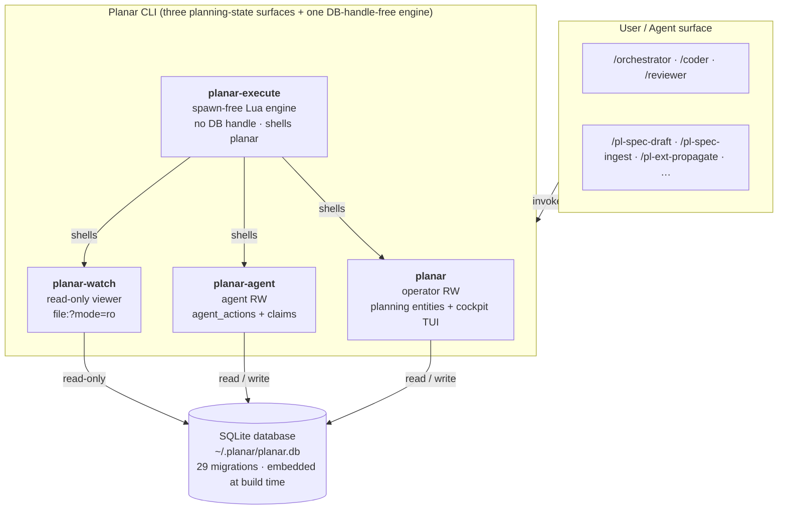
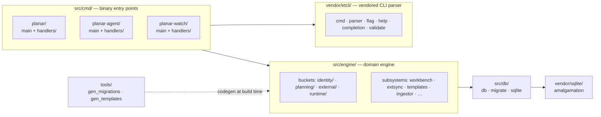

# Planar Architecture

Planar is a local-first task tracker and agent-operations infrastructure tool. It spans planning, tasking, scoping, durable agent handoff, vendor parity, and operational-plane integration with Jira and GitHub Issues.

This document describes the system as it stands today — for a new contributor or curious user who wants to understand how Planar works without reading the full source. For the operational flows drawn as diagrams — the spec pipeline, orchestration lifecycle, and claim ritual — see [Operations](operations.md).

---

## System Layers



Two layers are touched by users and agents:

1. **The Planar binaries** — four Zig executables. Three share the SQLite engine/runtime graph: `planar` is the operator surface and hosts the interactive cockpit, `planar-agent` owns coordination writes, and `planar-watch` is a driver-enforced read-only viewer. `planar-execute` links the vendored Lua runtime and reaches state only through an exact allowlist of sibling Planar commands. Capability boundaries are enforced by each binary's verb set and locked by integration tests. See [Four-binary architecture](#four-binary-architecture) below.
2. **The skill and agent layer** — vendor-specific command surfaces (Claude slash commands, Codex skills, Copilot skills) generated from a single source tree under `skills/src/` at install time. Skills invoke binary verbs; binary verbs operate on SQLite.

An LLM agent running a skill has no direct database access. It calls Planar verbs and reads their stdout.

---

## Storage

The database lives at `~/.planar/planar.db` by default. Set `PLANAR_DB` to override the path; there is no global `--db` flag.

### Schema management

Migrations are plain SQL files under `migrations/` in sqlx-cli format (`NNNNN_<name>.up.sql` / `.down.sql`, five-digit zero-padded prefix). The build-time codegen tool `tools/gen_migrations.zig` scans the directory and emits a `migrations` Zig module exposing `pub const all: []const Migration` that the runtime applies on startup; already-applied migrations are skipped. There is no external migrator dependency — the migration corpus is embedded in the binary at compile time.

`schema_migrations` is the public schema-version contract. Every migration inserts one row with a version number and description. Read-side tools (e.g., a web viewer, an Obsidian bridge) must open the database read-only and query `schema_migrations` to verify they support the current version before operating. `planar-agent` and `planar-watch` perform this handshake at startup and refuse with exit code 7 if the database schema is older than the binary's embedded minimum.

Authoring rules (file naming, the `schema_migrations` insert/delete contract, the `.sqlfluff` linter config, and the up/down/up roundtrip test) live in [`migrations/README.md`](../migrations/README.md). New migrations are created via `sqlx migrate add -r <name> --source migrations`; the next `zig build` regenerates the embedded module.

### Application tables

| Migration | Tables / schema change |
|-----------|------------------------|
| 0001 foundation | `schema_migrations`, `config`, `projects`, `associations`, `project_associations` |
| 0002 planning | `plans`, `artifacts`, `decisions` |
| 0003 work items | `agents`, `active_scope`, `tasks`, `questions`, `test_scenarios`, `plan_steps` |
| 0004 entity links | `entity_links` |
| 0005 sessions | `sessions`, `session_entries`, `context_snapshots`, `handoffs` |
| 0006 external | `external_systems`, `external_links`, `sync_events` |
| 0007 workbench | `workbench_sync_state` |
| 0008 doc artifact kinds | extends `artifacts.kind` CHECK with `research`, `getting_started`, `changelog_entry`, `glossary_term` |
| 0009 drop active scope | drops `active_scope` (replaced by cwd-derived resolution) |
| 0010 task reopens | adds reopen accounting columns to `tasks` |
| 0011 slug refs FTS | slug-reference index + FTS5 virtual table for search |
| 0012 annotations | `annotations` |
| 0013 test_spec artifact kind | extends `artifacts.kind` CHECK with `test_spec` |
| 0014 audit log | `audit_log` |
| 0015 agent activity | `agent_work_claims`, `agent_actions` (claims carry `repo_root` / `branch` / `head_sha_at_claim` / `dirty_at_claim` + optional worktree id/path; actions carry `head_sha` / `dirty`) |
| 0016 agent_actions metadata | adds nullable `agent_actions.metadata` text column for caller-attached opaque JSON (orchestrator strategy persistence; first consumer is the orchestrator's rule-6 stickiness) |
| 0017 handoffs worktree | adds nullable `handoffs.worktree_path` / `repo_root` / `branch` columns; `planar handoff create` copies them from the active `agent_work_claims` row on the target task so `planar resume` can recover `cd <path>` even after the originating claim has been released |
| 0018 fix migration descriptions | data-only: corrects the `schema_migrations.description` text for versions 2-7, which had been copy-pasted from unrelated Go-archive migrations. No schema change; the `description` column is not read at runtime (the version contract is the numeric `version`). |
| 0019 task touch paths | `task_touch_paths` (path-level touch declarations: `task_id` → `repo_id` (`projects.id`) → repo-relative `path`); additive to the coarse `entity_links` repo-touch edge, consumed by `plan recommend-strategy` for the path-shaped parallelizability rules |
| 0020 cli_invocations usage log | `cli_invocations` — opt-in local log of operator CLI usage (one row per `planar` invocation when `[introspection].cli_log = true` in config.toml). Privacy: `args_shape` carries flag names + positional arity only; flag/arg values are never written. Rows expire statelessly via a retention-prune on the capture path. |
| 0021 session commits | `session_commits` — persisted `session_id → commit` attribution rows (`sha`, `repo_root`, `branch`, `subject`, `author`, `committed_at`, `recorded_at`, optional `claim_id`) plus nullable `sessions.repo_root` and `sessions.head_sha_at_start` columns for operator-session commit windows |
| 0022 workflow context plane | `workflow_runs` — identity + audit for one external harness run (`plan_id`, `workflow_name`, `run_identifier` unique, `pid`, `repo_root`, `started_at`, `ended_at`, `status` in `running\|completed\|failed\|interrupted\|abandoned`); `context_records` — run-scoped working memory keyed `(run_id, stage, session_id, claim_id)` with `kind` in `finding\|risk\|artifact\|followup\|summary\|capsule` and `status` lifecycle `active\|consumed\|superseded`, plus nullable `compiled_from` provenance column for capsule rows |
| 0023 claims run/stage | adds nullable `agent_work_claims.run_id` (FK `workflow_runs(id) on delete set null`) and `agent_work_claims.stage` (text) so claims acquired inside an external workflow harness run carry the run identity and stage name; `planar-agent pull` and `claim` gain optional `--run <id>` / `--stage <text>` flags that populate these columns; claims acquired without those flags behave unchanged (null run/stage) |
| 0024 context_records nullable claim | table-rebuild (rename → recreate → copy → drop) that relaxes `context_records.claim_id NOT NULL → nullable`; indexes are also rebuilt to match migration-22 shape. Required by decision 456 (plan 585 stage-close compaction): when the orchestrator writes a compiled capsule via `planar-agent context capsule --run <id>`, the write is run-keyed to `workflow_runs`, not to a worker claim, so capsule rows carry `claim_id = NULL` |
| 0025 runs | `runs` (one row per `(plan, arm, repetition)` — the measurement-rig experimental unit: `run_uid` unique external id, `plan_id` cascade FK, `arm`/`status`/`corpus_repo` plain-TEXT CLI-enforced enums, `config_hash` GROUP BY key + opaque `config_json`, `base_sha`, `started_at`/`ended_at`); `run_events` (append-only seq-ordered journal, `unique(run_id, seq)`, standalone from `agent_activity`); `run_touches` (declared-vs-actual harvest for RQ1, `kind in (declared, actual)` CHECK, `task_id` a plain integer **not** an FK-cascade so deleting a task never erases historical evidence — only `run_id` cascades) |
| 0026 closures | `closures` (one row per `(task, symbol unit)` in a task's *derived* closure — the symbols a task must hold resident, computed by static analysis from its declared seed paths: `task_id`/`repo_id` cascade FKs, `path` (defining file) + `symbol` (stem-only qualified name) **both** stored so same-stem files don't collide, `role in (modify, reference, transitive)` CHECK, `token_weight`, `extractor_version`; `unique(task_id, repo_id, path, symbol, role, extractor_version)`). Written by `planar closure compute`, read by `planar closure show`. `transitive` rows are stored but excluded from the effective closure by default |
| 0027 external sync baseline | adds nullable `external_links.baseline_title` and `baseline_status`, the last common synchronized values used to classify converged, local-only, remote-only, and two-sided changes |
| 0028 feedback triage | `feedback_triage` — one structured triage row per task or question finding, with severity, disposition, reproduction status, optional duplicate relationship, redacted evidence, and database constraints for target/disposition consistency |
| 0029 agent failure categories | adds nullable `agent_work_claims.failure_category` with the closed `usage_limit\|context_limit\|output_limit\|tool_failure\|validation\|unknown` enum and a category/claimed-time partial index for aggregate reporting |
| 0030 adaptive routing evidence | the routing evidence plane: `routing_candidates` + `routing_candidate_bindings` + `routing_host_observations` (opaque, host-scoped model registry), `routing_task_facts`, `routing_experiments` (frozen manifests), `routing_dispatch_snapshots` (immutable per-dispatch record), `routing_dispatch_events` (append-only attempts/outcomes, unique `event_id`), `routing_terminal_samples`, `routing_legacy_outcomes`. A trigger rejects any declared-experiment dispatch whose work item, cohort, or candidate falls outside the frozen manifest |
| 0031 dispatch confirmation tokens | `routing_dispatch_previews` — freezes every value a dispatch preview showed the operator (packet/profile/policy/capability digests, cohort, candidate, host, claim target, exclusions, evidence state) behind a single-use, expiry-bound `preview_token`. Confirm revalidates each bound value before writing a snapshot; a trigger makes a consumed token immutable so the preview→dispatch audit link cannot be rewritten |

Migration 0015 (`migrations/00015_agent_activity.up.sql`) lands the claim + action store that the agent-coordination feature is built on. `claim_token` is generated in SQL via `lower(hex(randomblob(16)))` (32-char opaque handle). Exclusivity of `(entity_kind, entity_id)` is enforced transactionally in the engine store (`src/engine/runtime/agentactivity/`) under `BEGIN IMMEDIATE` because SQLite cannot express the time-dependent "unexpired" predicate in a partial unique index. WAL mode is enabled per-connection in `src/cmd/planar/runtime.zig` — load-bearing for the wake-tier ladder behind `--follow` AND for cross-binary concurrency between the operator and agent binaries (see Four-binary architecture below).

Migration 0029 adds the nullable, CHECK-constrained
`agent_work_claims.failure_category` classification. `planar-agent fail`
writes a supplied category (default `unknown`) inside the same transaction as
the action, task, and claim terminal updates. Operator recovery may attach the
same classification through `abort --category` or `reconcile --category` when
clearing dead-session claims. Omitted recovery categories, legacy rows, and
`complete`/`release`/`block` terminals remain null. Free-text
`release_reason` remains operator-facing context and is not a substitute for
the closed aggregate field. `planar report` groups only aborted/stale claims by
provider plus closed category (null recovery/legacy values become `unknown`),
and never selects the release reason or action prose. `planar-watch` exposes
the nullable enum on claim JSON rows and appends a text `category:` column only
for categorized terminals; its database handle remains strictly read-only.

The `worktree_path TEXT` column on `agent_work_claims` (also migration 0015) is the persistence path for worktree-isolated dispatch. Sequential worktree isolation and `parallel-fanout` are model-runnable via the spawn-free `workflows/parallel-dispatch.lua` seam: `cycle_plan` computes one sequential lane, while `plan`/`waves` compute staged fan-out lanes; the model orchestrator runs the git worktree/branch/merge ops and spawns the coders. `planar-agent pull --worktree <path>` and `claim --entity task:<id> --worktree <path>` write the path; `planar resume <task>` reads it via the active claim row (surfaced as `active_claim.worktree_path` in `--json` and as a `cd:` line in the text packet); `planar-watch claims | log | feed | ps` and `planar dashboard --agents` surface it in their projections. The persistence model is deliberately claim-attached — there is no standalone `worktrees` table — though the forward-compat `validateWorktreeId` hook in `src/engine/runtime/agentactivity/store.zig` is the seam should that decision ever be revisited. For the concept overview and canonical path/branch/lifecycle convention see [`docs/concepts.md §Worktree`](concepts.md#worktree).

The `handoffs.worktree_path` / `repo_root` / `branch` columns (migration 00017) close the cold-start recovery loop for plan 297. At handoff-create time the `planar handoff` handler copies the active claim's worktree fields onto the new row; `planar resume` reads them as a fallback when no active claim exists or the active claim row has a NULL `worktree_path`. The fallback surfaces as `from_handoff.{worktree_path,repo_root,branch,handoff_id}` in the `--json` packet and as a `from handoff: <id>` block (with `worktree:` / `cd:` / `branch:` / `repo_root:` lines) in the text packet's audit footer. Both fallback projections lie alongside `active_claim` rather than replacing it — when both are populated, `active_claim` is authoritative. See [`docs/concepts.md §Handoff`](concepts.md#handoff) for the lifecycle overview and [`skills/src/pl-handoff.md`](../skills/src/pl-handoff.md) for the operator-facing prose.

The `task_touch_paths` table (migration 00019) is the path-level touch surface for the parallelizability rules behind `planar plan recommend-strategy` (decision 370, plan 492 M5). Each row declares that a task is expected to modify a specific repo-relative file path: `(task_id → tasks.id, repo_id → projects.id, path)` with a `unique(task_id, repo_id, path)` guard and cascade-delete on both FKs. It is ADDITIVE to — and coexists with — the coarse `entity_links(from_kind='task', to_kind='repo', relationship='touches')` repo-level edge; the two are written together by `planar task touches add <task> <repo> --path <p>` (a path-touch implies the repo-touch). The strategy engine (`src/engine/planning/strategy.zig`) reads path-level rows where a repo has them and falls back to the coarse repo slug only for repos with no path declaration, so two tasks editing different files in the same repo are parallel-eligible while an under-declared (empty) touch set is treated as "touches everything" → never eligible. Rules 3/4 (migration touched, singleton authoritative file touched) match on the raw repo-relative path. `planar task touches list <task> --json` surfaces both granularities (`repos` + `paths`).

The `cli_invocations` table (migration 00020) is the opt-in local log of operator CLI usage. It is written by the capture hook in `src/cmd/planar/cli_log.zig` when `[introspection].cli_log = true` in `~/.planar/config.toml`. Privacy is enforced at the write site: `args_shape` carries flag names and positional arity only — argument and flag values are never written to this table. The hook runs synchronously on the `planar` exit path and is fail-open: any write failure is swallowed and leaves the command's stdout, stderr, and exit code unchanged. Retention pruning piggybacks on each capture write: SQLite date arithmetic (`date('now', '-N days')`) compares `recorded_at` to the configured `retention_days` (default 90) and deletes expired rows in the same write; no last-prune timestamp is stored anywhere. The table is indexed on `recorded_at`, `verb_path`, and `exit_code` for the aggregate queries that will power `planar report` (M2). The `error_category` column is gated by a dual CHECK: the set of valid enum values (`usage`, `scope`, `not_found`, `conflict`, `validation`, `io`, `db`, `internal`) and the consistency invariant `(exit_code = 0) = (error_category is null)`.

The `session_commits` table (migration 00021) is the durable commit-attribution surface for sessions. Each row links a commit SHA to a `sessions.id` and, when the commit came from an agent claim window, optionally to `agent_work_claims.id`. Commit metadata (`subject`, `author`, `committed_at`, `branch`, `repo_root`) is denormalized into the row so audit queries still work after a worktree is deleted or history is rewritten. A `unique(session_id, sha)` constraint makes re-recording idempotent within a session, while still allowing the same commit to appear in multiple sessions. The operator-session side of the feature extends `sessions` with nullable `repo_root` and `head_sha_at_start` columns: `planar capture session` records the first-open repo and starting HEAD, `planar capture end` walks `head_sha_at_start..HEAD` in that repo before marking the session ended, and `planar capture commits` is the explicit recovery path for ended sessions, multi-repo work, or any missed automatic window. On the agent path, `planar-agent complete|fail|release|block` record commits from `head_sha_at_claim..HEAD` after the atomic terminal transaction succeeds, so claim outcome and commit attribution remain independent facts.

Migration 00022 lands the **workflow context plane** (plan 585): two tables that give an external Lua-based workflow harness a run-scoped durable context surface. `workflow_runs` is the identity and audit record for one harness run. Rows are created and closed by `planar-agent run start/end` — the harness remains DB-handle-free and shells those verbs (decision 444). `pid` and `repo_root` are stored so crash reconciliation can pid-probe a stalled run and flip its `status` to `abandoned` without a terminal verb having been called; `abandoned` is never written by `run end`. The `run_identifier` column carries a unique runlock-derived string and has a `UNIQUE` index so duplicate-run detection is atomic. `context_records` is run-scoped working memory distinct from `session_entries` by deliberate design (decision 445): `session_entries` is a narrative timeline (what happened); `context_records` is working memory (what the next stage needs), with its own lifecycle and consumers. Records are keyed `(run_id, stage, session_id, claim_id)`. For worker-written records (kinds `finding`, `risk`, `artifact`, `followup`, `summary`), `claim_id` is the worker-side correlation key (decision 447) — `context add --claim <token>` stamps `run_id`, `session_id`, and `stage` server-side from the claim row, and `claim_id` is NOT NULL. For compaction-written `capsule` records (written at stage close by `context capsule --run <id>`), the write is run-keyed to `workflow_runs`, not to a worker claim, so `claim_id` is NULL (decision 456; migration 0024 relaxes the original NOT NULL constraint to support this). The `kind` CHECK (`finding`, `risk`, `artifact`, `followup`, `summary`, `capsule`) covers both raw records and the compiled stage-capsule records written at stage close. Cleanup is lifecycle, not deletion (decision 446): stage close marks raw records `consumed` or `superseded` and writes one compiled `capsule` record whose nullable `compiled_from` column stores the integer ids of the raw records it distilled, retaining full provenance. The three-value `status` CHECK (`active`, `consumed`, `superseded`) with default `active` is the machine-readable lifecycle signal; `compiled_from` is the audit trail.

Migration 00025 lands the **measurement-rig substrate** (plan 635, experiment anchor 634): three tables that record one benchmark run of the vertical-slice decomposition experiment. The subsystem is reached only through the `planar run *` verb group in the engine — it holds no coupling to any execution mechanism, so the same recording surface measures a Lua-harness run, a bare-loop run, and a host-native run, and it survives the Lua-layer excision by construction (`docs/research/run-record-schema.md §1`). `runs` is the experimental unit: one row per `(plan, arm, repetition)`, comparison paired per plan (two runs are comparable iff their `config_hash` matches except for `arm`). `run_uid` is the stable harness-minted external id (`unique`) that keys the archived transcript tree, decoupled from the autoincrement `id` so artifacts survive a DB rebuild; `config_hash` is the GROUP BY key and `config_json` the opaque audit blob it is taken over (same opaque-text philosophy as `agent_actions.metadata`). `arm`, `status`, and `corpus_repo` are deliberately plain `TEXT` with their enum sets enforced at the CLI parse layer rather than a schema CHECK, so pilot/probe runs introduce no migration (run-record-schema.md §2). `run_events` is an append-only, `seq`-ordered journal (`unique(run_id, seq)`) standalone from `agent_activity` (decision D3) so operational or excision-driven changes cannot corrupt a recorded measurement; token samples, reviewer decisions, conflict events, and budget marks land here. `run_touches` is the declared-vs-actual harvest for RQ1: each `(task, path)` touch is tagged `kind in ('declared','actual')` — a schema CHECK, since the two-value set is closed and central to the precision/recall self-join. `declared` rows are the predicted closure snapshotted into the run at start (not a live FK to `task_touch_paths`, so improving the extractor cannot rewrite a recorded prediction); `actual` rows are ground truth from `git diff --name-only` at fan-in. `run_touches.task_id` is a **plain integer, not an FK-cascade** (decision D2): a run is immutable historical evidence, so deleting a task later must not erase the record of what it once touched — the `run_id` cascade is the only intended deletion path. No `run_metrics` table exists by design (run-record-schema.md §3): primary metrics are computed by checked-in SQL over these raw tables, never materialized, to keep every reported number reproducible and the pre-registration honest.

Migration 00026 lands the **derived-closure snapshot** (plan 636 M2; `docs/research/closure-measurement-build-spec.md §3`): the `closures` table records, per task, the symbol-level closure the task must hold resident — *computed* by static analysis from its declared seed paths rather than asserted via `task_touch_paths`. This is the experiment's contribution (the derived closure the declared-touch baseline must be beaten by). One row is one `(task, symbol unit)` in the closure. Both `path` (the repo-relative file the symbol is defined in) and `symbol` (the qualified name) are stored: the qualified-name scheme is **stem-only** (`<file-stem>.<decl>`), so without `path` two same-stem files in different directories would collide once their modify-sets coexist in one table (the M2.2 reviewer caveat). `role` partitions the closure with a schema CHECK (`modify` = the seed's own edited symbols, `reference` = the interfaces it depends on, `transitive` = deeper hops); `transitive` rows are stored — so the extractor's decisions stay auditable and promotion experiments need no re-extraction — but are **excluded from the effective closure by default** (`modify ∪ interfaces(reference)`). `token_weight` is the unit's raw Zig-token count (`std.zig.Tokenizer`, deterministic); `extractor_version` records which extractor produced the row so a re-extraction is comparable rather than silently overwritten, and `unique(task_id, repo_id, path, symbol, role, extractor_version)` lets a recompute at the same version replace cleanly. `task_id` and `repo_id` both cascade-delete. The pipeline lives in `src/engine/closure/` (`symbols` → `walk` → `weight` → `store`); `planar closure compute <task>` runs it and persists the rows (the only write verb in the group; standard write-scope guard), `planar closure show <task> [--json]` reads them back.

The `agent_actions.metadata` JSON column (migration 00016) is the durable home for caller-attached per-action context. It is a nullable `TEXT` column; the engine and CLI store it opaquely, only parsing happens at the consuming surface. The first consumer is the orchestrator strategy-persistence model (see [`docs/concepts.md §Orchestration strategy`](concepts.md#orchestration-strategy) and the strategy-gate contract owned by the armarium orchestration layer): when the orchestrator confirms a strategy for a cycle it writes `{"strategy":"<name>","axes":{...},"dispatch_shape":"<shape>","rationale":"<text>"}` to the dispatch action row via `planar-agent pull --metadata '...'` (for plan-pull dispatch) or `planar-agent action start --metadata '...' --claim <token>` (for hand-picked task dispatch). The next cycle's strategy gate reads the most recent dispatch entry's metadata via `planar-watch actions --plan <id> --json` and applies the recommendation algorithm's rule-6 stickiness. Both write verbs validate `--metadata` as well-formed JSON at the CLI parse layer; the read-side surfaces (`planar-watch actions | log | feed`) include the field in their `ActionRow` JSON shape as a nullable string.

Migration 00027 adds `external_links.baseline_title` and `baseline_status`. These fields store the last common synchronized values used to distinguish local-only, remote-only, converged, and true two-sided changes before a two-way pull mutates local state.

### Four-binary architecture

Planar ships four binaries. Three planning-state binaries share the SQLite engine/runtime graph; `planar-execute` links the vendored Lua runtime and no SQLite graph. The split is real: separate `src/cmd/` source trees, separate `addExecutable` entries in `build.zig`, separate `--help` surfaces, and separate installed artifacts.

(The fourth binary, `planar-execute`, ships from `src/cmd/planar-execute/`, but it is **not a planning-state binary**: it holds no SQLite handle and is absent from the capability matrix below. It is the deterministic, spawn-free Lua workflow engine described in [`planar-execute` — fourth binary, no DB handle](#planar-execute--fifth-binary-no-db-handle) below; its constrained host surface shells only `planar`, `planar-agent`, and `planar-watch`, so its state access remains bounded by those binaries' verb sets.)

| Binary | Audience | Write surface | DB open mode |
|---|---|---|---|
| `planar` | Operator (human + scripts) | Planning entities (plans/tasks/decisions/etc.) + `tasks.status` on operator-driven transitions | Read-write; owns `init` and runs migrations. |
| `planar-agent` | Agent (vendor hook, orchestrator dispatch) + operator recovery | `agent_actions`, `agent_work_claims`, `workflow_runs`, and `context_records`; `tasks.status` ONLY as part of an atomic coordinated operation under a status-transition guard | Read-write; refuses startup with exit 7 if schema is older than the binary's embedded minimum. |
| `planar-watch` | Operator (live view) + scripts | None — the binary registers zero write verbs AND opens SQLite via `file:?mode=ro` URI as a second line of defense | Read-only; same schema-version handshake as `planar-agent`. |

Capability invariant — non-overlapping write surfaces enforced at
compile time by each binary's verb set, not by runtime ACLs:

- `planar` NEVER writes to `agent_work_claims`. It writes `agent_actions`
  only through the best-effort entity-create provenance hook (plan 467
  D2/D3): when `decision` / `question` / `artifact add` runs under an
  active agent claim it appends a `created <entity>` action; with no
  active claim (the ordinary operator shell) the call is a silent no-op.
  No other `agent_*` write path exists on `planar`. The `planar agent`
  subcommand namespace does not exist; agent observability lives on
  `planar-watch`, agent-table mutation lives on `planar-agent`.
- `planar-agent` NEVER writes to plan / decision / question / scenario
  / artifact / annotation rows. A vendor hook configured with only
  `planar-agent` on its PATH has bounded blast radius — it cannot
  touch planning state.
- `planar-watch` is incapable of writing to the DB at all — both the
  verb set and the read-only DB handle are load-bearing.
- Documentation state is outside Planar. The standalone `tabularium` tool owns
  a machine-local SQLite database and only reads the documented repository.

The operator-recovery verbs `planar-agent reconcile` and
`planar-agent abort` live on `planar-agent` (not `planar`) because both
are `agent_*` table writers. The capability boundary tracks tables,
not audience. Their optional `--category` flag records an operator-supplied
closed failure classification only while the existing recovery transaction
clears the claim; neither verb categorizes claims autonomously.

Default direct task claims use the same atomic ownership model as pulls.
`planar-agent claim --entity task:<id>` acquires the claim, moves an eligible
task from `todo` to `doing`, and opens a `claim_check` action in one
`BEGIN IMMEDIATE` transaction. The action is durable evidence that this claim
owned the transition. `abort` and `reconcile` may therefore restore that task
to `todo` only when no live replacement claim exists, and close the marker in
the same recovery transaction. `claim --no-transition` is the explicit
low-level primitive: it creates no marker and recovery does not infer a task
status change from it.

Capacity containment is deliberately split between durable classification
and deterministic orchestration. Migration 0029 stores the closed category on
terminal claims; `planar-watch` and `planar report` expose it. The
`capacity_reconcile` phase of `workflows/parallel-dispatch.lua` consumes
caller-supplied lane outcomes and opens an in-memory breaker only for a
provider with `usage_limit`, `context_limit`, or `output_limit`. It preserves
landed and already-running lanes, blocks only later lanes for that provider,
and emits inspection/resume commands. The phase uses only `flow.*`: it never
spawns, mutates a claim, reconciles, aborts, or persists breaker state. Provider
reset and any recovery mutation remain explicit operator decisions.

The `planar-agent run start/end` verbs and the `planar-agent context add/list/resolve/capsule` verbs (plan 585) are agent-table writers — they write `workflow_runs` and `context_records` respectively — so they live on `planar-agent`, not `planar`. (`context capsule` is the run-keyed capsule writer used by stage-close compaction; it writes a `capsule` record with `claim_id = NULL`, distinct from the claim-keyed worker writes of `context add`.) The observability view (`planar-watch run list/show`) lives on `planar-watch`, consistent with the zero-write boundary. These verbs were originally designed to serve an embedded-Lua harness; that re-entrant, model-spawning incarnation was extracted to a separate external project. They remain in `planar-agent` / `planar-watch` as the durable coordination surface any external harness — or the revived deterministic `planar-execute` engine — can consume.

The shared engine module lives at `src/engine/runtime/agentactivity/`; per-binary handlers live under `src/cmd/<binary>/handlers/`. `planar-agent` carries the full coordination surface; `planar-watch` carries the read-only viewer surface (`feed`, `ps`, `claims`, `actions`, `plans`, `log`, `tree`, `run`, `version`, `completion`, `schema`) with a Tier-2 event-driven `--follow` loop.

### Interactive cockpit — embedded in `planar`

The `planar` binary embeds an interactive TUI cockpit (plan 591). Bare `planar` on a TTY launches it (landing on the Scope Explorer); `planar explore` is the explicit alias. Non-TTY contexts, `TERM=dumb`, `PLANAR_NO_TUI`, and `--plain` all fall back to the existing help/usage output — the cockpit never activates in automated pipelines.

**Why `planar`, not `planar-watch`:** the cockpit offers three editing tiers (entity-field editing, claim-aware task lifecycle transitions, external/workbench actions). Editing requires a read-write DB handle, which is structurally incompatible with `planar-watch`'s `SQLITE_OPEN_READONLY` driver. `planar-watch` is **unchanged** — it remains the scriptable, zero-write, NDJSON-streaming viewer whose `capability_boundary_test.zig` invariants stand. The cockpit's placement in `planar` preserves the four-binary capability model.

**No schema change.** The cockpit's views are read-only projections of existing tables (see the data-source table in the tech spec). Editing reuses the existing engine write paths and guards — no new tables, columns, or write code.

Cockpit startup loads only the selected initial view. Other views load when the operator switches to them, so an unrelated projection cannot delay or abort startup and refresh failures are reported at the triggering action rather than silently clearing state. Text rendering iterates grapheme clusters and uses Vaxis display widths for wide and combining characters.

**Cockpit source layout under `src/cmd/planar/cockpit/`:**

| Path | Role |
|------|------|
| `gate.zig` | Terminal-capability gate: checks TTY, `TERM`, `PLANAR_NO_TUI`, `--plain`; returns `launch_cockpit` or `fallback_help`. Called from `main.zig` (bare-invocation path) and from `handlers/explore.zig` (explicit alias). |
| `app.zig` | Top-level cockpit shell: libvaxis `Loop(Event)`, wake-thread integration, view-switcher chrome, minimum-size guard. Entry points: `run(io, alloc, env_map, environ, db_path, db_handle)`. |
| `view_model.zig` | Stable compatibility facade that re-exports the cockpit data-layer API and holds cross-domain regression tests. |
| `view_model/` | Pure domain query modules and owned row/tree/detail structs (`agent_monitor`, `scope_explorer`, `task_board`, `decision_log`, `open_questions`, `coverage`, `entity_link_graph`, `external_ops`, `sessions`, `audit`, `cli_history`, `topology`, `utility`). Shared dependency-free contracts live in `common.zig`; shared entity-title lookup lives in `entity_title.zig`. Unit-testable without a real TTY. |
| `views/` | Per-view modules (`scope_explorer.zig`, `agent_monitor.zig`, `task_board.zig`, `decision_log.zig`, `open_questions.zig`, `coverage_view.zig`, `entity_link_graph.zig`, `external_ops_plane.zig`, `sessions_handoff.zig`, `audit_log.zig`, `cli_history.zig`, `topology.zig`, `utility_view.zig`). |
| `widgets/` | Spine widgets: tree-navigator, markdown detail pane, split layout, view-switcher. |
| `edit/` | Edit-action modules: `actions.zig` (entity-field tier), `task_lifecycle.zig` (claim-aware task tier), `external_actions.zig` (sync/workbench tier). |

**TUI framework:** libvaxis (vendored under `vendor/libvaxis/`), MIT-licensed, Zig 0.16-compatible. The cockpit uses the `vxfw` app runtime for the main loop and built-in widgets, and the low-level cell surface for custom spine widgets.

**Wake integration:** a dedicated wake thread owns the `Wake` (`follow.zig`'s kqueue/inotify on the SQLite `-wal` file) and posts `loop.postEvent(.db_changed)` on each WAL change and on a ≤1 second heartbeat tick (the coalesced/missed-wake backstop). The main event loop drains `nextEvent()` and re-queries the active view's view-model slice on `.db_changed`. No polling.

See [docs/concepts.md § Interactive cockpit](concepts.md#interactive-cockpit) for the operator-facing model and [docs/cli-reference.md § Domain: explore](cli-reference.md#domain-explore) for the full flag reference.

### `planar-execute` — fourth binary, no DB handle

Revived in plan 633, `planar-execute` is a deterministic, spawn-free Lua workflow engine. A caller invokes `planar-execute run <wf.lua> --phase <name> [--args <json>]`; the engine loads the workflow in a Lua sandbox, registers an allowlisted host surface (`cli`/`git`/`fs`/`flow`/`ctx`), runs the named phase, and prints `flow.result(table)` as JSON. The CLI boundary is an exact `(binary, command path)` allowlist, and each Planar binary is resolved beside the running `planar-execute` rather than through `PATH`. `git.*` is confined with `-C <worktree>` plus validated refs. `fs.*` walks from an opened sandbox-root handle, opens every parent and final entry with no-follow semantics, and rejects absolute paths, dot segments, alternate separators, and symlink components. The sandbox exposes no model-spawning primitive and nils `os`/`io`/`load`/`loadfile`/`loadstring`/`require`/`dofile`/`math.random`. The engine holds no SQLite handle and does not participate in the claim ritual; the caller owns transitions between deterministic phases and any LLM work.

Its source tree lives under `src/cmd/planar-execute/` (separate `addExecutable` entry in `build.zig`); it links the Lua 5.5 C library (vendored) but does not link `src/db/` or `vendor/sqlite/`. See [docs/cli-reference.md § Binary: planar-execute](cli-reference.md#binary-planar-execute) for the full flag reference.

### Live tail wake abstraction

The `planar-watch <verb> --follow` family runs a poll loop: take an
initial snapshot, then re-query the watermark whenever new activity
might have landed. The TRANSPORT — how the loop knows when to wake
— is INTERNAL and evolves through a tier ladder. The public contract
(JSON event shape, watermark columns, `--interval` flag, SIGINT
exit-0) is preserved across tiers.

| Tier | Transport | Latency | Idle CPU | Status |
|---|---|---|---|---|
| 1 | Fixed-interval sleep (`--interval` cadence) | `--interval` floor (default 1s) | ~0 (sleeps) | Shipped; remains the fallback. |
| 2 | kqueue (macOS/BSD) or inotify (Linux) on the SQLite `-wal` sibling | Sub-millisecond wake from any committed write | ~0 (kernel notification) | Shipped. |
| 3 | Writer-side `update_hook` → sidecar notify socket | Same as Tier 2, plus per-row filtering | ~0 | Future. |

The abstraction lives at `src/engine/runtime/agentactivity/wake.zig`
behind a `Wake` struct with `init` / `waitNext` / `close`. The follow
loop in `src/cmd/planar-watch/handlers/follow.zig` calls
`Wake.waitNext(timeout_ns)` once per iteration; the wake source
returns `.wal_changed` when a kernel notification arrived, or
`.heartbeat` when the timeout elapsed without a notification. The
`--interval` flag is the HEARTBEAT cadence — a maximum fallback that
catches coalesced/missed wake events (laptop sleep, ENOMEM, etc.).

Backend selection is compile-time: macOS/BSD get kqueue with
`EVFILT_VNODE` (`NOTE_WRITE | NOTE_EXTEND | NOTE_DELETE | NOTE_RENAME`)
on the `-wal` fd opened with `O_EVTONLY` (darwin's "watch but don't
hold a real reference" mode — required to avoid interfering with
SQLite's WAL coordination); Linux gets inotify with
`IN_MODIFY | IN_DELETE_SELF | IN_MOVE_SELF`. Unsupported platforms
fall back to a plain timed sleep with a one-shot stderr warning.

WAL rotation (`PRAGMA wal_checkpoint(TRUNCATE)`, crash recovery) is
detected via `NOTE_DELETE`/`NOTE_RENAME` (kqueue) and
`IN_DELETE_SELF`/`IN_IGNORED` (inotify); the wake source re-opens
the watch transparently on the next `waitNext` call. Operators
never have to restart `planar-watch` after a checkpoint.

The wake transport is NOT part of the public contract — future
tiers (Tier 3 writer-side hook + sidecar; alternative IPC mechanisms)
can swap behind the same `Wake` interface without breaking
consumers.

### SQLite driver

Planar vendors the official SQLite amalgamation under `vendor/sqlite/` (`sqlite3.c` + `sqlite3.h`). `build.zig` compiles it as a static library with `SQLITE_THREADSAFE=1`, `SQLITE_ENABLE_FTS5`, `SQLITE_ENABLE_JSON1`, `SQLITE_DQS=0`, `SQLITE_DEFAULT_FOREIGN_KEYS=1`, and `SQLITE_USE_URI=1`. There is no system SQLite requirement and no external wrapper. Cross-compilation works out of the box because Zig itself compiles the C source — the toolchain handles every supported target.

The Zig bindings live in `src/db/sqlite.zig`; the higher-level `*Db` wrapper (connection + transaction helpers) lives in `src/db/db.zig`.

---

## Source Layout

The repo root IS the Zig package root: `build.zig`, `build.zig.zon`, and the source tree (`src/`) sit together at the top level. The runtime is organized into per-binary entry points, a domain engine grouped by bucket, a hand-rolled CLI parser, a database layer, and a build-time codegen pipeline.



### Binary entry points (`src/cmd/`)

| Path | Role |
|------|------|
| `src/cmd/planar/` | Operator binary entry — `main.zig` plus runtime scaffolding (`runtime.zig`, `scope.zig`, `output.zig`, `editflow.zig`, `editor.zig`, `exit.zig`) and per-verb handlers under `handlers/`. Also contains the interactive cockpit under `cockpit/` (`gate.zig`, `app.zig`, the `view_model.zig` facade plus `view_model/` domains, `views/`, `widgets/`, `edit/`). |
| `src/cmd/planar-agent/` | Agent-callable coordination binary — `main.zig`, `exit.zig`, and its comptime-registered claim, action, run, context, recovery, and terminal-operation handlers. |
| `src/cmd/planar-watch/` | Read-only viewer binary — `main.zig`, `exit.zig`, and per-verb handlers under `handlers/` (including the `--follow` wake loop). Unchanged by the cockpit addition; `planar-watch` remains the scriptable NDJSON viewer. |
| `src/cmd/planar-execute/` | Spawn-free deterministic workflow engine — Lua workflow loading, schema/allowlist enforcement, state, and `run` handling. It links the first-party confinement layers under `src/lua/`, `src/runtime/`, and `src/treesitter/`, but no SQLite module. |

The first-party runtime boundary is source-owned: `src/lua/lua.zig` provides
the Lua binding used by `planar-execute`; and
`src/treesitter/treesitter.zig` is Planar's Tree-sitter binding. These files
are ordinary reviewed source, not generated projections. Build-generated Zig
modules are limited to the migration and default-template outputs emitted by
`tools/gen_migrations.zig` and `tools/gen_templates.zig`.

### Domain engine (`src/engine/`)

The engine is organized into four buckets that map to data-model domains plus a flat set of subsystem modules. Each bucket directory holds per-entity sub-modules; the bucket name itself is also exported as a `<bucket>.zig` namespace at the engine root.

| Path | Contents |
|------|----------|
| `src/engine/identity/` | Project, scope, association, and scope-argument parsing — "who is asking and in what context." |
| `src/engine/planning/` | Plans, tasks, questions, test scenarios, artifacts, decisions — the core structured-intent and execution surfaces. |
| `src/engine/external/` | External-system registration (`system.zig`), external-link tracking (`link.zig`), sync engine (`sync.zig`), agent ingest (`agentingest/`). |
| `src/engine/runtime/` | Sessions, session entries, context snapshots, handoffs, capture, audit trail, and the `agentactivity/` claim + action store with its wake transport (`wake.zig`). |

Subsystem modules live at the engine root:

| Path | Role |
|------|------|
| `src/engine/workbench/` (+ `workbench.zig`) | Bidirectional sync between the workbench filesystem and the database — pull, push, sync, resolve, archive, restore, publish, manifest management. |
| `src/engine/extsync/` (+ `extsync.zig`) | Operational-plane adapters and propagation. Holds `jira.zig`, `github.zig`, `strategy.zig`, `propagate.zig`, `parent_issue.zig`, `projects_v2.zig`. |
| `src/engine/templates/` (+ `templates.zig`) | Template rendering for external-system payloads — three-level resolution (user set → default set → embedded), Go-template-compatible placeholder substitution. |
| `src/engine/ingestor/` (+ `ingestor.zig`) | Planning-document parser and ingestion engine. Reads workbench tech-spec / roadmap / test-spec files, diffs against DB state, applies. |
| `src/engine/evals.zig` | Read-only routing-evals aggregator. Mines completed dispatch notes, terminal claims, and test-coder action outcomes into a per-`(work_type, candidate)` scorecard for `planar models evals`; never mutates config or SQLite. |
| `src/engine/synthesize.zig` | Synthesis pipeline for `synthesize`: Request/Result, fingerprint cache, Validate, Merge. The LLM runs in the vendor skill; this module owns the deterministic floor and the skill-handoff cache contract. |
| `src/engine/import.zig` | Transcription pipeline for `import`: classifier, parser, status-inference, diff, apply. The apply layer is shared with `synthesize`. |
| `src/engine/tree.zig` | Hierarchical rendering for `planar tree` — walks the plan / task / artifact / decision / scenario / question graph and produces the indented output. |
| `src/engine/config/` (+ `config.zig`) | Configuration-plane reader: loads `~/.planar/config.toml`, applies the layered resolution order, validates, exposes the resolved config to other modules. |
| `src/engine/workspace/` (+ `workspace.zig`) | Workspace state directory model: routing table, generated AGENTS.md, symlink lifecycle. |
| `src/engine/llm/` (+ `llm.zig`), `entitylink.zig`, `health.zig`, `policy/`, `promotion.zig`, `local/`, `docs.zig`, `search.zig`, `init.zig` | Cross-cutting subsystem modules. |

### CLI parser ([`vendor/etcli/`](https://github.com/rdrsss/etcli))

Comptime-driven argv parser — no third-party CLI framework, just a small purpose-built library extracted from Planar's former in-tree `src/cli/` into [etcli](https://github.com/rdrsss/etcli). Vendored under `vendor/etcli/` and consumed via a path dependency in `build.zig.zon`; `build.zig` wires it into every binary as the `cli` module. Files in the upstream tree mirror Planar's prior layout: `cmd.zig`, `parser.zig`, `flag.zig`, `help.zig`, `completion.zig`, `validate.zig`, `error.zig`, `duration.zig`, `platform/`. Each binary's `main.zig` builds a `cli.Cmd` tree and dispatches to its handlers.

### Database layer (`src/db/`)

| File | Role |
|------|------|
| `src/db/db.zig` | `*Db` connection wrapper, transaction helpers (`beginTx` / `commit`), PRAGMA setup (foreign keys on, WAL mode). |
| `src/db/migrate.zig` | Applies the embedded `migrations` Zig module (emitted by `tools/gen_migrations.zig`) on startup. |
| `src/db/sqlite.zig` | Zig bindings against the vendored SQLite amalgamation. |

### Build-time codegen (`tools/`)

| Tool | Role |
|------|------|
| `tools/gen_migrations.zig` | Scans `migrations/` and emits a `migrations` Zig module exposing `pub const all: []const Migration`. |
| `tools/gen_templates.zig` | Scans `templates/defaults/` and emits an embedded-templates module so propagation defaults compile into the binary. |

---

## CLI Binary

Structured feedback triage is operator-plane planning state stored in
`feedback_triage` (migration 00028). Each row belongs to exactly one task or
question finding and records severity, disposition, reproduction status,
optional duplicate target, and a redacted evidence summary. Partial unique
indexes enforce one row per finding; duplicate targets must remain in the same
`planar-feedback` plan. Unplanned findings, questions linked to multiple plans,
and findings on other plans are rejected. Deleting a duplicate target preserves
dependent triage rows and atomically clears their duplicate reference while
resetting their disposition to `untriaged`. The `planar feedback triage` read
leaves are deterministic and `set` uses the normal entity scope guard. It never
writes agent tables or external systems.

`planar` is a Zig executable with a thin `main` in `src/cmd/planar/main.zig` that builds a `cli.Cmd` tree against the [etcli](https://github.com/rdrsss/etcli) parser (vendored under `vendor/etcli/`). Each subcommand domain maps to one entity kind or system surface. Parsing, help rendering, shell completion, and validation are all in the etcli library — Planar does not vendor a CLI framework like cobra or clap.

### Handler layout

Per-verb handlers live under `src/cmd/planar/handlers/`, grouped into per-domain sub-directories (`plan/`, `task/`, `artifact/`, `scenario/`, `decision/`, `question/`, `ext/`, `links/`, `sync/`, `handoff/`, `resume/`, `audit/`, `capture/`, `annotate/`, `association/`, `dashboard.zig`, `health.zig`, `init.zig`, `tree.zig`, `synthesize.zig`, `import.zig`, etc.). Each handler is a small dispatch function that parses verb-specific args via `cli.parser`, calls the engine module that owns the domain logic, and emits text or JSON via `output.zig`.

The handler tree mirrors the engine bucket layout. The `runtime` bucket is materialized as runtime-scoped handlers (`handoff/`, `resume/`, `audit/`, `capture/`, `session/`); the `identity` bucket as (`scope/`, `association/`, `promote.zig`, `demote.zig`, `init.zig`); the `planning` bucket as (`plan/`, `task/`, `artifact/`, `question/`, `scenario/`, `decision/`, `spec/`, `templates/`); the `external` bucket as (`ext/`, `link.zig`, `links/`, `sync/`).

### Subcommand domains

The live command tree currently exposes `init`, `scope`, `assoc`, `plan`,
`task`, `question`, `scenario`, `decision`, `artifact`, `annotate`, `promote`,
`demote`, `workbench`, `workspace`, `ext`, `link`, `unlink`, `links`, `sync`,
`resume`, `handoff`, `capture`, `audit`, `health`, `models`, `dashboard`,
`spec`, `test-spec`, `config`, `templates`, `tree`, `search`, `local`, `skills`,
`import`, `synthesize`, `version`, `completion`, `schema`, `report`, `bench`,
`closure`, `run`, `groups`, `explore`, `workflow`, and `feedback`.

Use `planar --help` for the current list. Use `planar <domain> --help` for subcommand detail. The full surface is enumerated in [docs/cli-reference.md](cli-reference.md).

### Command flags

The root command has no inherited global flags. Flags are declared on the leaf
that consumes them; for example, commands that support machine output declare
their own `--json`. The deterministic `planar schema` catalog is the authority
for paths, positionals, aliases, required flags, types, and defaults, and is
also the input to the schema-driven authored-usage validator.

### Output conventions

- Human mode (default): line-oriented text.
- Machine mode (`--json`, where declared): one JSON value followed by a newline.
  List leaves normally emit an array; single-result leaves emit an object.
  Stable engine structs generally use snake_case field names, while command
  envelopes document their own explicit keys.
- Mutating commands that produce no entity data emit `{"ok":true,"id":<id>}` under `--json`.
- Shared exit mapping: `0` success, `1` operational/default failure, `2`
  parse or input failure, `3` sync conflict, `5` scope mismatch, `6`
  conflict/precondition failure, `7` schema-version mismatch, and `64`
  registered-but-not-implemented. Individual command sections narrow this set.

---

## The Workbench

The workbench is a bidirectionally synced drafting filesystem at `$PLANAR_WORKBENCH_ROOT` (default `~/.planar/workbench/`). It is the primary surface where agents and users read and write planning documents.

Each anchor plan gets its own directory:

```
~/.planar/workbench/
  <assoc-slug>/
    p<plan-id>-<plan-slug>/
      product-spec.md      ← artifact (kind=product_spec)
      tech-spec.md         ← artifact (kind=tech_spec)
      roadmap.md           ← artifact (kind=roadmap)
      tasks/
        <id>-<slug>.md     ← task
      scenarios/
        <id>-<slug>.md     ← test_scenario
      decisions/
        <id>-<slug>.md     ← decision
      ...
```

Sync is explicit, not automatic:

- `planar workbench push <plan>` — DB → FS: write the current DB state to disk.
- `planar workbench pull <plan>` — FS → DB: read disk changes into DB.
- `planar workbench sync <plan>` — bidirectional: apply FS→DB and DB→FS in one pass; surface conflicts as `sync_events(outcome='conflict')` rows.
- `planar workbench status [<plan>]` — show FS-only, DB-only, and conflicting files without writing.
- `planar workbench lint <plan>|--all|--path <file-or-directory>` — validate workbench Markdown without changing the filesystem or database.
- `planar workbench resolve <event-id> --prefer fs|db` — settle a conflict.

Workbench Markdown begins with YAML front matter that identifies the entity and
its anchor plan. Pull, push, status, sync, and lint all use the same
schema-aware parser, so runtime reconciliation and preflight validation accept
the same files. The parser requires a supported entity kind, positive entity
ID, non-empty title and status, a status allowed by that entity kind's schema,
and, for artifacts, a valid artifact kind. Lint additionally verifies that
`anchor_plan_id` names an existing plan and reports each issue with its path,
line, stable severity/code, message, and repair hint. It can validate one plan
tree, the entire workbench, or an explicit Markdown file or directory as a
read-only CI or pre-commit surface.

Malformed files are classified separately from ordinary drift and conflicts.
Push refuses to overwrite them, while pull and sync refuse to import or
auto-delete them; other files in the same run may still be reconciled. Text
summaries report the malformed count, JSON results include
`malformed_files` entries with `path` and `parse_error`, and the command exits
with code 1. When malformed files and conflicts occur together, the malformed
exit takes precedence while both classes remain visible; the diagnostic points
the operator to `planar workbench lint` for field- and line-level repair
guidance.

`workbench_sync_state` tracks the per-file relationship (entity kind, entity id, content hash, last sync time) so the sync engine can detect changes without re-reading every file on every run.

When a feature is complete, `planar workbench archive <plan>` removes the on-disk tree. The database retains every entity row. `planar workbench restore <plan>` recreates the tree byte-identically from the DB.

`planar workbench publish <plan> --system <slug>` renders the workbench files for a plan and pushes the rendered content to a registered external operational system via the adapter layer. For full plan-subtree counterpart creation in an external system, `planar ext propagate <plan> --system <slug>` is the verb of record.

---

## Workspace State Directory Model

A workspace is an `associations` row of `kind=org` together with its `project_associations` members — a polyrepo grouping. Each workspace owns a state directory under `~/.planar/` that holds the canonical AGENTS.md surface and the structured routing table that drives it. There is no `workspaces` table; the state directory path is derived from the org's id and the convention is the contract.

### Layout

```
~/.planar/workspaces/<org_id>/
├── AGENTS.md                       # canonical, generated by workspace regenerate
├── routing-table.json              # structured project map, generated by routing build
├── config.toml                     # optional per-workspace settings (enrich_command, etc.)
├── routing-table-overrides.json    # optional manual overrides merged on every build
└── .manifest-docs                  # plan-96 drift manifest tracking the generated files
```

The state directory lives alongside the rest of Planar's state under `~/.planar/`: the database (`planar.db`), the workbench tree (`workbench/`), the templates layer (`templates/`), and the enrichment cache (`cache/workspace-enrichment/<org_id>/`). Keeping everything under one root makes backup, sync, and clean-slate operations a single-path operation.

### Symlink lifecycle at the workspace root

Two symlinks at the workspace root (the cwd of `planar workspace init` — typically `~/work/`) project the canonical content into the directory where agents naturally look:

```
<workspace-root>/AGENTS.md  →  ~/.planar/workspaces/<org_id>/AGENTS.md
<workspace-root>/CLAUDE.md  →  ~/.planar/workspaces/<org_id>/AGENTS.md
```

Both names point at the same target so Codex / Copilot (which read `AGENTS.md`) and Claude Code (which reads `CLAUDE.md`) see the same content. On filesystems that reject symlinks (Windows without developer-mode enabled), the installer falls back to a regular-file copy and records the degraded mode in the routing table so subsequent regenerations rewrite the copy. `planar workspace doctor` re-creates either form when it is missing or pointing at the wrong target; the operation is idempotent.

### Bare-init guardrail

`planar init` refuses when cwd has no `.git` of its own but contains one or more immediate child directories that do. Without the guardrail, a bare init in `~/work/` would register a semantically-wrong project row (`~/work/` is not a repo) and quietly skip the workspace-shaped intent the user clearly had. The refusal points at `planar workspace init` instead. The `--allow-no-repo` (alias `--force`) escape hatch exists for the rare standalone non-repo project; routine workflows should not need it. See [cli-reference.md § `planar init`](cli-reference.md#planar-init) and [concepts.md § Workspace](concepts.md#workspace).

---

## The Configuration Plane

Configuration lives in `~/.planar/config.toml`. The `planar config` domain manages it.

### Resolution order (highest wins)

1. Environment variables (`PLANAR_*` prefix).
2. Per-association overrides in `config.toml` under `[assoc.<slug>]`.
3. Top-level keys in `config.toml`.
4. Embedded defaults compiled into the binary.

### Config subcommands

| Command | Purpose |
|---------|---------|
| `planar config show` | Print the fully-resolved configuration as TOML. |
| `planar config validate` | Check `config.toml` for syntax and semantic errors. |
| `planar config edit` | Open `config.toml` in `$EDITOR`. |
| `planar config init` | Write a starter `config.toml` with documented defaults. |
| `planar config path` | Print the path to the active config file. |

Notable config keys: `github_lead_repo` (used by the GitHub zero-repo propagation strategy), `jira_base_url`, `jira_project_key`, freshness windows for sync, template set selection.

---

## The Templates Layer

Templates live under `~/.planar/templates/` and drive external-system payload rendering for propagation (`ext propagate`) and ext-sync.

The resolution chain for any template file:

1. The user-chosen template set (configured in `config.toml`).
2. The `default` set under `~/.planar/templates/default/`.
3. Embedded binary defaults (compiled into the binary at build time from `templates/defaults/` via `tools/gen_templates.zig`).

Templates are JSON files; string values may contain a Go-template-compatible placeholder mini-language (`{{.Plan.Title}}`, `{{range .Touches}}…{{end}}`, `{{if .ExternalKey}}…{{end}}`) which `src/engine/templates/render.zig` substitutes against a rendering context exposing `.Task`, `.Plan`, `.Feature`, `.Scenario`, `.Touches`, `.Assoc`, `.ExternalKey`, and `.Children`. Non-string JSON values pass through unchanged. The placeholder syntax was preserved from the original Go implementation so existing template authors did not need to relearn the surface — but the renderer itself is plain Zig with no Go dependency.

`planar templates list` shows all available templates and their source level. `planar templates validate` checks them for syntax errors. `planar templates render <entity>` renders a template against a live entity for inspection.

---

## Operational Plane Adapters

The operational plane adapters connect Planar to external issue trackers. The boundary is duck-typed at compile time: `src/engine/external/sync.zig` and `src/engine/extsync/propagate.zig` accept an `adapter: anytype` and route calls through `extsync.dispatch(Adapter, .verb, adapter, args)`, where the comptime `Adapter` parameter resolves the concrete method. Each adapter exposes the same five-method surface (`fetch`, `create`, `update`, `comment`, `search`) with matching argument and return types.

HTTP transport runs each request in a cancelable I/O group with a 30-second monotonic deadline and writes responses into a fixed 4 MiB buffer. Timeout, cancellation, and oversized responses fail the adapter call rather than hanging the CLI or growing memory without bound.

Two adapters are implemented:

| Adapter | Location | Transport |
|---------|----------|-----------|
| Jira | `src/engine/extsync/jira.zig` | `std.http` (30s client timeout) |
| GitHub Issues | `src/engine/extsync/github.zig` | `std.http` (30s client timeout) |

Per-vendor logic stays behind the dispatch boundary; the sync engine and the ext-sync agent never branch on adapter kind.

### Strategy selection

For GitHub Issues, the propagation strategy is selected once at first propagation per feature and cached on `external_links.config_json` of the anchor plan:

| Condition | Strategy |
|-----------|---------|
| 0 repos touched by descendant tasks | `github-zero-repo` — parent issue in `github_lead_repo` |
| 1 repo touched | `github-parent-issue` — parent issue in the touched repo |
| 2+ repos touched | `github-projects-v2` — GitHub Projects v2, issues in their respective repos |

The strategy is sticky: subsequent re-propagations use the cached value. `--restrategize` forces fresh detection.

For Jira, the strategy is always the epic hierarchy: anchor plan → Epic, child plans → Stories, tasks → Sub-tasks.

### The ext-sync agent

Beyond propagation, `src/engine/extsync/propagate.zig` handles whole-feature propagation and `src/engine/external/sync.zig` handles bidirectional sync: pulling remote state changes into `sync_events` and pushing local mutations to the remote. The sync engine orchestrates the pull/push cycle; adapters handle the per-system translation. External conflict events persist a versioned evidence envelope in the existing `sync_events.context_json` contract: exact local and remote title/status values, provenance, observation time, the local entity's `updated_at`, the provider's non-empty remote `updated`/`updated_at` version, and a SHA-256 evidence token. `audit trail --link --json` exposes that envelope as `sync_events[].evidence`. Resolution is compare-and-swap guarded: the event must remain latest, the link conflicted, the approved token and local version exact, and a fresh adapter read must carry a non-empty provider version and match the recorded remote values and provider version before a whole-entity keep-local or keep-remote mutation proceeds. The local transaction and fresh remote read narrow the race window but cannot eliminate a provider-side GET-to-write race when the provider offers no conditional update primitive. After an ambiguous adapter or process failure, inspect audit, sync status, and entity post-state before deciding whether to obtain fresh approval or retry.

---

## Repo Onboarding Pipelines

Planar onboards an existing repository into the data model via two sibling verbs that share the same downstream Apply machinery but enter from different contracts.

### Transcription pipeline (`import`)

The `import` verb is a translator: it reads the repo's existing planning docs and emits them as Planar artifacts as-is. The pipeline lives in `src/engine/import.zig`:

```
discover  → walk repo, classify .md files (frontmatter → filename → path)
parse     → extract roadmap milestones, ADR decisions, deferred items
infer     → status correlation from git log + branch list + checkbox state
diff      → match against DB by fingerprint; emit additions / updates / removals
apply     → commit additions, updates, and (with --apply-removals) soft-cancels
```

The optional `--interpret` pass writes a fingerprinted Request to `$PLANAR_HOME/cache/import-interpretation/<repo-slug>/_pending.json` and exits 0. The vendor skill produces a Result; the next invocation merges it with the deterministic Corpus before reaching the Diff/Apply stages.

### Synthesis pipeline (`synthesize`)

The `synthesize` verb is a generator: it reads docs *and* source, then produces fresh planning artifacts via an LLM pass. The pipeline lives in `src/engine/synthesize.zig`:

```
codeprobe       → per-FeatureArea source / test / CI / commit signals with
                  SignalStrength scores; output is an EvidenceMap
discover+parse  → existing docs become Request context (not source-of-truth)
Request         → fingerprinted package: docs + EvidenceMap + greenfield flag,
                  written to $PLANAR_HOME/cache/bootstrap-synthesis/<slug>/_pending.json
[vendor skill]  → reads Request, writes Result to <cache-dir>/<fingerprint>.json
Validate        → hard-rejects Results that violate the code-evidence invariant
Merge           → adapts Result to interpretation.Result, merges with deterministic baseline
Diff + Apply    → SHARED with import — same Diff/Apply stages
```

The LLM never runs in the Planar binary. The binary stays free of provider API keys, retries, and rate limits; the unified `skills/src/pl-synthesize.md` workflow, projected for each selected vendor at install time, is the LLM engine. The cache contract is the handoff: the binary writes a Request, the skill writes a Result, the binary validates and merges.

### Merge rules (synthesis)

`synthesis.Merge` honors four rules when combining the LLM Result with the deterministic baseline:

1. **Deterministic kind wins.** Frontmatter / filename / path classification of existing docs is locked; the LLM cannot reclassify them.
2. **LLM fills the qualitative output.** Phase decomposition, rich task bodies, status claims, decisions, deferred items, and forward specs all come from the LLM.
3. **Code-evidence outranks LLM-claimed-done.** A task with `status != "todo"` must cite a `code_evidence` path that exists in the deterministic EvidenceMap. The validator rejects any Result that violates the invariant; the LLM cannot lie about completion.
4. **Floor refusals propagate.** A deterministic confidence-floor refusal (50% threshold) and a greenfield invariant (no `status != "todo"` when codeprobe reports zero source evidence) cannot be rescued by good LLM data.

### Shared Apply machinery

The Diff/Apply stages are shared between both verbs via the apply helpers in `src/engine/import.zig`. After the synthesis-specific merge or the import-specific interpretation merge, both pipelines converge on the same idempotent diff (match by fingerprint; additions / updates / proposed-removals) and the same apply path (soft-cancel removed entities; preserve the audit trail).

The synthesis-vs-transcription split serves the same downstream pipeline: both verbs produce artifacts that flow through `/pl-spec-ingest` for task decomposition, then through the orchestrator's execution + propagation phases. The split is at the entry point only — what counts as the authoritative planning material.

See [docs/concepts.md § Transcription vs Synthesis](concepts.md#transcription-vs-synthesis) for the conceptual framing and [docs/cli-reference.md § Domain: synthesize](cli-reference.md#domain-synthesize) for the full CLI surface.

---

## The Agent Methodology

Planar defines vendor-neutral agent roles under `agents/`. Per-vendor command surfaces (Claude, Codex, Copilot) inherit the role spec and add vendor-specific invocation details.

### Roles

| Agent | Tier | Responsibility |
|-------|------|---------------|
| `orchestrator` | large | Receives a goal or task list; manages the full feature lifecycle across up to seven phases; dispatches to coders; routes output through reviewers; enforces the iteration cap. |
| `coder` | medium | Implements one task (or task group) end-to-end; receives reviewer feedback and addresses it in the next iteration. |
| `test-coder` | large | Adversarial test authoring against the coder diff; dispatched when uncovered test-spec slugs intersect the cycle's tasks. |
| `reviewer` | large | Reviews coder output; returns `approve`, `request-changes`, `open-question`, or `abort`. |
| `janitor` | medium | Merge, Planar state reconciliation, worktree/branch cleanup, and `planar plan closeout` after Phase 3 finalization. |
| `planner` | large | Drafts planning documents (product spec, tech spec, roadmap, test spec) from a goal statement and registers them as workbench artifacts. |
| `spec-reviewer` | large | Adversarially reviews draft planning artifacts before ingestion and returns a readiness verdict. |
| `ingestor` | large | Reads planning documents from the workbench and decomposes them into plans, tasks, decisions, and scenarios in the database. |
| `documenter` | large | Proposes the doc worklist from `tabularium diff`; runs after Phase 3 so the post-cycle tree is visible. |
| `doc-author` | large | Writes only operator-approved reference prose under `docs/`; never decides coverage or mutates manifest state. |
| `ext-sync` | large | Propagates the feature tree to the operational plane and syncs changes bidirectionally. |
| `sync-reconciler` | large | Compares local and external sync-conflict evidence and coordinates the exact operator-approved whole-entity resolution. |
| `importer` | large | Translates an existing repository's planning artefacts (specs, ADRs, roadmaps, backlog files, GitHub issues) into Planar's data model without a goal statement. |
| `synthesizer` | large | Produces fresh planning artifacts for a repo from existing docs + git log + source code via an LLM pass. Sibling of `importer`; shares the Apply machinery but enters from a synthesis contract (code-evidence invariant) rather than transcription. |
| `introspector` | medium | Mines redacted local usage signal into preview-gated feedback findings. |
| `feedback-triager` | large | Applies deterministic severity, disposition, reproduction, and duplicate triage to feedback findings. |

### Phases (orchestrator)

| Phase | Skill / Agent | Trigger |
|-------|---------------|---------|
| 1 — Planning | `pl-spec-draft` | Goal given; no anchor plan or draft with no artifacts |
| 2 — Ingestion | `pl-spec-ingest` | Anchor plan draft with workbench artifacts present |
| 3 — Execution | coder + optional test-coder + reviewer | Anchor plan active with todo/doing tasks |
| 3.5 — Test-coder | `test-coder` | Cycle's tasks intersect uncovered test-spec slugs after coder output |
| 3.7 — Finalization | `janitor` | Explicit `--finalize` or interactive confirm after Phase 3; merge -> reconcile -> closeout gate |
| 4 — Propagation | `pl-ext-propagate` | User requests `--propagate` |
| 5 — Archive | `pl-workbench-archive` | Anchor plan done, user requests `--archive` |
| 6 — Documenter | `pl-documenter` | Default-on after Phase 3; `tabularium diff` -> gated worklist -> `tabularium build` |

The orchestrator gates Phases 2 and 3 on explicit user confirmation. Ingestion never auto-applies. Phases 3.7 and 4-5 are explicit/opt-in; Phase 6 is default-on but still gates every proposed doc action with the operator. The iteration cap is 5 per reviewer dispatch cycle.

### Vendor surfaces

Unified skill sources live only in `skills/src/`; vendor-neutral agent role
sources live in `agents/`. `install.sh` shells the external scriptorium binary
(plan 918; discovered by `scripts/discover-scriptorium.sh`) to create the
vendor projections at install time, so `commands/claude/`, `skills/codex/`,
and `skills/copilot/` are generated output trees rather than authored source
directories.

This is a source-of-truth boundary, not merely a directory convention. Review
and edit `skills/src/` and `agents/`; validate projections in an out-of-tree
render destination. Never repair guidance drift by editing a generated vendor
projection. At documentation closeout the orchestrator derives the migration
tail, schema version, exact four-binary set, generated-surface boundary, and
`AGENTS.md`/`CLAUDE.md` equivalence from repository/build evidence. Explicit
contradictions become operator-gated `guidance-identity-drift` rows; omissions
do not invent work and no guidance or manifest file is changed automatically.

| Vendor | Staged projection | Installed to |
|--------|-------------------|-------------|
| Claude | `$PLANAR_HOME/commands/claude/` | `~/.claude/commands/` |
| Codex | `$PLANAR_HOME/codex-skills/` | `$CODEX_HOME/skills/` (normally `~/.codex/skills/`) |
| Copilot | `$PLANAR_HOME/copilot-skills/` | `~/.copilot/skills/` |

Agent role specs (vendor-neutral) live under `agents/`. The retained files are `agents/planner.md`, `agents/spec-reviewer.md`, `agents/ingestor.md`, `agents/ext-sync.md`, `agents/importer.md`, `agents/synthesizer.md`, `agents/sync-reconciler.md`, `agents/feedback-triager.md`, and `agents/introspector.md`. The orchestrator, coder, reviewer, test-coder, and janitor roles — plus their companion methodology, doctrine, and model-tier-routing docs — were raised to armarium (the stack's meta repo) at plan 918/929 and no longer live in this repo. The documenter and doc-author roles (and their `pl-documenter` / `pl-doc-maintain` skills) were likewise raised — to tabularium, which owns the doc-system tool they drive — at the doc-cluster transfer (planar plan 933) and no longer live in this repo either; Phase 6 still dispatches them (see the §Roles table above, which lists the conceptual lifecycle roles regardless of which repo ships each surface).

Planar's own in-band `x-planar-source-digest`/`x-planar-projection-digest`
frontmatter metadata (one lowercase SHA-256 hex value each, versioned,
fixed-order, byte-length-prefixed encoding) retired along with the in-tree
renderer (plan 918 D5) — scriptorium-rendered projections carry neither
header. Scriptorium tracks render/install freshness out-of-band instead, in
its own machine-local merkle+xxhash manifest: a registry hash over
`skills/src/`/`agents/` sources, plus a per-artifact rendered-hash/on-disk-hash
pair whose mismatch is exactly what `scriptorium check` reports as `stale`
(source changed since last render) or `drifted` (installed bytes hand-edited
since last render) — read-only, non-zero exit on any finding.
`scriptorium status` gives the registry-vs-installed view. This is the
projection-freshness seam installation tooling now reads, replacing the old
in-tree renderer's `--check` comparison of complete rendered bytes.

After all selected vendor wiring succeeds, `install.sh` atomically replaces
`$PLANAR_HOME/install-manifest.json` (normally
`~/.planar/install-manifest.json`). Version 1 records the build id, global
`copy|link` installation mode, selected managed vendors, selected optional
installer extras (currently `mtkahypar`), and one row per managed skill or
agent projection. Each row fixes the vendor, projection kind
and name, staged and installed paths, actual `copy|link` install kind, and the
two legacy digest fields — populated only when the staged file happens to
carry the retired `x-planar-*` headers (nothing does, post plan-918 migration
to scriptorium as renderer); empty otherwise, and never treated as a mismatch
when empty. Codex and Copilot directory-shaped skills use their staged
`codex-skills/` or `copilot-skills/` `SKILL.md` as the staged authority; their
vendor installs are copies even during a global link-mode install. Claude
skills and vendor agent files are links.

The manifest is the ownership boundary: only its rows are Planar-managed.
Unselected vendors and destination-only operator extensions are never added.
The installer writes a temporary file in `$PLANAR_HOME`, closes it, then uses
a same-directory atomic rename, so an interrupted write cannot make partial
JSON authoritative. The older `.planar-install` prefix stamp remains for
legacy-install detection and the prefix adoption guard; an install without the
versioned manifest remains compatible and can be upgraded by reinstalling.

`src/engine/installedsurface.zig`'s `status()` classifier is the read-only
consumer of this contract. There is no more standalone `planar skills status`
CLI verb to expose it directly — plan 918 D5 retired it along with the
projection-digest path it used to read; `planar skills` is now a placeholder
verb with no subcommands. The classifier reports selected versus unselected
vendors and classifies managed rows as `fresh`, `stale`, or `missing` by
plain existence + byte/symlink comparison against the staged authority (not a
semantic digest match — that scheme retired with it), and may enumerate
destination-only `unmanaged` entries without treating discovery as ownership.
Missing, malformed, future-version, and stamped legacy manifests remain
aggregate manifest states with a source-checkout `./install.sh --prefix
<resolved-prefix>` bootstrap command; they are never guessed into managed
rows. Canonical projection drift in the *rendered content itself* (source
changed, hand-edited install, orphaned install) is scriptorium's own finding
now — see `scriptorium check`/`scriptorium status` in Recipe 14A.

`planar health` calls this same classifier and folds its summary into the
`projection_freshness` contributor; classification and ownership decisions
are not duplicated elsewhere. Manifest-owned stale/missing rows and aggregate
legacy, invalid, or unsupported manifest states degrade overall health and
carry the exact classifier recovery command. No manifest and no legacy stamp
is `not_installed`; unmanaged entries and unselected vendors remain visible
counts but do not degrade. The health path never invokes repair, rendering,
installation, or any filesystem/database mutation.

There is no more per-name `planar skills repair` verb — it retired alongside
`skills status` and the digest path both used to read (plan 918 D5). Any
stale or missing row now surfaces the same fixed full-reinstall recovery
command: `repair_command` is always the `./install.sh --prefix
<resolved-prefix>` bootstrap, never a scoped per-row repair. The classifier
itself never opens SQLite and has no write path of its own.

### Authored-surface validation

`tools/surface_lint.zig` deterministically scans canonical Markdown under
`agents/`, `skills/src/`, and `docs/`. Its stable finding codes are
`surface-link-missing`, `surface-legacy-reference`,
`surface-artifact-set-drift`, `surface-capability-drift`,
`surface-command-drift`, and `surface-contract-missing`; malformed or unused
suppressions use `surface-suppression-invalid` and
`surface-suppression-unused`. These cover absent repository-relative links,
pinned retired implementation references, contradictory four-artifact
contracts, read-only roles containing write commands, invalid semantic command
shapes, and missing skill feedback/recovery headings. Every unified skill is
checked by default unless its frontmatter contains the literal boolean
`internal_only: true`. Generated vendor-projection links are assigned to
renderer fixtures rather than resolved against output directories that do not
exist in a source checkout.

Run `make surface-lint` for stable text findings or
`zig build surface-lint -- --json` for the versioned envelope
`{version,ok,files_scanned,findings}`. Each finding is
`{code,file,line,message}`; findings are ordered by file, line, code, and
message. A clean result exits 0, and any finding or validator failure exits
non-zero. An intentional match may be suppressed only by a comment on the
preceding non-blank line naming one code and a non-empty rationale:

```html
<!-- surface-lint-ignore surface-legacy-reference: historical comparison required -->
```

Unknown, malformed, file-wide, and unused suppressions are errors. The
semantic validator is read-only and does not invoke an LLM or open SQLite.
The normal authored-surface quality gate is `make cli-usage-check`: it runs the
existing schema-driven CLI-usage validator first, then this semantic validator.
The ordering preserves schema-lint diagnostics for unexposed flags instead of
duplicating them as semantic findings. `make test-all` reaches both validators
once through that composed target; it does not depend separately on
`surface-lint`.

---

## Build and Test

The Zig package root IS the repo root: `build.zig` and `build.zig.zon` sit at the top level. Build via the Makefile wrappers or `zig build` directly.

```bash
# Makefile wrappers
make build              # → ./bin/planar (ReleaseSafe)
make install            # install the four executables to PREFIX/bin
make test               # unit tests
make test-integration   # builds ./bin/planar, sets PLANAR_BIN, runs the
                        # integration suite under integration_tests/
make test-all           # unit + integration + parity + coverage + authored-surface gates

# Direct zig CLI from the repo root
zig build                                # default install (zig-out/bin/planar)
zig build test                           # unit tests
zig build test-integration               # integration tests
zig build run -- <subcommand>            # run from source
```

Planar runs a two-tier test model plus a cross-binary parity gate:

- **Unit tests** — `test "<name>" { ... }` blocks colocated with the code under test under `src/<module>/`. They exercise the module directly (plus the `db` module when they need a DB) and run under `zig build test`.
- **CLI integration tests** — `integration_tests/` at the repo root exec the compiled `planar` binary via the `harness.zig` runner (`harness.smoke`, `harness.mustRun`, `harness.mustRunJSON`, `harness.expectFailure`). The suite imports nothing from the engine modules. These suites lock the user-visible contract — flag names, JSON shapes, exit codes, status-transition rules. Always invoke them via `make test-integration` so `PLANAR_BIN` points at the freshly-built `./bin/planar` rather than falling back to per-call rebuilds.
- **Cross-binary parity gate** — `make parity-check` (wired into `make test-all`) runs `scripts/parity-check.sh`, which diffs the current zig binary against the archived Go reference across the full verb surface and fails on any gap not present in `scripts/parity-allowlist.txt`. When the Go reference binary is unreachable, the gate prints a skip notice and exits 0; the integration suite remains the always-on guard.
- **Authored-surface lint gate** — `make cli-usage-check` runs the schema-driven CLI validator followed by the semantic authored-surface validator. `make surface-lint` runs only the semantic validator. The composed gate is wired into `make test-all` once.

The binaries produced by `make build` land under `./bin/`. `make install`
installs only those four executables under `PREFIX/bin` (default
`~/.local/bin`). The legacy `install.sh` / `make install-full` path additionally
stages skills, agents, workflows, and vendor wiring under `~/.planar`.

The integration suite also follows two stylistic conventions documented in [`CLAUDE.md` § Test stratification](../CLAUDE.md#test-stratification): focused per-verb tests (`integration_tests/<verb>_test.zig`) pin one verb's contract, and scenario tests (`integration_tests/scenarios/*.zig`) walk realistic operator workflows end-to-end through many verbs.

---

## Key Invariants

- **One `*Db` per process.** Passed through explicit `App` / `Store` parameters; no global mutable state.
- **Migrations are append-only.** Never edit a released migration. Add a new file with the next sequence number via `sqlx migrate add -r <name> --source migrations`.
- **The adapter boundary is duck-typed.** The sync engine and propagation modules accept `adapter: anytype` and dispatch via the comptime adapter type; they never branch on adapter kind.
- **No external (system) C dependencies — only vendored C source.** `vendor/sqlite/` (linked into `planar`, `planar-agent`, and `planar-watch`) and `vendor/lua/` (linked into `planar-execute`) are the only C the build touches.
- **Skills call the binaries.** Agent skills do not write the database directly. They invoke `planar` / `planar-agent` verbs and read stdout. `planar-watch` is read-only and opens the database via `file:?mode=ro`.
- **Schema is the contract.** Read-side tools must check `schema_migrations.version` before operating against the database. `planar-agent` and `planar-watch` enforce this at startup (exit 7 on mismatch).
- **The capability split is verb-level.** Each of the three planning-state binaries can only do what its registered verb set lets it do; `integration_tests/capability_boundary_test.zig` fails CI if a write verb is registered on `planar-watch` or a planning-entity verb on `planar-agent`. The fourth binary, `planar-execute`, holds no DB handle and is bounded by the verb sets of the binaries it shells.
- **The workflow engine holds no DB handle.** `planar-execute` is a pure, deterministic CLI driver: it shells an exact subset of sibling `planar`/`planar-agent`/`planar-watch` commands and confined Git operations, never opens SQLite, and exposes no model-spawning host function.
## Host-aware agent model binding

Planar model configuration describes desired role, tier, work-type, and
candidate routing. A vendor host's native subagent surface is the final
capability boundary: Codex-native orchestration binds only Codex agents and
Claude-native orchestration binds only Claude agents. The rendered
orchestrator projection (armarium orchestration layer) declares its active host vendor and refuses a
candidate that the host cannot represent rather than silently substituting a
provider, tier, model, or agent type. Claude supports invocation-level model
overrides (subject to its environment override); Codex role projections may be
fixed to their rendered TOML model and therefore require a visible matching
agent type. Confirmed dispatch records persist the actual
`{tier,candidate,work_type}` triple.

Shipped Lua workflows are installation assets under
`${PLANAR_HOME:-$HOME/.planar}/workflows/`. Authored agents and skills invoke
that installed path instead of assuming the target repository contains a
`workflows/` directory.
