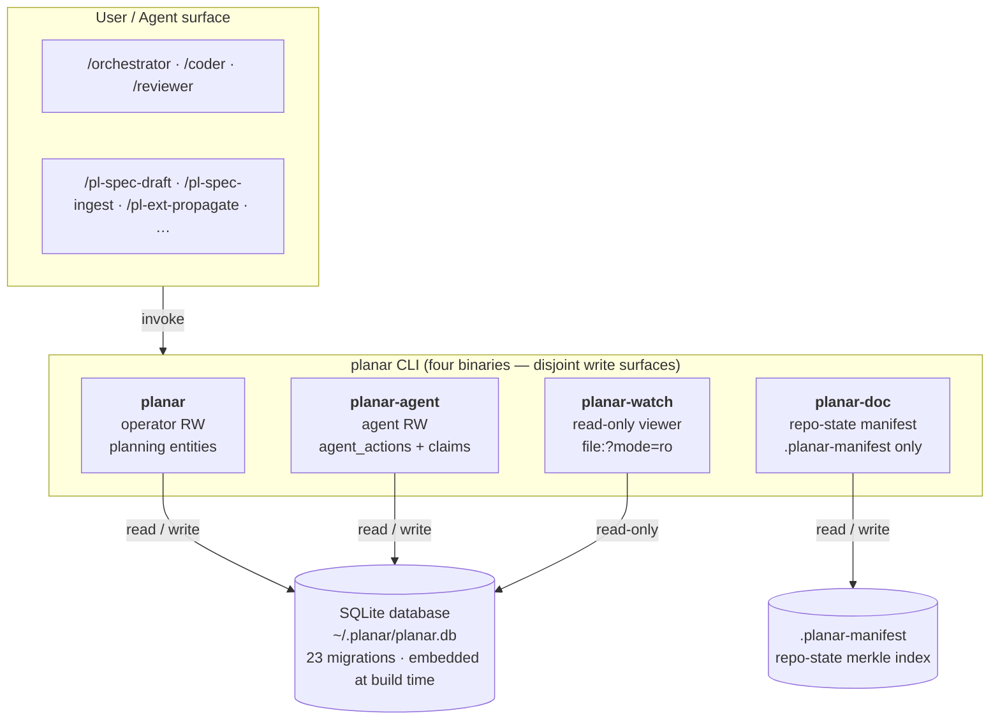
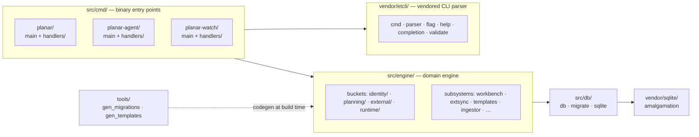

# Planar Architecture

Planar is a local-first task tracker and agent-operations infrastructure tool. It spans planning, tasking, scoping, durable agent handoff, vendor parity, and operational-plane integration with Jira and GitHub Issues.

This document describes the system as it stands today — for a new contributor or curious user who wants to understand how Planar works without reading the full source.

---

## System Layers



Two layers are touched by users and agents:

1. **The Planar binaries** — four Zig executables that share one schema and one engine module. `planar` is the operator surface; `planar-agent` is the agent-callable coordination binary; `planar-watch` is a read-only viewer; `planar-doc` is the repo-state documentation-manifest tool (no SQLite access at all — its only write is `.planar-manifest` at the repo root). The split is enforced **by each binary's verb set** at compile time, not by runtime ACLs. See [Four-binary architecture](#four-binary-architecture) below for the full capability matrix.
2. **The skill and agent layer** — vendor-specific command surfaces (Claude slash commands, Codex skills, Copilot skills) generated from a single source tree under `skills/src/` at install time. Skills invoke binary verbs; binary verbs operate on SQLite.

An LLM agent running a skill has no direct database access. It calls Planar verbs and reads their stdout.

---

## Storage

The database lives at `~/.planar/planar.db` by default. The `--db` global flag overrides the path.

### Schema management

Migrations are plain SQL files under `migrations/` in sqlx-cli format (`NNNNN_<name>.up.sql` / `.down.sql`, five-digit zero-padded prefix). The build-time codegen tool `tools/gen_migrations.zig` scans the directory and emits a `migrations` Zig module exposing `pub const all: []const Migration` that the runtime applies on startup; already-applied migrations are skipped. There is no external migrator dependency — the migration corpus is embedded in the binary at compile time.

`schema_migrations` is the public schema-version contract. Every migration inserts one row with a version number and description. Read-side tools (e.g., a web viewer, an Obsidian bridge) must open the database read-only and query `schema_migrations` to verify they support the current version before operating. `planar-agent` and `planar-watch` perform this handshake at startup and refuse with exit code 7 if the database schema is older than the binary's embedded minimum.

Authoring rules (file naming, the `schema_migrations` insert/delete contract, the `.sqlfluff` linter config, and the up/down/up roundtrip test) live in [`migrations/README.md`](../migrations/README.md). New migrations are created via `sqlx migrate add -r <name> --source migrations`; the next `zig build` regenerates the embedded module.

### Application tables

| Migration | Tables / schema change |
|-----------|------------------------|
| 0001 foundation | `schema_migrations`, `config`, `projects`, `associations`, `project_associations` |
| 0002 planning | `plans`, `artifacts`, `decisions` |
| 0003 work items | `agents`, `active_scope`, `tasks`, `questions`, `test_scenarios`, `plan_steps` |
| 0004 entity links | `entity_links` |
| 0005 sessions | `sessions`, `session_entries`, `context_snapshots`, `handoffs` |
| 0006 external | `external_systems`, `external_links`, `sync_events` |
| 0007 workbench | `workbench_sync_state` |
| 0008 doc artifact kinds | extends `artifacts.kind` CHECK with `research`, `getting_started`, `changelog_entry`, `glossary_term` |
| 0009 drop active scope | drops `active_scope` (replaced by cwd-derived resolution) |
| 0010 task reopens | adds reopen accounting columns to `tasks` |
| 0011 slug refs FTS | slug-reference index + FTS5 virtual table for search |
| 0012 annotations | `annotations` |
| 0013 test_spec artifact kind | extends `artifacts.kind` CHECK with `test_spec` |
| 0014 audit log | `audit_log` |
| 0015 agent activity | `agent_work_claims`, `agent_actions` (claims carry `repo_root` / `branch` / `head_sha_at_claim` / `dirty_at_claim` + optional worktree id/path; actions carry `head_sha` / `dirty`) |
| 0016 agent_actions metadata | adds nullable `agent_actions.metadata` text column for caller-attached opaque JSON (orchestrator strategy persistence; first consumer is `pl-orchestrator` rule-6 stickiness) |
| 0017 handoffs worktree | adds nullable `handoffs.worktree_path` / `repo_root` / `branch` columns; `planar handoff create` copies them from the active `agent_work_claims` row on the target task so `planar resume` can recover `cd <path>` even after the originating claim has been released |
| 0018 fix migration descriptions | data-only: corrects the `schema_migrations.description` text for versions 2-7, which had been copy-pasted from unrelated Go-archive migrations. No schema change; the `description` column is not read at runtime (the version contract is the numeric `version`). |
| 0019 task touch paths | `task_touch_paths` (path-level touch declarations: `task_id` → `repo_id` (`projects.id`) → repo-relative `path`); additive to the coarse `entity_links` repo-touch edge, consumed by `plan recommend-strategy` for the path-shaped parallelizability rules |
| 0020 cli_invocations usage log | `cli_invocations` — opt-in local log of operator CLI usage (one row per `planar` invocation when `[introspection].cli_log = true` in config.toml). Privacy: `args_shape` carries flag names + positional arity only; flag/arg values are never written. Rows expire statelessly via a retention-prune on the capture path. |
| 0021 session commits | `session_commits` — persisted `session_id → commit` attribution rows (`sha`, `repo_root`, `branch`, `subject`, `author`, `committed_at`, `recorded_at`, optional `claim_id`) plus nullable `sessions.repo_root` and `sessions.head_sha_at_start` columns for operator-session commit windows |
| 0022 workflow context plane | `workflow_runs` — identity + audit for one external harness run (`plan_id`, `workflow_name`, `run_identifier` unique, `pid`, `repo_root`, `started_at`, `ended_at`, `status` in `running\|completed\|failed\|interrupted\|abandoned`); `context_records` — run-scoped working memory keyed `(run_id, stage, session_id, claim_id)` with `kind` in `finding\|risk\|artifact\|followup\|summary\|capsule` and `status` lifecycle `active\|consumed\|superseded`, plus nullable `compiled_from` provenance column for capsule rows |
| 0023 claims run/stage | adds nullable `agent_work_claims.run_id` (FK `workflow_runs(id) on delete set null`) and `agent_work_claims.stage` (text) so claims acquired inside a `centurion` (external workflow harness) run carry the run identity and stage name; `planar-agent pull` and `claim` gain optional `--run <id>` / `--stage <text>` flags that populate these columns; claims acquired without those flags behave unchanged (null run/stage) |
| 0024 context_records nullable claim | table-rebuild (rename → recreate → copy → drop) that relaxes `context_records.claim_id NOT NULL → nullable`; indexes are also rebuilt to match migration-22 shape. Required by decision 456 (plan 585 stage-close compaction): when the orchestrator writes a compiled capsule via `planar-agent context capsule --run <id>`, the write is run-keyed to `workflow_runs`, not to a worker claim, so capsule rows carry `claim_id = NULL` |

Migration 0015 (`migrations/00015_agent_activity.up.sql`) lands the claim + action store that the agent-coordination feature is built on. `claim_token` is generated in SQL via `lower(hex(randomblob(16)))` (32-char opaque handle). Exclusivity of `(entity_kind, entity_id)` is enforced transactionally in the engine store (`src/engine/runtime/agentactivity/`) under `BEGIN IMMEDIATE` because SQLite cannot express the time-dependent "unexpired" predicate in a partial unique index. WAL mode is enabled per-connection in `src/cmd/planar/runtime.zig` — load-bearing for the wake-tier ladder behind `--follow` AND for cross-binary concurrency between the operator and agent binaries (see Four-binary architecture below).

The `worktree_path TEXT` column on `agent_work_claims` (also migration 0015) is the persistence path for the harness-driven worktree-isolation strategies (`isolated-sequential`, `parallel-fanout`), owned by the external `centurion` harness; the model-driven orchestrator runs `classic` (in-pwd) only. `planar-agent pull --worktree <path>` and `claim --entity task:<id> --worktree <path>` write it; `planar resume <task>` reads it via the active claim row (surfaced as `active_claim.worktree_path` in `--json` and as a `cd:` line in the text packet); `planar-watch claims | log | feed | ps` and `planar dashboard --agents` surface it in their projections. The persistence model is deliberately claim-attached — there is no standalone `worktrees` table — though the forward-compat `validateWorktreeId` hook in `src/engine/runtime/agentactivity/store.zig` is the seam should that decision ever be revisited. For the concept overview see [`docs/concepts.md §Worktree`](concepts.md#worktree); for the canonical path/branch/lifecycle convention see plan 492's tech spec (relocated there from `agents/methodology.md` when the model orchestrator was reduced to `classic`).

The `handoffs.worktree_path` / `repo_root` / `branch` columns (migration 00017) close the cold-start recovery loop for plan 297. At handoff-create time the `planar handoff` handler copies the active claim's worktree fields onto the new row; `planar resume` reads them as a fallback when no active claim exists or the active claim row has a NULL `worktree_path`. The fallback surfaces as `from_handoff.{worktree_path,repo_root,branch,handoff_id}` in the `--json` packet and as a `from handoff: <id>` block (with `worktree:` / `cd:` / `branch:` / `repo_root:` lines) in the text packet's audit footer. Both fallback projections lie alongside `active_claim` rather than replacing it — when both are populated, `active_claim` is authoritative. See [`docs/concepts.md §Handoff`](concepts.md#handoff) for the lifecycle overview and [`skills/src/pl-handoff.md`](../skills/src/pl-handoff.md) for the operator-facing prose.

The `task_touch_paths` table (migration 00019) is the path-level touch surface for the parallelizability rules behind `planar plan recommend-strategy` (decision 370, plan 492 M5). Each row declares that a task is expected to modify a specific repo-relative file path: `(task_id → tasks.id, repo_id → projects.id, path)` with a `unique(task_id, repo_id, path)` guard and cascade-delete on both FKs. It is ADDITIVE to — and coexists with — the coarse `entity_links(from_kind='task', to_kind='repo', relationship='touches')` repo-level edge; the two are written together by `planar task touches add <task> <repo> --path <p>` (a path-touch implies the repo-touch). The strategy engine (`src/engine/planning/strategy.zig`) reads path-level rows where a repo has them and falls back to the coarse repo slug only for repos with no path declaration, so two tasks editing different files in the same repo are parallel-eligible while an under-declared (empty) touch set is treated as "touches everything" → never eligible. Rules 3/4 (migration touched, singleton authoritative file touched) match on the raw repo-relative path. `planar task touches list <task> --json` surfaces both granularities (`repos` + `paths`).

The `cli_invocations` table (migration 00020) is the opt-in local log of operator CLI usage. It is written by the capture hook in `src/cmd/planar/cli_log.zig` when `[introspection].cli_log = true` in `~/.planar/config.toml`. Privacy is enforced at the write site: `args_shape` carries flag names and positional arity only — argument and flag values are never written to this table. The hook runs synchronously on the `planar` exit path and is fail-open: any write failure is swallowed and leaves the command's stdout, stderr, and exit code unchanged. Retention pruning piggybacks on each capture write: SQLite date arithmetic (`date('now', '-N days')`) compares `recorded_at` to the configured `retention_days` (default 90) and deletes expired rows in the same write; no last-prune timestamp is stored anywhere. The table is indexed on `recorded_at`, `verb_path`, and `exit_code` for the aggregate queries that will power `planar report` (M2). The `error_category` column is gated by a dual CHECK: the set of valid enum values (`usage`, `scope`, `not_found`, `conflict`, `validation`, `io`, `db`, `internal`) and the consistency invariant `(exit_code = 0) = (error_category is null)`.

The `session_commits` table (migration 00021) is the durable commit-attribution surface for sessions. Each row links a commit SHA to a `sessions.id` and, when the commit came from an agent claim window, optionally to `agent_work_claims.id`. Commit metadata (`subject`, `author`, `committed_at`, `branch`, `repo_root`) is denormalized into the row so audit queries still work after a worktree is deleted or history is rewritten. A `unique(session_id, sha)` constraint makes re-recording idempotent within a session, while still allowing the same commit to appear in multiple sessions. The operator-session side of the feature extends `sessions` with nullable `repo_root` and `head_sha_at_start` columns: `planar capture session` records the first-open repo and starting HEAD, `planar capture end` walks `head_sha_at_start..HEAD` in that repo before marking the session ended, and `planar capture commits` is the explicit recovery path for ended sessions, multi-repo work, or any missed automatic window. On the agent path, `planar-agent complete|fail|release|block` record commits from `head_sha_at_claim..HEAD` after the atomic terminal transaction succeeds, so claim outcome and commit attribution remain independent facts.

Migration 00022 lands the **workflow context plane** (plan 585): two tables that give an external Lua-based harness (such as `centurion`) a run-scoped durable context surface. `workflow_runs` is the identity and audit record for one harness run. Rows are created and closed by `planar-agent run start/end` — the harness remains DB-handle-free and shells those verbs (decision 444). `pid` and `repo_root` are stored so crash reconciliation can pid-probe a stalled run and flip its `status` to `abandoned` without a terminal verb having been called; `abandoned` is never written by `run end`. The `run_identifier` column carries a unique runlock-derived string and has a `UNIQUE` index so duplicate-run detection is atomic. `context_records` is run-scoped working memory distinct from `session_entries` by deliberate design (decision 445): `session_entries` is a narrative timeline (what happened); `context_records` is working memory (what the next stage needs), with its own lifecycle and consumers. Records are keyed `(run_id, stage, session_id, claim_id)`. For worker-written records (kinds `finding`, `risk`, `artifact`, `followup`, `summary`), `claim_id` is the worker-side correlation key (decision 447) — `context add --claim <token>` stamps `run_id`, `session_id`, and `stage` server-side from the claim row, and `claim_id` is NOT NULL. For compaction-written `capsule` records (written at stage close by `context capsule --run <id>`), the write is run-keyed to `workflow_runs`, not to a worker claim, so `claim_id` is NULL (decision 456; migration 0024 relaxes the original NOT NULL constraint to support this). The `kind` CHECK (`finding`, `risk`, `artifact`, `followup`, `summary`, `capsule`) covers both raw records and the compiled stage-capsule records written at stage close. Cleanup is lifecycle, not deletion (decision 446): stage close marks raw records `consumed` or `superseded` and writes one compiled `capsule` record whose nullable `compiled_from` column stores the integer ids of the raw records it distilled, retaining full provenance. The three-value `status` CHECK (`active`, `consumed`, `superseded`) with default `active` is the machine-readable lifecycle signal; `compiled_from` is the audit trail.

The `agent_actions.metadata` JSON column (migration 00016) is the durable home for caller-attached per-action context. It is a nullable `TEXT` column; the engine and CLI store it opaquely, only parsing happens at the consuming surface. The first consumer is the orchestrator strategy-persistence model (see [`docs/concepts.md §Orchestration strategy`](concepts.md#orchestration-strategy) and [`agents/methodology.md §Strategy gate`](../agents/methodology.md#strategy-gate)): when the orchestrator confirms a strategy for a cycle it writes `{"strategy":"<name>","axes":{...},"dispatch_shape":"<shape>","rationale":"<text>"}` to the dispatch action row via `planar-agent pull --metadata '...'` (for plan-pull dispatch) or `planar-agent action start --metadata '...' --claim <token>` (for hand-picked task dispatch). The next cycle's strategy gate reads the most recent dispatch entry's metadata via `planar-watch actions --plan <id> --json` and applies the recommendation algorithm's rule-6 stickiness. Both write verbs validate `--metadata` as well-formed JSON at the CLI parse layer; the read-side surfaces (`planar-watch actions | log | feed`) include the field in their `ActionRow` JSON shape as a nullable string.

### Four-binary architecture

Planar ships FOUR planning-state binaries that share one schema, one engine module, and one runtime library. The split is real: separate `src/cmd/` source trees (`src/cmd/planar/`, `src/cmd/planar-agent/`, `src/cmd/planar-watch/`, `src/cmd/planar-doc/`), separate `addExecutable` entries in `build.zig`, separate `--help` surfaces, separate `bin/` artifacts under `~/.planar/bin/`.

| Binary | Audience | Write surface | DB open mode |
|---|---|---|---|
| `planar` | Operator (human + scripts) | Planning entities (plans/tasks/decisions/etc.) + `tasks.status` on operator-driven transitions | Read-write; owns `init` and runs migrations. |
| `planar-agent` | Agent (vendor hook, orchestrator dispatch) + operator recovery | `agent_actions` + `agent_work_claims`; `tasks.status` ONLY as part of an atomic coordinated operation under a status-transition guard | Read-write; refuses startup with exit 7 if schema is older than the binary's embedded minimum. |
| `planar-watch` | Operator (live view) + scripts | None — the binary registers zero write verbs AND opens SQLite via `file:?mode=ro` URI as a second line of defense | Read-only; same schema-version handshake as `planar-agent`. |
| `planar-doc` | Operator + documenter agent | `.planar-manifest` ONLY — repo-state merkle index at the repo root. Never opens SQLite at all. | No DB handle. |

Capability invariant — non-overlapping write surfaces enforced at
compile time by each binary's verb set, not by runtime ACLs:

- `planar` NEVER writes to `agent_work_claims`. It writes `agent_actions`
  only through the best-effort entity-create provenance hook (plan 467
  D2/D3): when `decision` / `question` / `artifact add` runs under an
  active agent claim it appends a `created <entity>` action; with no
  active claim (the ordinary operator shell) the call is a silent no-op.
  No other `agent_*` write path exists on `planar`. The `planar agent`
  subcommand namespace does not exist; agent observability lives on
  `planar-watch`, agent-table mutation lives on `planar-agent`.
- `planar-agent` NEVER writes to plan / decision / question / scenario
  / artifact / annotation rows. A vendor hook configured with only
  `planar-agent` on its PATH has bounded blast radius — it cannot
  touch planning state.
- `planar-watch` is incapable of writing to the DB at all — both the
  verb set and the read-only DB handle are load-bearing.
- `planar-doc` is incapable of touching the DB at all (no SQLite
  driver linked into the binary). Its only write is the
  `.planar-manifest` file at the repo root.

The operator-recovery verbs `planar-agent reconcile` and
`planar-agent abort` live on `planar-agent` (not `planar`) because both
are `agent_*` table writers. The capability boundary tracks tables,
not audience.

The `planar-agent run start/end` verbs and the `planar-agent context add/list/resolve/capsule` verbs (plan 585) are agent-table writers — they write `workflow_runs` and `context_records` respectively — so they live on `planar-agent`, not `planar`. (`context capsule` is the run-keyed capsule writer used by stage-close compaction; it writes a `capsule` record with `claim_id = NULL`, distinct from the claim-keyed worker writes of `context add`.) The observability view (`planar-watch run list/show`) lives on `planar-watch`, consistent with the zero-write boundary. These verbs were originally designed to serve `planar-execute` (the embedded-Lua harness, extracted to the external `centurion` repo); they remain in `planar-agent` / `planar-watch` as the durable coordination surface any external harness can consume.

The shared engine module lives at `src/engine/runtime/agentactivity/`; per-binary handlers live under `src/cmd/<binary>/handlers/`. `planar-agent` carries the full coordination surface; `planar-watch` carries the read-only viewer surface (`feed`, `ps`, `claims`, `actions`, `plans`, `log`, `tree`, `run`, `version`, `completion`, `schema`) with a Tier-2 event-driven `--follow` loop.

### Live tail wake abstraction

The `planar-watch <verb> --follow` family runs a poll loop: take an
initial snapshot, then re-query the watermark whenever new activity
might have landed. The TRANSPORT — how the loop knows when to wake
— is INTERNAL and evolves through a tier ladder. The public contract
(JSON event shape, watermark columns, `--interval` flag, SIGINT
exit-0) is preserved across tiers.

| Tier | Transport | Latency | Idle CPU | Status |
|---|---|---|---|---|
| 1 | Fixed-interval sleep (`--interval` cadence) | `--interval` floor (default 1s) | ~0 (sleeps) | Shipped; remains the fallback. |
| 2 | kqueue (macOS/BSD) or inotify (Linux) on the SQLite `-wal` sibling | Sub-millisecond wake from any committed write | ~0 (kernel notification) | Shipped. |
| 3 | Writer-side `update_hook` → sidecar notify socket | Same as Tier 2, plus per-row filtering | ~0 | Future. |

The abstraction lives at `src/engine/runtime/agentactivity/wake.zig`
behind a `Wake` struct with `init` / `waitNext` / `close`. The follow
loop in `src/cmd/planar-watch/handlers/follow.zig` calls
`Wake.waitNext(timeout_ns)` once per iteration; the wake source
returns `.wal_changed` when a kernel notification arrived, or
`.heartbeat` when the timeout elapsed without a notification. The
`--interval` flag is the HEARTBEAT cadence — a maximum fallback that
catches coalesced/missed wake events (laptop sleep, ENOMEM, etc.).

Backend selection is compile-time: macOS/BSD get kqueue with
`EVFILT_VNODE` (`NOTE_WRITE | NOTE_EXTEND | NOTE_DELETE | NOTE_RENAME`)
on the `-wal` fd opened with `O_EVTONLY` (darwin's "watch but don't
hold a real reference" mode — required to avoid interfering with
SQLite's WAL coordination); Linux gets inotify with
`IN_MODIFY | IN_DELETE_SELF | IN_MOVE_SELF`. Unsupported platforms
fall back to a plain timed sleep with a one-shot stderr warning.

WAL rotation (`PRAGMA wal_checkpoint(TRUNCATE)`, crash recovery) is
detected via `NOTE_DELETE`/`NOTE_RENAME` (kqueue) and
`IN_DELETE_SELF`/`IN_IGNORED` (inotify); the wake source re-opens
the watch transparently on the next `waitNext` call. Operators
never have to restart `planar-watch` after a checkpoint.

The wake transport is NOT part of the public contract — future
tiers (Tier 3 writer-side hook + sidecar; alternative IPC mechanisms)
can swap behind the same `Wake` interface without breaking
consumers.

### SQLite driver

Planar vendors the official SQLite amalgamation under `vendor/sqlite/` (`sqlite3.c` + `sqlite3.h`). `build.zig` compiles it as a static library with `SQLITE_THREADSAFE=1`, `SQLITE_ENABLE_FTS5`, `SQLITE_ENABLE_JSON1`, `SQLITE_DQS=0`, `SQLITE_DEFAULT_FOREIGN_KEYS=1`, and `SQLITE_USE_URI=1`. There is no system SQLite requirement and no external wrapper. Cross-compilation works out of the box because Zig itself compiles the C source — the toolchain handles every supported target.

The Zig bindings live in `src/db/sqlite.zig`; the higher-level `*Db` wrapper (connection + transaction helpers) lives in `src/db/db.zig`.

---

## Source Layout

The repo root IS the Zig package root: `build.zig`, `build.zig.zon`, and the source tree (`src/`) sit together at the top level. The runtime is organized into per-binary entry points, a domain engine grouped by bucket, a hand-rolled CLI parser, a database layer, and a build-time codegen pipeline.



### Binary entry points (`src/cmd/`)

| Path | Role |
|------|------|
| `src/cmd/planar/` | Operator binary entry — `main.zig` plus runtime scaffolding (`runtime.zig`, `scope.zig`, `output.zig`, `editflow.zig`, `editor.zig`, `exit.zig`) and ~38 per-verb handlers under `handlers/`. |
| `src/cmd/planar-agent/` | Agent-callable coordination binary — `main.zig`, `exit.zig`, and per-verb handlers under `handlers/` for the 13-verb coordination surface. |
| `src/cmd/planar-watch/` | Read-only viewer binary — `main.zig`, `exit.zig`, and per-verb handlers under `handlers/` (including the `--follow` wake loop). |

### Domain engine (`src/engine/`)

The engine is organized into four buckets that map to data-model domains plus a flat set of subsystem modules. Each bucket directory holds per-entity sub-modules; the bucket name itself is also exported as a `<bucket>.zig` namespace at the engine root.

| Path | Contents |
|------|----------|
| `src/engine/identity/` | Project, scope, association, and scope-argument parsing — "who is asking and in what context." |
| `src/engine/planning/` | Plans, tasks, questions, test scenarios, artifacts, decisions — the core structured-intent and execution surfaces. |
| `src/engine/external/` | External-system registration (`system.zig`), external-link tracking (`link.zig`), sync engine (`sync.zig`), agent ingest (`agentingest/`). |
| `src/engine/runtime/` | Sessions, session entries, context snapshots, handoffs, capture, audit trail, and the `agentactivity/` claim + action store with its wake transport (`wake.zig`). |

Subsystem modules live at the engine root:

| Path | Role |
|------|------|
| `src/engine/workbench/` (+ `workbench.zig`) | Bidirectional sync between the workbench filesystem and the database — pull, push, sync, resolve, archive, restore, publish, manifest management. |
| `src/engine/extsync/` (+ `extsync.zig`) | Operational-plane adapters and propagation. Holds `jira.zig`, `github.zig`, `strategy.zig`, `propagate.zig`, `parent_issue.zig`, `projects_v2.zig`. |
| `src/engine/templates/` (+ `templates.zig`) | Template rendering for external-system payloads — three-level resolution (user set → default set → embedded), Go-template-compatible placeholder substitution. |
| `src/engine/ingestor/` (+ `ingestor.zig`) | Planning-document parser and ingestion engine. Reads workbench tech-spec / roadmap files, diffs against DB state, applies. |
| `src/engine/synthesize.zig` | Synthesis pipeline for `synthesize`: Request/Result, fingerprint cache, Validate, Merge. The LLM runs in the vendor skill; this module owns the deterministic floor and the skill-handoff cache contract. |
| `src/engine/import.zig` | Transcription pipeline for `import`: classifier, parser, status-inference, diff, apply. The apply layer is shared with `synthesize`. |
| `src/engine/tree.zig` | Hierarchical rendering for `planar tree` — walks the plan / task / artifact / decision / scenario / question graph and produces the indented output. |
| `src/engine/config/` (+ `config.zig`) | Configuration-plane reader: loads `~/.planar/config.toml`, applies the layered resolution order, validates, exposes the resolved config to other modules. |
| `src/engine/workspace/` (+ `workspace.zig`) | Workspace state directory model: routing table, generated AGENTS.md, symlink lifecycle. |
| `src/engine/llm/` (+ `llm.zig`), `entitylink.zig`, `health.zig`, `policy/`, `promotion.zig`, `local/`, `skillrender.zig`, `docs.zig`, `search.zig`, `init.zig` | Cross-cutting subsystem modules. |

### CLI parser ([`vendor/etcli/`](https://github.com/rdrsss/etcli))

Comptime-driven argv parser — no third-party CLI framework, just a small purpose-built library extracted from Planar's former in-tree `src/cli/` into [etcli](https://github.com/rdrsss/etcli). Vendored under `vendor/etcli/` and consumed via a path dependency in `build.zig.zon`; `build.zig` wires it into every binary as the `cli` module. Files in the upstream tree mirror Planar's prior layout: `cmd.zig`, `parser.zig`, `flag.zig`, `help.zig`, `completion.zig`, `validate.zig`, `error.zig`, `duration.zig`, `platform/`. Each binary's `main.zig` builds a `cli.Cmd` tree and dispatches to its handlers.

### Database layer (`src/db/`)

| File | Role |
|------|------|
| `src/db/db.zig` | `*Db` connection wrapper, transaction helpers (`beginTx` / `commit`), PRAGMA setup (foreign keys on, WAL mode). |
| `src/db/migrate.zig` | Applies the embedded `migrations` Zig module (emitted by `tools/gen_migrations.zig`) on startup. |
| `src/db/sqlite.zig` | Zig bindings against the vendored SQLite amalgamation. |

### Build-time codegen (`tools/`)

| Tool | Role |
|------|------|
| `tools/gen_migrations.zig` | Scans `migrations/` and emits a `migrations` Zig module exposing `pub const all: []const Migration`. |
| `tools/gen_templates.zig` | Scans `templates/defaults/` and emits an embedded-templates module so propagation defaults compile into the binary. |

---

## CLI Binary

`planar` is a Zig executable with a thin `main` in `src/cmd/planar/main.zig` that builds a `cli.Cmd` tree against the [etcli](https://github.com/rdrsss/etcli) parser (vendored under `vendor/etcli/`). Each subcommand domain maps to one entity kind or system surface. Parsing, help rendering, shell completion, and validation are all in the etcli library — Planar does not vendor a CLI framework like cobra or clap.

### Handler layout

Per-verb handlers live under `src/cmd/planar/handlers/`, grouped into per-domain sub-directories (`plan/`, `task/`, `artifact/`, `scenario/`, `decision/`, `question/`, `ext/`, `links/`, `sync/`, `handoff/`, `resume/`, `audit/`, `capture/`, `annotate/`, `association/`, `dashboard.zig`, `health.zig`, `init.zig`, `tree.zig`, `synthesize.zig`, `import.zig`, etc.). Each handler is a small dispatch function that parses verb-specific args via `cli.parser`, calls the engine module that owns the domain logic, and emits text or JSON via `output.zig`.

The handler tree mirrors the engine bucket layout. The `runtime` bucket is materialized as runtime-scoped handlers (`handoff/`, `resume/`, `audit/`, `capture/`, `session/`); the `identity` bucket as (`scope/`, `association/`, `promote.zig`, `demote.zig`, `init.zig`); the `planning` bucket as (`plan/`, `task/`, `artifact/`, `question/`, `scenario/`, `decision/`, `spec/`, `templates/`); the `external` bucket as (`ext/`, `link.zig`, `links/`, `sync/`).

### Subcommand domains

`artifact`, `assoc`, `audit`, `capture`, `config`, `dashboard`, `decision`, `demote`, `doc`, `ext`, `handoff`, `health`, `help`, `import`, `init`, `link`, `links`, `local`, `plan`, `promote`, `question`, `resume`, `scenario`, `scope`, `search`, `skills`, `spec`, `sync`, `synthesize`, `task`, `templates`, `tree`, `workbench`, `workspace`.

Use `planar --help` for the current list. Use `planar <domain> --help` for subcommand detail. The full surface is enumerated in [docs/cli-reference.md](cli-reference.md).

### Global flags

| Flag | Default | Purpose |
|------|---------|---------|
| `--db <path>` | `~/.planar/planar.db` | Database path override |
| `--json` | off | Emit newline-delimited JSON instead of human text |
| `-q` / `--quiet` | off | Suppress informational output |
| `--v` | off | Debug-level tracing |
| `--vv` | off | Trace-level tracing |

### Output conventions

- Human mode (default): line-oriented text.
- Machine mode (`--json`): one JSON object per result row, snake_case keys matching schema column names.
- Mutating commands that produce no entity data emit `{"ok":true,"id":<id>}` under `--json`.
- Exit codes: `0` success, `1` user-fixable error, `2` system error, `3` sync conflict, `64` usage error.

---

## The Workbench

The workbench is a bidirectionally synced drafting filesystem at `$PLANAR_WORKBENCH_ROOT` (default `~/.planar/workbench/`). It is the primary surface where agents and users read and write planning documents.

Each anchor plan gets its own directory:

```
~/.planar/workbench/
  <assoc-slug>/
    p<plan-id>-<plan-slug>/
      product-spec.md      ← artifact (kind=product_spec)
      tech-spec.md         ← artifact (kind=tech_spec)
      roadmap.md           ← artifact (kind=roadmap)
      tasks/
        <id>-<slug>.md     ← task
      scenarios/
        <id>-<slug>.md     ← test_scenario
      decisions/
        <id>-<slug>.md     ← decision
      ...
```

Sync is explicit, not automatic:

- `planar workbench push <plan>` — DB → FS: write the current DB state to disk.
- `planar workbench pull <plan>` — FS → DB: read disk changes into DB.
- `planar workbench sync <plan>` — bidirectional: apply FS→DB and DB→FS in one pass; surface conflicts as `sync_events(outcome='conflict')` rows.
- `planar workbench status [<plan>]` — show FS-only, DB-only, and conflicting files without writing.
- `planar workbench resolve <event-id> --prefer fs|db` — settle a conflict.

`workbench_sync_state` tracks the per-file relationship (entity kind, entity id, content hash, last sync time) so the sync engine can detect changes without re-reading every file on every run.

When a feature is complete, `planar workbench archive <plan>` removes the on-disk tree. The database retains every entity row. `planar workbench restore <plan>` recreates the tree byte-identically from the DB.

`planar workbench publish <plan> --system <slug>` renders the workbench files for a plan and pushes the rendered content to a registered external operational system via the adapter layer. For full plan-subtree counterpart creation in an external system, `planar ext propagate <plan> --system <slug>` is the verb of record.

---

## Workspace State Directory Model

A workspace is an `associations` row of `kind=org` together with its `project_associations` members — a polyrepo grouping. Each workspace owns a state directory under `~/.planar/` that holds the canonical AGENTS.md surface and the structured routing table that drives it. There is no `workspaces` table; the state directory path is derived from the org's id and the convention is the contract.

### Layout

```
~/.planar/workspaces/<org_id>/
├── AGENTS.md                       # canonical, generated by workspace regenerate
├── routing-table.json              # structured project map, generated by routing build
├── config.toml                     # optional per-workspace settings (enrich_command, etc.)
├── routing-table-overrides.json    # optional manual overrides merged on every build
└── .manifest-docs                  # plan-96 drift manifest tracking the generated files
```

The state directory lives alongside the rest of Planar's state under `~/.planar/`: the database (`planar.db`), the workbench tree (`workbench/`), the templates layer (`templates/`), and the enrichment cache (`cache/workspace-enrichment/<org_id>/`). Keeping everything under one root makes backup, sync, and clean-slate operations a single-path operation.

### Symlink lifecycle at the workspace root

Two symlinks at the workspace root (the cwd of `planar workspace init` — typically `~/work/`) project the canonical content into the directory where agents naturally look:

```
<workspace-root>/AGENTS.md  →  ~/.planar/workspaces/<org_id>/AGENTS.md
<workspace-root>/CLAUDE.md  →  ~/.planar/workspaces/<org_id>/AGENTS.md
```

Both names point at the same target so Codex / Copilot (which read `AGENTS.md`) and Claude Code (which reads `CLAUDE.md`) see the same content. On filesystems that reject symlinks (Windows without developer-mode enabled), the installer falls back to a regular-file copy and records the degraded mode in the routing table so subsequent regenerations rewrite the copy. `planar workspace doctor` re-creates either form when it is missing or pointing at the wrong target; the operation is idempotent.

### Bare-init guardrail

`planar init` refuses when cwd has no `.git` of its own but contains one or more immediate child directories that do. Without the guardrail, a bare init in `~/work/` would register a semantically-wrong project row (`~/work/` is not a repo) and quietly skip the workspace-shaped intent the user clearly had. The refusal points at `planar workspace init` instead. The `--allow-no-repo` (alias `--force`) escape hatch exists for the rare standalone non-repo project; routine workflows should not need it. See [cli-reference.md § `planar init`](cli-reference.md#planar-init) and [concepts.md § Workspace](concepts.md#workspace).

---

## The Configuration Plane

Configuration lives in `~/.planar/config.toml`. The `planar config` domain manages it.

### Resolution order (highest wins)

1. Environment variables (`PLANAR_*` prefix).
2. Per-association overrides in `config.toml` under `[assoc.<slug>]`.
3. Top-level keys in `config.toml`.
4. Embedded defaults compiled into the binary.

### Config subcommands

| Command | Purpose |
|---------|---------|
| `planar config show` | Print the fully-resolved configuration as TOML. |
| `planar config validate` | Check `config.toml` for syntax and semantic errors. |
| `planar config edit` | Open `config.toml` in `$EDITOR`. |
| `planar config init` | Write a starter `config.toml` with documented defaults. |
| `planar config path` | Print the path to the active config file. |

Notable config keys: `github_lead_repo` (used by the GitHub zero-repo propagation strategy), `jira_base_url`, `jira_project_key`, freshness windows for sync, template set selection.

---

## The Templates Layer

Templates live under `~/.planar/templates/` and drive external-system payload rendering for propagation (`ext propagate`) and ext-sync.

The resolution chain for any template file:

1. The user-chosen template set (configured in `config.toml`).
2. The `default` set under `~/.planar/templates/default/`.
3. Embedded binary defaults (compiled into the binary at build time from `templates/defaults/` via `tools/gen_templates.zig`).

Templates are JSON files; string values may contain a Go-template-compatible placeholder mini-language (`{{.Plan.Title}}`, `{{range .Touches}}…{{end}}`, `{{if .ExternalKey}}…{{end}}`) which `src/engine/templates/render.zig` substitutes against a rendering context exposing `.Task`, `.Plan`, `.Feature`, `.Scenario`, `.Touches`, `.Assoc`, `.ExternalKey`, and `.Children`. Non-string JSON values pass through unchanged. The placeholder syntax was preserved from the original Go implementation so existing template authors did not need to relearn the surface — but the renderer itself is plain Zig with no Go dependency.

`planar templates list` shows all available templates and their source level. `planar templates validate` checks them for syntax errors. `planar templates render <entity>` renders a template against a live entity for inspection.

---

## Operational Plane Adapters

The operational plane adapters connect Planar to external issue trackers. The boundary is duck-typed at compile time: `src/engine/external/sync.zig` and `src/engine/extsync/propagate.zig` accept an `adapter: anytype` and route calls through `extsync.dispatch(Adapter, .verb, adapter, args)`, where the comptime `Adapter` parameter resolves the concrete method. Each adapter exposes the same five-method surface (`fetch`, `create`, `update`, `comment`, `search`) with matching argument and return types.

Two adapters are implemented:

| Adapter | Location | Transport |
|---------|----------|-----------|
| Jira | `src/engine/extsync/jira.zig` | `std.http` (30s client timeout) |
| GitHub Issues | `src/engine/extsync/github.zig` | `std.http` (30s client timeout) |

Per-vendor logic stays behind the dispatch boundary; the sync engine and the ext-sync agent never branch on adapter kind.

### Strategy selection

For GitHub Issues, the propagation strategy is selected once at first propagation per feature and cached on `external_links.config_json` of the anchor plan:

| Condition | Strategy |
|-----------|---------|
| 0 repos touched by descendant tasks | `github-zero-repo` — parent issue in `github_lead_repo` |
| 1 repo touched | `github-parent-issue` — parent issue in the touched repo |
| 2+ repos touched | `github-projects-v2` — GitHub Projects v2, issues in their respective repos |

The strategy is sticky: subsequent re-propagations use the cached value. `--restrategize` forces fresh detection.

For Jira, the strategy is always the epic hierarchy: anchor plan → Epic, child plans → Stories, tasks → Sub-tasks.

### The ext-sync agent

Beyond propagation, `src/engine/extsync/propagate.zig` handles whole-feature propagation and `src/engine/external/sync.zig` handles bidirectional sync: pulling remote state changes into `sync_events` and pushing local mutations to the remote. The sync engine orchestrates the pull/push cycle; adapters handle the per-system translation.

---

## Repo Onboarding Pipelines

Planar onboards an existing repository into the data model via two sibling verbs that share the same downstream Apply machinery but enter from different contracts.

### Transcription pipeline (`import`)

The `import` verb is a translator: it reads the repo's existing planning docs and emits them as Planar artifacts as-is. The pipeline lives in `src/engine/import.zig`:

```
discover  → walk repo, classify .md files (frontmatter → filename → path)
parse     → extract roadmap milestones, ADR decisions, deferred items
infer     → status correlation from git log + branch list + checkbox state
diff      → match against DB by fingerprint; emit additions / updates / removals
apply     → commit additions, updates, and (with --apply-removals) soft-cancels
```

The optional `--interpret` pass writes a fingerprinted Request to `$PLANAR_HOME/cache/import-interpretation/<repo-slug>/_pending.json` and exits 0. The vendor skill produces a Result; the next invocation merges it with the deterministic Corpus before reaching the Diff/Apply stages.

### Synthesis pipeline (`synthesize`)

The `synthesize` verb is a generator: it reads docs *and* source, then produces fresh planning artifacts via an LLM pass. The pipeline lives in `src/engine/synthesize.zig`:

```
codeprobe       → per-FeatureArea source / test / CI / commit signals with
                  SignalStrength scores; output is an EvidenceMap
discover+parse  → existing docs become Request context (not source-of-truth)
Request         → fingerprinted package: docs + EvidenceMap + greenfield flag,
                  written to $PLANAR_HOME/cache/bootstrap-synthesis/<slug>/_pending.json
[vendor skill]  → reads Request, writes Result to <cache-dir>/<fingerprint>.json
Validate        → hard-rejects Results that violate the code-evidence invariant
Merge           → adapts Result to interpretation.Result, merges with deterministic baseline
Diff + Apply    → SHARED with import — same Diff/Apply stages
```

The LLM never runs in the Planar binary. The binary stays free of provider API keys, retries, and rate limits; the vendor skill (`skills/src/pl-synthesize.md` rendered to `commands/claude/pl-synthesize.md` etc.) is the LLM engine. The cache contract is the handoff: the binary writes a Request, the skill writes a Result, the binary validates and merges.

### Merge rules (synthesis)

`synthesis.Merge` honors four rules when combining the LLM Result with the deterministic baseline:

1. **Deterministic kind wins.** Frontmatter / filename / path classification of existing docs is locked; the LLM cannot reclassify them.
2. **LLM fills the qualitative output.** Phase decomposition, rich task bodies, status claims, decisions, deferred items, and forward specs all come from the LLM.
3. **Code-evidence outranks LLM-claimed-done.** A task with `status != "todo"` must cite a `code_evidence` path that exists in the deterministic EvidenceMap. The validator rejects any Result that violates the invariant; the LLM cannot lie about completion.
4. **Floor refusals propagate.** A deterministic confidence-floor refusal (50% threshold) and a greenfield invariant (no `status != "todo"` when codeprobe reports zero source evidence) cannot be rescued by good LLM data.

### Shared Apply machinery

The Diff/Apply stages are shared between both verbs via the apply helpers in `src/engine/import.zig`. After the synthesis-specific merge or the import-specific interpretation merge, both pipelines converge on the same idempotent diff (match by fingerprint; additions / updates / proposed-removals) and the same apply path (soft-cancel removed entities; preserve the audit trail).

The synthesis-vs-transcription split serves the same downstream pipeline: both verbs produce artifacts that flow through `/pl-spec-ingest` for task decomposition, then through the orchestrator's execution + propagation phases. The split is at the entry point only — what counts as the authoritative planning material.

See [docs/concepts.md § Transcription vs Synthesis](concepts.md#transcription-vs-synthesis) for the conceptual framing and [docs/cli-reference.md § Domain: synthesize](cli-reference.md#domain-synthesize) for the full CLI surface.

---

## The Agent Methodology

Planar defines vendor-neutral agent roles under `agents/`. Per-vendor command surfaces (Claude, Codex, Copilot) inherit the role spec and add vendor-specific invocation details.

### Roles

| Agent | Tier | Responsibility |
|-------|------|---------------|
| `orchestrator` | large | Receives a goal or task list; manages the full feature lifecycle across up to five phases; dispatches to coders; routes output through reviewers; enforces the iteration cap. |
| `coder` | medium | Implements one task (or task group) end-to-end; receives reviewer feedback and addresses it in the next iteration. |
| `reviewer` | large | Reviews coder output; returns `approve`, `request-changes`, `open-question`, or `abort`. |
| `planner` | large | Drafts planning documents (product spec, tech spec, roadmap) from a goal statement and registers them as workbench artifacts. |
| `ingestor` | large | Reads planning documents from the workbench and decomposes them into plans, tasks, decisions, and scenarios in the database. |
| `ext-sync` | large | Propagates the feature tree to the operational plane and syncs changes bidirectionally. |
| `importer` | large | Translates an existing repository's planning artefacts (specs, ADRs, roadmaps, backlog files, GitHub issues) into Planar's data model without a goal statement. |
| `synthesizer` | large | Produces fresh planning artifacts for a repo from existing docs + git log + source code via an LLM pass. Sibling of `importer`; shares the Apply machinery but enters from a synthesis contract (code-evidence invariant) rather than transcription. |

### Phases (orchestrator)

| Phase | Skill | Trigger |
|-------|-------|---------|
| 1 — Planning | `pl-spec-draft` | Goal given; no anchor plan or draft with no artifacts |
| 2 — Ingestion | `pl-spec-ingest` | Anchor plan draft with workbench artifacts present |
| 3 — Execution | coder + reviewer | Anchor plan active with todo/doing tasks |
| 4 — Propagation | `pl-ext-propagate` | User requests `--propagate` |
| 5 — Archive | `pl-workbench-archive` | Anchor plan done, user requests `--archive` |

The orchestrator gates Phases 2 and 3 on explicit user confirmation. Ingestion never auto-applies. The iteration cap is 5 per dispatch cycle.

### Vendor surfaces

| Vendor | Source dir | Installed to |
|--------|-----------|-------------|
| Claude | `commands/claude/` | `~/.claude/commands/` |
| Codex | `skills/codex/` | `~/.planar/codex-skills/` runtime, installed into `~/.codex/skills/` |
| Copilot | `skills/copilot/` | `~/.copilot/skills/` |

Agent role specs (vendor-neutral) live under `agents/`. The key files are `agents/methodology.md`, `agents/orchestrator.md`, `agents/planner.md`, `agents/ingestor.md`, `agents/extsync.md`, `agents/importer.md`, `agents/synthesizer.md`, `agents/coder.md`, `agents/reviewer.md`, and `agents/models.md` (tier-to-model resolution).

---

## Build and Test

The Zig package root IS the repo root: `build.zig` and `build.zig.zon` sit at the top level. Build via the Makefile wrappers or `zig build` directly.

```bash
# Makefile wrappers
make build              # → ./bin/planar (ReleaseSafe)
make test               # unit tests
make test-integration   # builds ./bin/planar, sets PLANAR_BIN, runs the
                        # integration suite under integration_tests/
make test-all           # unit + integration + cross-binary parity gate

# Direct zig CLI from the repo root
zig build                                # default install (zig-out/bin/planar)
zig build test                           # unit tests
zig build test-integration               # integration tests
zig build run -- <subcommand>            # run from source
```

Planar runs a two-tier test model plus a cross-binary parity gate:

- **Unit tests** — `test "<name>" { ... }` blocks colocated with the code under test under `src/<module>/`. They exercise the module directly (plus the `db` module when they need a DB) and run under `zig build test`.
- **CLI integration tests** — `integration_tests/` at the repo root exec the compiled `planar` binary via the `harness.zig` runner (`harness.smoke`, `harness.mustRun`, `harness.mustRunJSON`, `harness.expectFailure`). The suite imports nothing from the engine modules. These suites lock the user-visible contract — flag names, JSON shapes, exit codes, status-transition rules. Always invoke them via `make test-integration` so `PLANAR_BIN` points at the freshly-built `./bin/planar` rather than falling back to per-call rebuilds.
- **Cross-binary parity gate** — `make parity-check` (wired into `make test-all`) runs `scripts/parity-check.sh`, which diffs the current zig binary against the archived Go reference across the full verb surface and fails on any gap not present in `scripts/parity-allowlist.txt`. When the Go reference binary is unreachable, the gate prints a skip notice and exits 0; the integration suite remains the always-on guard.

The binary produced by `make build` lands at `./bin/planar`. The installed binary (used by skills) is at `~/.planar/bin/planar`, built and staged by `install.sh`.

The integration suite also follows two stylistic conventions documented in [`CLAUDE.md` § Test stratification](../CLAUDE.md#test-stratification): focused per-verb tests (`integration_tests/<verb>_test.zig`) pin one verb's contract, and scenario tests (`integration_tests/scenarios/*.zig`) walk realistic operator workflows end-to-end through many verbs.

---

## Key Invariants

- **One `*Db` per process.** Passed through explicit `App` / `Store` parameters; no global mutable state.
- **Migrations are append-only.** Never edit a released migration. Add a new file with the next sequence number via `sqlx migrate add -r <name> --source migrations`.
- **The adapter boundary is duck-typed.** The sync engine and propagation modules accept `adapter: anytype` and dispatch via the comptime adapter type; they never branch on adapter kind.
- **No external C dependencies beyond vendored SQLite.** `vendor/sqlite/` is the only C source the build touches; Zig compiles it as a static library with no system library requirement and no wrapper crate.
- **Skills call the binaries.** Agent skills do not write the database directly. They invoke `planar` / `planar-agent` verbs and read stdout. `planar-watch` is read-only and opens the database via `file:?mode=ro`.
- **Schema is the contract.** Read-side tools must check `schema_migrations.version` before operating against the database. `planar-agent` and `planar-watch` enforce this at startup (exit 7 on mismatch).
- **The four-binary capability split is verb-level.** A binary can only do what its registered verb set lets it do; `integration_tests/capability_boundary_test.zig` fails CI if a write verb is registered on `planar-watch`, a planning-entity verb on `planar-agent`, or any SQLite-touching verb on `planar-doc`.
- **External workflow harnesses hold no DB handle.** The `centurion` harness (external repo; formerly `planar-execute`, plan 492) is a pure CLI driver: it shells `planar`/`planar-agent`/`git` for all state access and never opens SQLite directly. Its blast radius is bounded by the verb sets of the binaries it shells.
