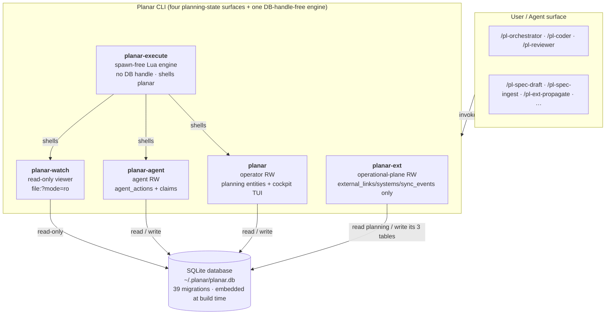
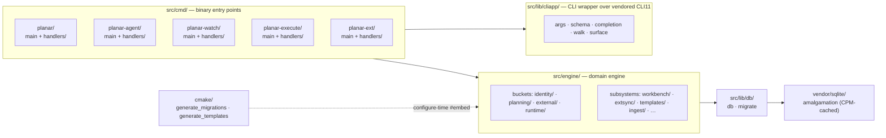

# Planar Architecture

Planar is a local-first task tracker and agent-operations infrastructure tool. It spans planning, tasking, scoping, durable agent handoff, vendor parity, and operational-plane integration with Jira and GitHub Issues.

This document describes the system as it stands today — for a new contributor or curious user who wants to understand how Planar works without reading the full source. For the operational flows drawn as diagrams — the spec pipeline, orchestration lifecycle, and claim ritual — see [Operations](operations.md).

---

## System Layers



Two layers are touched by users and agents:

1. **The Planar binaries** — five C++26 executables. Four share the SQLite engine/runtime graph: `planar` is the operator surface, `planar-agent` owns coordination writes, `planar-watch` is a driver-enforced read-only viewer, and `planar-ext` (decisions 995–1001) owns the operational-plane adapters (Jira, GitHub Issues) with read-only access to planning tables and read-write access to exactly `external_links` / `external_systems` / `sync_events`, enforced by a `sqlite3_set_authorizer` allowlist. `planar-execute` links the vendored Lua runtime and reaches state only through an exact allowlist of sibling Planar commands — it holds no SQLite handle at all. Capability boundaries are enforced by each binary's verb set and locked by integration tests. See [Five-binary architecture](#five-binary-architecture) below. The Zig implementation these binaries were ported from was retained under `zig/` as the port's parity oracle and DELETED at the M10 cutover (decisions 963/982) once its state-differential evidence came back clean; C++26 is now the only implementation.
2. **The skill and agent layer** — vendor-specific command surfaces (Claude slash commands, Codex skills, Copilot skills, Gemini skills) generated from a single source tree under `skills/src/` at install time. Skills invoke binary verbs; binary verbs operate on SQLite.

An LLM agent running a skill has no direct database access. It calls Planar verbs and reads their stdout.

---

## Storage

The database lives at `~/.planar/planar.db` by default. Set `PLANAR_DB` to override the path; there is no global `--db` flag.

### Schema management

Migrations are plain SQL files under `migrations/` in sqlx-cli format (`NNNNN_<name>.up.sql` / `.down.sql`, five-digit zero-padded prefix). The configure-time CMake codegen `cmake/generate_migrations.cmake` scans the directory (sorted explicitly, never relying on glob order) and `#embed`s each pair into a generated `planar.db.migrations` module that the runtime applies on startup; already-applied migrations are skipped. There is no external migrator dependency — the migration corpus is embedded in the binary at compile time.

`schema_migrations` is the public schema-version contract. Every migration inserts one row with a version number and description. Read-side tools (e.g., a web viewer, an Obsidian bridge) must open the database read-only and query `schema_migrations` to verify they support the current version before operating. Every binary that holds a SQLite handle performs this handshake at startup, in `planar.db.migrate`'s `assert_schema_compatible` (`planar-execute` holds no handle and is exempt). A database **ahead** of the binary — migrated by a newer build — is refused by all four with exit code 7. A database **behind** the binary is refused with exit code 7 by the three consumer binaries (`planar-agent`, `planar-watch`, `planar-ext`), whose remediation is `planar init`; `planar` itself owns migration and applies the pending chain instead. A database whose applied set has a **hole** in it — `max(version)` reports a version whose predecessors are not all present, which `max(version)` alone cannot distinguish from a healthy database — produces a warning on stderr rather than a refusal, so the diagnostic verbs stay reachable. The embedded chain itself must be contiguous (`1..n`, no holes); `apply_all` refuses a chain that is merely monotonic.

Authoring rules (file naming, the `schema_migrations` insert/delete contract, the `.sqlfluff` linter config, and the up/down/up roundtrip test) live in [`migrations/README.md`](../migrations/README.md). New migrations are created via `sqlx migrate add -r <name> --source migrations`; the next `cmake --build` regenerates the embedded module (CMake re-runs configure automatically on new/removed migration files).

#### The agent database's stream

The agent database (`~/.planar/agent.db`, plan 1080, decision 1181) has a second, independent migration stream under `migrations-agent/`, in the same sqlx-cli format. The same codegen embeds it, called a second time from `src/lib/db/CMakeLists.txt` with its own module name, namespace and accessor: `planar.db.migrations_agent` exports `planar::db::agent::migrations()`, and neither generated module holds a file from the other directory. The same runner applies it: every `planar.db.migrate` entry point that reads a version table takes the table name as a parameter (`k_main_version_table` = `schema_migrations`, `k_agent_version_table` = `agent_schema_migrations`), and the overloads without one are the unchanged main-stream defaults.

The store's location is resolved by `planar.db.agentdb` (`src/lib/db/agentdb.cppm`): `PLANAR_AGENT_DB` when set (a variable that is set but empty is refused, not skipped: it does not fall back to `HOME`), else `$HOME/.planar/agent.db`, beside `planar.db` when `HOME` is set and non-empty (an empty `HOME` counts as unset), and `PLANAR_DB` is never consulted, so pointing the main database elsewhere does not move the agent store. `open_agent_db` creates the file and its parent directory on first use, opens it through the same `connection::open` as the main database (foreign keys on, WAL journal mode, the 5000 ms busy timeout), checks the store's compatibility (below), and applies the agent stream through `apply_contiguous` against `agent_schema_migrations`, so the store is at head when the call returns and a second open changes nothing. It never opens the main database: a main-schema lockout does not reach it. A failure is an `open_error` naming the path: an unwritable parent directory, a file SQLite cannot open, a store that needs a newer binary, or a migration that fails; when neither `PLANAR_AGENT_DB` nor `HOME` is set, the error names both variables and nothing is created anywhere. The `queue run` verb (M2) maps that error to exit 125 (decision 1185). The `planar-agent` entry point resolves the main database's path before dispatch and exits 1 when it cannot (no `PLANAR_DB`, no `HOME`), for every verb except the `queue` domain, which never opens the main database and so is not stopped by it (`uses_main_database`).

`agent_schema_migrations(version integer primary key, compat integer not null, description text not null)` is the agent database's schema-version contract. The row with the highest `version` is authoritative, and its `compat` names the oldest binary schema version that may open the store: a migration that only adds tables, columns with defaults, or indexes keeps the previous `compat`, and one that drops, renames or changes the meaning of anything sets `compat` to its own version. The binary's own agent schema version is the head of the chain it embeds (`planar::db::agent::agent_schema_version()`). `check_compat`, which `open_agent_db_at` runs between opening the file and applying the stream, refuses the store with an `incompatible_store` error naming the path, the store's `compat` and the binary's version only when that `compat` is higher than the binary's version; the refusal happens before any migration write, so the file is unchanged. A store whose `version` is higher than the binary's but whose `compat` is not is opened as it is: the binary reads the tables it understands and applies nothing. A fresh store, or one behind the binary, passes the check and is migrated to head. Every agent migration's `compat` is pinned in one test table (`src/lib/db/agentdb.t.cpp`), which fails naming the file when a migration's inserted value differs from the table or a migration is missing from it, so changing a value is a reviewed edit. Existing agent tables (`agent_work_claims`, `agent_actions`, the routing dispatch tables) stay in the main database; moving them is a separate plan. Authoring rules for the stream live in [`migrations-agent/README.md`](../migrations-agent/README.md).

Agent migration 00002 (task hq-enqueue) adds the host-wide build and test queue's two tables, verbatim from tech spec 647 § Schema Changes, and keeps `compat` at 1 because it only adds. `queue_entries` holds one row per submitted command that has not finished: `seq integer primary key autoincrement` (the sequence number; `autoincrement` means a number is never reused, so arrival order is sequence order even across deleted entries), `state text check in ('waiting','running')`, the submitter's identity (`host_id`, `pid`, `pid_started`), the command's process group once started (`child_pgid`, `child_started`), `parent_seq` for a nested run, the stopping markers (`terminating_since_mono`, `terminate_reason check in ('timeout','cancelled')`, `cancelled_by`), what runs (`cwd`, `argv` as a JSON array of strings, `label`, `vendor`, `role`, `claim_token`, `log_path`), the wall-clock display columns (`enqueued_at`, `started_at`, ms since the epoch) and the monotonic columns that are compared (`refreshed_mono`, `deadline_mono`, `wait_deadline_mono`), indexed on `state` and `parent_seq`. `queue_history` holds one row per entry that has ended: the same `seq`, `outcome check in ('exited','signaled','timeout','cancelled','wait_timeout','not_started','abandoned')`, `exit_code`, `signal`, `successor_seq`, `cancelled_by`, `nested` (default 0) and `parent_seq`, the command columns copied from the entry, `enqueued_at`, `started_at`, `ended_at`, `waited_ms` and `ran_ms`, indexed on `ended_at` for retention pruning (decision 1199). Only `src/engine/hostqueue/` writes these tables (including `set_log_path`, which records a detached run's output file once its sequence number is known, and `discard_entry`, which takes back an entry that never became a run without a history row; both shipped with task hq-detach). History rows and pruning shipped with task hq-history: an entry's delete and its one history row are one transaction, and rows (with their log files) older than `[queue] history_days` are deleted at enqueue. The poll transaction, which reaps entries and starts turns, shipped with task hq-poll-transaction; stopping a command, which signals a terminating entry's group after the marker commits and removes the entry only once that group is empty, shipped with task hq-terminate; enforcing an orphan's deadline from every polling submitter shipped with task hq-orphan-deadline.

Agent migration 00003 (task hq-queue-limit-columns) adds nullable `run_limit_ms integer` and `wait_limit_ms integer` to both `queue_entries` and `queue_history`, and keeps `compat` at 1 because it only adds columns an older binary never names (its inserts leave them NULL). The store otherwise holds only monotonic deadlines (`deadline_mono`, `wait_deadline_mono`), from which the limit an entry was submitted with cannot be recovered, and `queue status` reports the limits in force. `wait_limit_ms` is the `--wait-timeout` value, written by `enqueue` (NULL when the entry has no wait limit; a nested entry never waits and records none); `rejoin` inserts the request it is given, so a rejoined waiter that passes its original request keeps it. `run_limit_ms` is written in the same statement that sets `deadline_mono` from it, by the poll that gives an entry its turn and by the nested insert, so the recorded limit and the deadline cannot disagree; it is NULL while an entry waits. `end_entry` copies both into the history row. A limit reads NULL wherever a binary older than agent schema version 3 did the writing, because such a binary does not know the columns: `wait_limit_ms` when it enqueued the entry, `run_limit_ms` when its poll started it, and both on a history row it wrote when it ended the entry (including a reap by its poll). The rows that existed before the migration read NULL too. `queue status` opens the store read-only and never migrates it, so after an upgrade it may read a store still at version 2, where the columns do not exist at all: every entry and history read (`find`, `list`, `find_history`, `list_history`) builds its select list through `limit_columns_select`, which checks `pragma_table_info` once per call and selects `null as run_limit_ms, null as wait_limit_ms` when the columns are absent, so the answer carries NULL limits instead of failing. Writers need no such fallback: they run only on a connection `open_agent_db` has migrated to head. The general rule, stated in `planar.db.agentdb`, is that every read path over the agent store must tolerate a store behind head, reading an additive column as NULL. The down migration drops the four columns in place (`alter table ... drop column`; the vendored SQLite is 3.53), and the agent stream's per-version test requires every down to restore exactly the previous version's schema.

### Application tables

| Migration | Tables / schema change |
|-----------|------------------------|
| 0001 foundation | `schema_migrations`, `config`, `projects`, `associations`, `project_associations` |
| 0002 planning | `plans`, `artifacts`, `decisions` |
| 0003 work items | `agents`, `active_scope`, `tasks`, `questions`, `test_scenarios`, `plan_steps` |
| 0004 entity links | `entity_links` |
| 0005 sessions | `sessions`, `session_entries`, `context_snapshots`, `handoffs` |
| 0006 external | `external_systems`, `external_links`, `sync_events` |
| 0007 workbench | `workbench_sync_state` |
| 0008 doc artifact kinds | extends `artifacts.kind` CHECK with `research`, `getting_started`, `changelog_entry`, `glossary_term` |
| 0009 drop active scope | drops `active_scope` (replaced by cwd-derived resolution) |
| 0010 task reopens | `task_reopens` — one audit row per reopen of a terminal (`done`/`cancelled`) task, with `from_status`, `to_status`, `source`, and optional `reason` |
| 0011 slug refs FTS | slug-reference index + per-entity FTS5 virtual tables for search (`plans_fts`, `tasks_fts`, `questions_fts`, `test_scenarios_fts`, `decisions_fts`, `artifacts_fts`) |
| 0012 annotations | `annotations`, `annotation_tags`, and the `search_annotations` FTS5 virtual table |
| 0013 test_spec artifact kind | extends `artifacts.kind` CHECK with `test_spec` |
| 0014 audit log | `audit_log` |
| 0015 agent activity | `agent_work_claims`, `agent_actions` (claims carry `repo_root` / `branch` / `head_sha_at_claim` / `dirty_at_claim` + optional worktree id/path; actions carry `head_sha` / `dirty`) |
| 0016 agent_actions metadata | adds nullable `agent_actions.metadata` text column for caller-attached opaque JSON (orchestrator strategy persistence; first consumer is the orchestrator's rule-6 stickiness) |
| 0017 handoffs worktree | adds nullable `handoffs.worktree_path` / `repo_root` / `branch` columns; `planar handoff create` copies them from the active `agent_work_claims` row on the target task so `planar resume` can recover `cd <path>` even after the originating claim has been released |
| 0018 fix migration descriptions | data-only: corrects the `schema_migrations.description` text for versions 2-7, which had been copy-pasted from unrelated Go-archive migrations. No schema change; the `description` column is not read at runtime (the version contract is the numeric `version`). |
| 0019 task touch paths | `task_touch_paths` (path-level touch declarations: `task_id` → `repo_id` (`projects.id`) → repo-relative `path`); additive to the coarse `entity_links` repo-touch edge, consumed by `plan recommend-strategy` for the path-shaped parallelizability rules |
| 0020 cli_invocations usage log | `cli_invocations` — opt-in local log of operator CLI usage (one row per `planar` invocation when `[introspection].cli_log = true` in config.toml). Privacy: `args_shape` carries flag names + positional arity only; flag/arg values are never written. Rows expire statelessly via a retention-prune on the capture path. |
| 0021 session commits | `session_commits` — persisted `session_id → commit` attribution rows (`sha`, `repo_root`, `branch`, `subject`, `author`, `committed_at`, `recorded_at`, optional `claim_id`) plus nullable `sessions.repo_root` and `sessions.head_sha_at_start` columns for operator-session commit windows |
| 0022 workflow context plane | `workflow_runs` — identity + audit for one external harness run (`plan_id`, `workflow_name`, `run_identifier` unique, `pid`, `repo_root`, `started_at`, `ended_at`, `status` in `running\|completed\|failed\|interrupted\|abandoned`); `context_records` — run-scoped working memory keyed `(run_id, stage, session_id, claim_id)` with `kind` in `finding\|risk\|artifact\|followup\|summary\|capsule` and `status` lifecycle `active\|consumed\|superseded`, plus nullable `compiled_from` provenance column for capsule rows |
| 0023 claims run/stage | adds nullable `agent_work_claims.run_id` (FK `workflow_runs(id) on delete set null`) and `agent_work_claims.stage` (text) so claims acquired inside an external workflow harness run carry the run identity and stage name; `planar-agent pull` and `claim` gain optional `--run <id>` / `--stage <text>` flags that populate these columns; claims acquired without those flags behave unchanged (null run/stage) |
| 0024 context_records nullable claim | table-rebuild (rename → recreate → copy → drop) that relaxes `context_records.claim_id NOT NULL → nullable`; indexes are also rebuilt to match migration-22 shape. Required by decision 456 (plan 585 stage-close compaction): when the orchestrator writes a compiled capsule via `planar-agent context capsule --run <id>`, the write is run-keyed to `workflow_runs`, not to a worker claim, so capsule rows carry `claim_id = NULL` |
| 0025 runs | `runs` (one row per `(plan, arm, repetition)` — the measurement-rig experimental unit: `run_uid` unique external id, `plan_id` cascade FK, `arm`/`status`/`corpus_repo` plain-TEXT CLI-enforced enums, `config_hash` GROUP BY key + opaque `config_json`, `base_sha`, `started_at`/`ended_at`); `run_events` (append-only seq-ordered journal, `unique(run_id, seq)`, standalone from `agent_activity`); `run_touches` (declared-vs-actual harvest for RQ1, `kind in (declared, actual)` CHECK, `task_id` a plain integer **not** an FK-cascade so deleting a task never erases historical evidence — only `run_id` cascades) |
| 0026 closures | `closures` (one row per `(task, symbol unit)` in a task's *derived* closure — the symbols a task must hold resident, computed by static analysis from its declared seed paths: `task_id`/`repo_id` cascade FKs, `path` (defining file) + `symbol` (stem-only qualified name) **both** stored so same-stem files don't collide, `role in (modify, reference, transitive)` CHECK, `token_weight`, `extractor_version`; `unique(task_id, repo_id, path, symbol, role, extractor_version)`). Written by `planar closure compute`, read by `planar closure show`. `transitive` rows are stored but excluded from the effective closure by default |
| 0027 external sync baseline | adds nullable `external_links.baseline_title` and `baseline_status`, the last common synchronized values used to classify converged, local-only, remote-only, and two-sided changes |
| 0028 feedback triage | `feedback_triage` — one structured triage row per task or question finding, with severity, disposition, reproduction status, optional duplicate relationship, redacted evidence, and database constraints for target/disposition consistency |
| 0029 agent failure categories | adds nullable `agent_work_claims.failure_category` with the closed `usage_limit\|context_limit\|output_limit\|tool_failure\|validation\|unknown` enum and a category/claimed-time partial index for aggregate reporting |
| 0030 adaptive routing evidence | the routing evidence plane: `routing_candidates` + `routing_candidate_bindings` + `routing_host_observations` (opaque, host-scoped model registry), `routing_task_facts`, `routing_experiments` (frozen manifests), `routing_dispatch_snapshots` (immutable per-dispatch record), `routing_dispatch_events` (append-only attempts/outcomes, unique `event_id`), `routing_terminal_samples`, `routing_legacy_outcomes`. A trigger rejects any declared-experiment dispatch whose work item, cohort, or candidate falls outside the frozen manifest |
| 0032 routing sample cost metrics | adds nullable `latency_ms`, `cost_micros`, and `total_tokens` to `routing_terminal_samples`, plus a partial index over measured rows. All three are nullable ON PURPOSE: a sample from a host that cannot report them genuinely has no value, and a zero would rank an unmeasured candidate as instant and free — the exact ordering error the quality floor exists to prevent. Ranking compares them only when both candidates carry them. `total_tokens` is kept separate from `cost_micros` so a price change cannot silently re-scale historical samples |
| 0031 dispatch confirmation tokens | `routing_dispatch_previews` — freezes every value a dispatch preview showed the operator (packet/profile/policy/capability digests, cohort, candidate, host, claim target, exclusions, evidence state) behind a single-use, expiry-bound `preview_token`. Confirm revalidates each bound value before writing a snapshot; a trigger makes a consumed token immutable so the preview→dispatch audit link cannot be rewritten |
| 0033 rename blocks to depends_on | renames the `entity_links` relationship `blocks` to `depends-on` |
| 0034 annotation anchors and receipts | rebuilds `annotations` and `annotation_tags` (entity anchors, revisions) and adds `annotation_source_identity` and `annotation_operation_receipts` |
| 0035 annotation bulk receipts | adds `annotation_operation_receipts.affected_count`, the durable affected-row count on bulk annotation receipts |
| 0036 cli_invocations busy category | widens `cli_invocations.error_category` with `busy` (a competing Planar writer is retryable) |
| 0037 drop dormant slug columns | drops `artifacts.slug`, `questions.slug`, `test_scenarios.slug`, `decisions.slug` and their partial unique indexes. Migration 0011 added `slug` to five tables; only `tasks.slug` was ever read or written, and the other four never held a value (task 6808, measured 2026-09-17). `plans.slug`, `tasks.slug` and `annotations.slug` are live. No new `--slug` flag is to be added for the four domains |
| 0038 execution supervision | plan 1033 (decision 1007): adds `agent_work_claims.supervisor` (`caller`/`engine`, default `caller`) and `agent_work_claims.attempt_id` (the supervising Centurion attempt, partial index where not null), adds `workflow_runs.engine` (`embedded`/`centurion`, default `embedded`), makes `workflow_runs.plan_id` nullable (a run need not be bound to a plan), and widens `agent_actions.action_kind` with `claim_associate`, `claim_terminal`, `supervisor_override`, `run_submitted`, `run_reconciled`. Pre-existing rows read `caller` / null / `embedded`. The NOT NULL and CHECK relaxations are made by editing the stored `CREATE TABLE` text under `writable_schema` rather than by table rebuild, because both tables are foreign-key parents and a rebuild inside the foreign-keys-on migration transaction cascades into `context_records` and nulls claims' `run_id` (measured; see the migration's header). Its down refuses by name while a plan-less run or a new-kind action exists. |
| 0039 workflow_runs lease | plan 1065 M2 (decision D11, task 6846): makes `workflow_runs.pid` nullable and adds `workflow_runs.expires_at` (text, nullable) — a pid-less run's lease deadline, extended by `planar-agent run heartbeat` — plus `CHECK (pid is not null or expires_at is not null)` so a run is supervised one way or the other. Pre-existing rows keep their pid and no `expires_at`, unaffected by the CHECK. `reconcile` marks a pid-less run `abandoned` only once its `expires_at` has lapsed; a pid-bound run keeps the existing pid-probe behavior. Like 0038, the NOT NULL relaxation and the CHECK are `writable_schema` text edits, not a table rebuild, for the same foreign-key-cascade reason (0038's header measured it; `workflow_runs` is still a foreign-key parent of `agent_work_claims.run_id` and `context_records.run_id`). Its down deletes any pid-less row (a shape the pre-0039 schema could never hold) before restoring `pid NOT NULL`. |

Migration 0015 (`migrations/00015_agent_activity.up.sql`) lands the claim + action store that the agent-coordination feature is built on. `claim_token` is generated in SQL via `lower(hex(randomblob(16)))` (32-char opaque handle). Exclusivity of `(entity_kind, entity_id)` is enforced transactionally in the engine store (`src/engine/runtime/agentactivity.cpp`) under `BEGIN IMMEDIATE` because SQLite cannot express the time-dependent "unexpired" predicate in a partial unique index. WAL mode is enabled per-connection in `db::connection::open` (`src/lib/db/db.cpp`, task 6842/decision D7 — set once for every read-write connection rather than duplicated per binary) — load-bearing for the wake-tier ladder behind `--follow` AND for cross-binary concurrency between the operator and agent binaries (see Five-binary architecture below).

Migration 0029 adds the nullable, CHECK-constrained
`agent_work_claims.failure_category` classification. `planar-agent fail`
writes a supplied category (default `unknown`) inside the same transaction as
the action, task, and claim terminal updates. Operator recovery may attach the
same classification through `abort --category` or `reconcile --category` when
clearing dead-session claims. Omitted recovery categories, legacy rows, and
`complete`/`release`/`block` terminals remain null. Free-text
`release_reason` remains operator-facing context and is not a substitute for
the closed aggregate field. `planar report` groups only aborted/stale claims by
provider plus closed category (null recovery/legacy values become `unknown`),
and never selects the release reason or action prose. `planar-watch` exposes
the nullable enum on claim JSON rows and appends a text `category:` column only
for categorized terminals; its database handle remains strictly read-only.

The `worktree_path TEXT` column on `agent_work_claims` (also migration 0015) is the persistence path for worktree-isolated dispatch. Sequential worktree isolation and `parallel-fanout` are model-runnable via the spawn-free `workflows/parallel-dispatch.lua` seam — an optional deterministic helper, not a required exclusive path: `cycle_plan` computes one sequential lane, while `plan`/`waves` compute staged fan-out lanes; the model orchestrator, a host-native workflow, or a background agent (decision 1007) runs the git worktree/branch/merge ops and spawns the coders. `planar-agent pull --worktree <path>` and `claim --entity task:<id> --worktree <path>` write the path; `planar resume <task>` reads it via the active claim row (surfaced as `active_claim.worktree_path` in `--json` and as a `cd:` line in the text packet); `planar-watch claims | log | feed | ps` and `planar dashboard --agents` surface it in their projections. The persistence model is deliberately claim-attached — there is no standalone `worktrees` table — though the forward-compat `validate_worktree_id` hook in `src/engine/runtime/agentactivity.cpp` is the seam should that decision ever be revisited. For the concept overview and canonical path/branch/lifecycle convention see [`docs/concepts.md §Worktree`](concepts.md#worktree).

The `handoffs.worktree_path` / `repo_root` / `branch` columns (migration 00017) close the cold-start recovery loop for plan 297. At handoff-create time the `planar handoff` handler copies the active claim's worktree fields onto the new row; `planar resume` reads them as a fallback when no active claim exists or the active claim row has a NULL `worktree_path`. The fallback surfaces as `from_handoff.{worktree_path,repo_root,branch,handoff_id}` in the `--json` packet and as a `from handoff: <id>` block (with `worktree:` / `cd:` / `branch:` / `repo_root:` lines) in the text packet's audit footer. Both fallback projections lie alongside `active_claim` rather than replacing it — when both are populated, `active_claim` is authoritative. See [`docs/cli-reference.md` § Domain: handoff](cli-reference.md#domain-handoff) for the lifecycle overview and [`skills/src/pl-handoff.md`](../skills/src/pl-handoff.md) for the operator-facing prose.

The `task_touch_paths` table (migration 00019) is the path-level touch surface for the parallelizability rules behind `planar plan recommend-strategy` (decision 370, plan 492 M5). Each row declares that a task is expected to modify a specific repo-relative file path: `(task_id → tasks.id, repo_id → projects.id, path)` with a `unique(task_id, repo_id, path)` guard and cascade-delete on both FKs. It is ADDITIVE to — and coexists with — the coarse `entity_links(from_kind='task', to_kind='repo', relationship='touches')` repo-level edge; the two are written together by `planar task touches add <task> <repo> --path <p>` (a path-touch implies the repo-touch). The strategy engine (`src/engine/planning/strategy.cpp`) reads path-level rows where a repo has them and falls back to the coarse repo slug only for repos with no path declaration, so two tasks editing different files in the same repo are parallel-eligible while an under-declared (empty) touch set is treated as "touches everything" → never eligible. Rules 3/4 (migration touched, singleton authoritative file touched) match on the raw repo-relative path. `planar task touches list <task> --json` surfaces both granularities (`repos` + `paths`).

The `cli_invocations` table (migration 00020) is the opt-in local log of operator CLI usage. It is written by the capture hook in `src/cmd/planar/cli_log.cpp` when `[introspection].cli_log = true` in `~/.planar/config.toml`. Privacy is enforced at the write site: `args_shape` carries flag names and positional arity only — argument and flag values are never written to this table. The hook runs synchronously on the `planar` exit path and is fail-open: any write failure is swallowed and leaves the command's stdout, stderr, and exit code unchanged. Retention pruning piggybacks on each capture write: SQLite date arithmetic (`date('now', '-N days')`) compares `recorded_at` to the configured `retention_days` (default 90) and deletes expired rows in the same write; no last-prune timestamp is stored anywhere. The table is indexed on `recorded_at`, `verb_path`, and `exit_code` for the aggregate queries that will power `planar report` (M2). The `error_category` column is gated by a dual CHECK: the set of valid enum values (`usage`, `scope`, `not_found`, `conflict`, `validation`, `io`, `db`, `busy`, `internal`; `busy` was added by migration 00036) and the consistency invariant `(exit_code = 0) = (error_category is null)`.

The `session_commits` table (migration 00021) is the durable commit-attribution surface for sessions. Each row links a commit SHA to a `sessions.id` and, when the commit came from an agent claim window, optionally to `agent_work_claims.id`. Commit metadata (`subject`, `author`, `committed_at`, `branch`, `repo_root`) is denormalized into the row so audit queries still work after a worktree is deleted or history is rewritten. A `unique(session_id, sha)` constraint makes re-recording idempotent within a session, while still allowing the same commit to appear in multiple sessions. The operator-session side of the feature extends `sessions` with nullable `repo_root` and `head_sha_at_start` columns: `planar capture session` records the first-open repo and starting HEAD, `planar capture end` walks `head_sha_at_start..HEAD` in that repo before marking the session ended, and `planar capture commits` is the explicit recovery path for ended sessions, multi-repo work, or any missed automatic window. On the agent path, `planar-agent complete|fail|release|block` record commits from `head_sha_at_claim..HEAD` after the atomic terminal transaction succeeds, so claim outcome and commit attribution remain independent facts.

Migration 00022 lands the **workflow context plane** (plan 585): two tables that give an external Lua-based workflow harness a run-scoped durable context surface. `workflow_runs` is the identity and audit record for one harness run. Rows are created and closed by `planar-agent run start/end` — the harness remains DB-handle-free and shells those verbs (decision 444). `pid` and `repo_root` are stored so crash reconciliation can pid-probe a stalled run and flip its `status` to `abandoned` without a terminal verb having been called; `abandoned` is never written by `run end`. The `run_identifier` column carries a unique runlock-derived string and has a `UNIQUE` index so duplicate-run detection is atomic. `context_records` is run-scoped working memory distinct from `session_entries` by deliberate design (decision 445): `session_entries` is a narrative timeline (what happened); `context_records` is working memory (what the next stage needs), with its own lifecycle and consumers. Records are keyed `(run_id, stage, session_id, claim_id)`. For worker-written records (kinds `finding`, `risk`, `artifact`, `followup`, `summary`), `claim_id` is the worker-side correlation key (decision 447) — `context add --claim <token>` stamps `run_id`, `session_id`, and `stage` server-side from the claim row, and `claim_id` is NOT NULL. For compaction-written `capsule` records (written at stage close by `context capsule --run <id>`), the write is run-keyed to `workflow_runs`, not to a worker claim, so `claim_id` is NULL (decision 456; migration 0024 relaxes the original NOT NULL constraint to support this). The `kind` CHECK (`finding`, `risk`, `artifact`, `followup`, `summary`, `capsule`) covers both raw records and the compiled stage-capsule records written at stage close. Cleanup is lifecycle, not deletion (decision 446): stage close marks raw records `consumed` or `superseded` and writes one compiled `capsule` record whose nullable `compiled_from` column stores the integer ids of the raw records it distilled, retaining full provenance. The three-value `status` CHECK (`active`, `consumed`, `superseded`) with default `active` is the machine-readable lifecycle signal; `compiled_from` is the audit trail.

Migration 00025 lands the **measurement-rig substrate** (plan 635, experiment anchor 634): three tables that record one benchmark run of the vertical-slice decomposition experiment. The subsystem is reached only through the `planar run *` verb group in the engine — it holds no coupling to any execution mechanism, so the same recording surface measures a Lua-harness run, a bare-loop run, and a host-native run, and it survives the Lua-layer excision by construction (`docs/research/run-record-schema.md §1`). `runs` is the experimental unit: one row per `(plan, arm, repetition)`, comparison paired per plan (two runs are comparable iff their `config_hash` matches except for `arm`). `run_uid` is the stable harness-minted external id (`unique`) that keys the archived transcript tree, decoupled from the autoincrement `id` so artifacts survive a DB rebuild; `config_hash` is the GROUP BY key and `config_json` the opaque audit blob it is taken over (same opaque-text philosophy as `agent_actions.metadata`). `arm`, `status`, and `corpus_repo` are deliberately plain `TEXT` with their enum sets enforced at the CLI parse layer rather than a schema CHECK, so pilot/probe runs introduce no migration (run-record-schema.md §2). `run_events` is an append-only, `seq`-ordered journal (`unique(run_id, seq)`) standalone from `agent_activity` (decision D3) so operational or excision-driven changes cannot corrupt a recorded measurement; token samples, reviewer decisions, conflict events, and budget marks land here. `run_touches` is the declared-vs-actual harvest for RQ1: each `(task, path)` touch is tagged `kind in ('declared','actual')` — a schema CHECK, since the two-value set is closed and central to the precision/recall self-join. `declared` rows are the predicted closure snapshotted into the run at start (not a live FK to `task_touch_paths`, so improving the extractor cannot rewrite a recorded prediction); `actual` rows are ground truth from `git diff --name-only` at fan-in. `run_touches.task_id` is a **plain integer, not an FK-cascade** (decision D2): a run is immutable historical evidence, so deleting a task later must not erase the record of what it once touched — the `run_id` cascade is the only intended deletion path. No `run_metrics` table exists by design (run-record-schema.md §3): primary metrics are computed by checked-in SQL over these raw tables, never materialized, to keep every reported number reproducible and the pre-registration honest.

Migration 00026 lands the **derived-closure snapshot** (plan 636 M2; `docs/research/closure-measurement-build-spec.md §3`): the `closures` table records, per task, the symbol-level closure the task must hold resident — *computed* by static analysis from its declared seed paths rather than asserted via `task_touch_paths`. This is the experiment's contribution (the derived closure the declared-touch baseline must be beaten by). One row is one `(task, symbol unit)` in the closure. Both `path` (the repo-relative file the symbol is defined in) and `symbol` (the qualified name) are stored: the qualified-name scheme is **stem-only** (`<file-stem>.<decl>`), so without `path` two same-stem files in different directories would collide once their modify-sets coexist in one table (the M2.2 reviewer caveat). `role` partitions the closure with a schema CHECK (`modify` = the seed's own edited symbols, `reference` = the interfaces it depends on, `transitive` = deeper hops); `transitive` rows are stored — so the extractor's decisions stay auditable and promotion experiments need no re-extraction — but are **excluded from the effective closure by default** (`modify ∪ interfaces(reference)`). `token_weight` is the unit's raw Zig-token count (a bounded C++ port of Zig's `std.zig.Tokenizer` algorithm, `tokens()` in `src/engine/closure/compute.cpp`; deterministic); `extractor_version` records which extractor produced the row so a re-extraction is comparable rather than silently overwritten, and `unique(task_id, repo_id, path, symbol, role, extractor_version)` lets a recompute at the same version replace cleanly. `task_id` and `repo_id` both cascade-delete. The pipeline lives in `src/engine/closure/` (`compute` → `store`); `planar closure compute <task>` runs it and persists the rows (the only write verb in the group; standard write-scope guard), `planar closure show <task> [--json]` reads them back.

The `agent_actions.metadata` JSON column (migration 00016) is the durable home for caller-attached per-action context. It is a nullable `TEXT` column; the engine and CLI store it opaquely, only parsing happens at the consuming surface. The first consumer is the orchestrator strategy-persistence model (see [`docs/concepts.md §Orchestration strategy`](concepts.md#orchestration-strategy) and `agents/methodology.md` § Strategy gate): when the orchestrator confirms a strategy for a cycle it writes `{"strategy":"<name>","axes":{...},"dispatch_shape":"<shape>","rationale":"<text>"}` to the dispatch action row via `planar-agent pull --metadata '...'` (for plan-pull dispatch) or `planar-agent action start --metadata '...' --claim <token>` (for hand-picked task dispatch). The next cycle's strategy gate reads the most recent dispatch entry's metadata via `planar-watch actions --plan <id> --json` and applies the recommendation algorithm's rule-6 stickiness. Both write verbs validate `--metadata` as well-formed JSON at the CLI parse layer; the read-side surfaces (`planar-watch actions | log | feed`) include the field in their `ActionRow` JSON shape as a nullable string.

Migration 00027 adds `external_links.baseline_title` and `baseline_status`. These fields store the last common synchronized values used to distinguish local-only, remote-only, converged, and true two-sided changes before a two-way pull mutates local state.

### Five-binary architecture

Planar ships five binaries (decisions 995–1001 add the fifth, `planar-ext`, this milestone). Four planning-state binaries share the SQLite engine/runtime graph; `planar-execute` links the vendored Lua runtime and no SQLite graph. The split is real: separate `src/cmd/<binary>/` source trees, separate CMake executable targets (`src/cmd/CMakeLists.txt`), separate `--help` surfaces, and separate installed artifacts.

(`planar-execute` ships from `src/cmd/planar-execute/`, but it is **not a planning-state binary**: it holds no SQLite handle and is absent from the capability matrix below. It is the deterministic, spawn-free Lua workflow engine described in [`planar-execute` — no DB handle](#planar-execute--no-db-handle) below; its constrained host surface shells only `planar`, `planar-agent`, and `planar-watch`, so its state access remains bounded by those binaries' verb sets.)

| Binary | Audience | Write surface | DB open mode |
|---|---|---|---|
| `planar` | Operator (human + scripts) | Planning entities (plans/tasks/decisions/etc.) + `tasks.status` on operator-driven transitions | Read-write; owns `init` and runs migrations. |
| `planar-agent` | Agent (vendor hook, orchestrator dispatch) + operator recovery | `agent_actions`, `agent_work_claims`, `workflow_runs`, `context_records`, and the `routing_dispatch_previews` / `routing_dispatch_snapshots` authorization tables (migrations 0030/0031, written by `dispatch preview` / `dispatch confirm` through `src/engine/routing/routing.cpp`); `tasks.status` ONLY as part of an atomic coordinated operation under a status-transition guard. **Plus, in the separate agent database** (`~/.planar/agent.db`, `PLANAR_AGENT_DB`): `queue_entries` and `queue_history`, through `queue run` (plan 1080). `queue run` also **executes** the command its caller names, in the caller's directory and environment. | Read-write on `planar.db`; refuses startup with exit 7 if schema is older than the binary's embedded minimum. The agent database is opened by `planar.db.agentdb` (own migration stream, own `agent_schema_migrations` table, `compat` check), lazily and independently, so a `planar.db` schema lockout does not stop `queue run`. |
| `planar-watch` | Operator (live view) + scripts | None — the binary registers zero write verbs AND opens SQLite via `file:?mode=ro` URI as a second line of defense | Read-only; same schema-version handshake as `planar-agent`. |
| `planar-ext` | Agent / operator (operational-plane sync) | Exactly three tables — `external_links`, `external_systems`, `sync_events` — enforced by a `sqlite3_set_authorizer` allowlist keyed on the parsed table name, not by convention alone (decision 995) | Read-write on its three tables; **read-only** on planning tables (`plans`, `tasks`, `questions`, `artifacts`). Owns both operational adapters, Jira and GitHub Issues together (decision 997 — one `external_adapter` interface, one binary). `sync pull` no longer writes remote values into planning entities (decision 996): it emits `remote_title`/`remote_status` for an agent to verify and write back through `planar`. Exposes its own `schema` catalog so `cli-usage-check` polices it (decision 998). |

Capability invariant — non-overlapping write surfaces enforced at
compile time by each binary's verb set, not by runtime ACLs:

- `planar` NEVER writes to `agent_work_claims`. It writes `agent_actions`
  only through the best-effort entity-create provenance hook (plan 467
  D2/D3): when `decision` / `question` / `artifact add` runs under an
  active agent claim it appends a `created <entity>` action; with no
  active claim (the ordinary operator shell) the call is a silent no-op.
  No other `agent_*` write path exists on `planar`. The `planar agent`
  subcommand namespace does not exist; agent observability lives on
  `planar-watch`, agent-table mutation lives on `planar-agent`.
- `planar-agent` NEVER writes to plan / decision / question / scenario
  / artifact / annotation rows. A vendor hook configured with only
  `planar-agent` on its PATH has bounded blast radius — it cannot
  touch planning state. Since plan 1080 the same binary also EXECUTES a
  command its caller names (`queue run -- <command>`) and writes the
  separate agent database (`queue_entries`, `queue_history`); neither
  reaches a planning table, and the queue is a coordination aid, not a
  security boundary (a caller can always run its command directly).
- `planar-watch` is incapable of writing to the DB at all — both the
  verb set and the read-only DB handle are load-bearing.
- Documentation state is outside Planar. The standalone `tabularium` tool owns
  a machine-local SQLite database and only reads the documented repository.

The operator-recovery verbs `planar-agent reconcile` and
`planar-agent abort` live on `planar-agent` (not `planar`) because both
are `agent_*` table writers. The capability boundary tracks tables,
not audience. Their optional `--category` flag records an operator-supplied
closed failure classification only while the existing recovery transaction
clears the claim; neither verb categorizes claims autonomously.

Default direct task claims use the same atomic ownership model as pulls.
`planar-agent claim --entity task:<id>` acquires the claim, moves an eligible
task from `todo` to `doing`, and opens a `claim_check` action in one
`BEGIN IMMEDIATE` transaction. The action is durable evidence that this claim
owned the transition. `abort` and `reconcile` may therefore restore that task
to `todo` only when no live replacement claim exists, and close the marker in
the same recovery transaction. `claim --no-transition` is the explicit
low-level primitive: it creates no marker and recovery does not infer a task
status change from it.

Capacity containment is deliberately split between durable classification
and deterministic orchestration. Migration 0029 stores the closed category on
terminal claims; `planar-watch` and `planar report` expose it. The
`capacity_reconcile` phase of `workflows/parallel-dispatch.lua` consumes
caller-supplied lane outcomes and opens an in-memory breaker only for a
provider with `usage_limit`, `context_limit`, or `output_limit`. It preserves
landed and already-running lanes, blocks only later lanes for that provider,
and emits inspection/resume commands. The phase uses only `flow.*`: it never
spawns, mutates a claim, reconciles, aborts, or persists breaker state. Provider
reset and any recovery mutation remain explicit operator decisions.

The `planar-agent run start/end` verbs and the `planar-agent context add/list/resolve/capsule` verbs (plan 585) are agent-table writers — they write `workflow_runs` and `context_records` respectively — so they live on `planar-agent`, not `planar`. (`context capsule` is the run-keyed capsule writer used by stage-close compaction; it writes a `capsule` record with `claim_id = NULL`, distinct from the claim-keyed worker writes of `context add`.) The observability view (`planar-watch run list/show`) lives on `planar-watch`, consistent with the zero-write boundary. These verbs were originally designed to serve an embedded-Lua harness; that re-entrant, model-spawning incarnation was extracted to a separate external project. They remain in `planar-agent` / `planar-watch` as the durable coordination surface any external harness — or the revived deterministic `planar-execute` engine — can consume.

The shared engine module lives at `src/engine/runtime/agentactivity.cpp`/`.cppm`; per-binary handlers live under `src/cmd/<binary>/handlers/`. `planar-agent` carries the full coordination surface; `planar-watch` carries the read-only viewer surface (`feed`, `ps`, `claims`, `actions`, `plans`, `log`, `tree`, `run`, `sync-events`, `version`, `completion`, `schema`) with a Tier-2 event-driven `--follow` loop.

### Interactive cockpit — specified, not implemented

> **NOT IMPLEMENTED, AND NO LONGER IMPLEMENTED ANYWHERE.** `explore` is registered as a leaf in the `planar` binary's surface, but its handler prints the leaf's own help page and exits 0 (`explore_fallback` in `src/cmd/planar/dispatch.cpp`, decision 1003 / task 6444 — the oracle's cockpit gate always refused in a non-TTY environment and every refusal path printed exactly that) — it is still the sole entry in that binary's `unported_paths()` inventory, pinned by `src/cmd/planar/unported_inventory.t.cpp`. Decision 980 records the cockpit as a **rewrite candidate, not a port** (it is ~4x the rest of the remaining port combined, and the characterization pins / state differential / break-probes the port's verification relied on do not apply to a TUI's screen output). Decision 982 excluded it from decision 963's zig-deletion gate for exactly that reason, so the Zig implementation that provided it was deleted with `zig/` at the M10 cutover without a replacement.
>
> **Everything below is a SPECIFICATION** — the design record for the eventual rewrite, describing the cockpit the Zig tree used to ship. It does not describe anything you can run today, and its Zig file names are historical.

The `planar` binary was to embed an interactive TUI cockpit (plan 591). Bare `planar` on a TTY launches it (landing on the Scope Explorer); `planar explore` is the explicit alias. Non-TTY contexts, `TERM=dumb`, `PLANAR_NO_TUI`, and `--plain` all fall back to the existing help/usage output — the cockpit never activates in automated pipelines.

**Why `planar`, not `planar-watch`:** the cockpit offers three editing tiers (entity-field editing, claim-aware task lifecycle transitions, external/workbench actions). Editing requires a read-write DB handle, which is structurally incompatible with `planar-watch`'s `SQLITE_OPEN_READONLY` driver. `planar-watch` is **unchanged** — it remains the scriptable, zero-write, NDJSON-streaming viewer whose capability-boundary invariants stand. The cockpit's placement in `planar` preserves the (now five-binary) capability model.

**No schema change.** The cockpit's views are read-only projections of existing tables (see the data-source table in the tech spec). Editing reuses the existing engine write paths and guards — no new tables, columns, or write code.

Cockpit startup loads only the selected initial view. Other views load when the operator switches to them, so an unrelated projection cannot delay or abort startup and refresh failures are reported at the triggering action rather than silently clearing state. Text rendering iterates grapheme clusters and uses Vaxis display widths for wide and combining characters.

**Cockpit source layout under `src/cmd/planar/cockpit/`:**

| Path | Role |
|------|------|
| `gate.zig` | Terminal-capability gate: checks TTY, `TERM`, `PLANAR_NO_TUI`, `--plain`; returns `launch_cockpit` or `fallback_help`. Called from `main.zig` (bare-invocation path) and from `handlers/explore.zig` (explicit alias). |
| `app.zig` | Top-level cockpit shell: libvaxis `Loop(Event)`, wake-thread integration, view-switcher chrome, minimum-size guard. Entry points: `run(io, alloc, env_map, environ, db_path, db_handle)`. |
| `view_model.zig` | Stable compatibility facade that re-exports the cockpit data-layer API and holds cross-domain regression tests. |
| `view_model/` | Pure domain query modules and owned row/tree/detail structs (`agent_monitor`, `scope_explorer`, `task_board`, `decision_log`, `open_questions`, `coverage`, `entity_link_graph`, `external_ops`, `sessions`, `audit`, `cli_history`, `topology`, `utility`). Shared dependency-free contracts live in `common.zig`; shared entity-title lookup lives in `entity_title.zig`. Unit-testable without a real TTY. |
| `views/` | Per-view modules (`scope_explorer.zig`, `agent_monitor.zig`, `task_board.zig`, `decision_log.zig`, `open_questions.zig`, `coverage_view.zig`, `entity_link_graph.zig`, `external_ops_plane.zig`, `sessions_handoff.zig`, `audit_log.zig`, `cli_history.zig`, `topology.zig`, `utility_view.zig`). |
| `widgets/` | Spine widgets: tree-navigator, markdown detail pane, split layout, view-switcher. |
| `edit/` | Edit-action modules: `actions.zig` (entity-field tier), `task_lifecycle.zig` (claim-aware task tier), `external_actions.zig` (sync/workbench tier). |

**TUI framework (as built in the Zig tree):** libvaxis, MIT-licensed, Zig 0.16-compatible — nothing equivalent is vendored today, so a C++ rewrite must re-choose here. The cockpit used the `vxfw` app runtime for the main loop and built-in widgets, and the low-level cell surface for custom spine widgets.

**Wake integration:** a dedicated wake thread owns the `Wake` (`follow.zig`'s kqueue/inotify on the SQLite `-wal` file) and posts `loop.postEvent(.db_changed)` on each WAL change and on a ≤1 second heartbeat tick (the coalesced/missed-wake backstop). The main event loop drains `nextEvent()` and re-queries the active view's view-model slice on `.db_changed`. No polling.

See [docs/concepts.md § Interactive cockpit](concepts.md#interactive-cockpit) for the operator-facing model and [docs/cli-reference.md § Domain: explore](cli-reference.md#domain-explore) for the full flag reference.

### `planar-execute` — no DB handle

Revived in plan 633, `planar-execute` is a deterministic, spawn-free Lua workflow engine. A caller invokes `planar-execute run <wf.lua> --phase <name> [--args <json>]`; the engine loads the workflow in a Lua sandbox, registers an allowlisted host surface (`cli`/`git`/`fs`/`flow`/`ctx`), runs the named phase, and prints `flow.result(table)` as JSON. The CLI boundary is an exact `(binary, command path)` allowlist, and each Planar binary is resolved beside the running `planar-execute` rather than through `PATH`. `git.*` is confined with `-C <worktree>` plus validated refs. `fs.*` walks from an opened sandbox-root handle, opens every parent and final entry with no-follow semantics, and rejects absolute paths, dot segments, alternate separators, and symlink components. The sandbox exposes no model-spawning primitive and nils `os`/`io`/`load`/`loadfile`/`loadstring`/`require`/`dofile`/`math.random`. The engine holds no SQLite handle and does not participate in the claim ritual; the caller owns transitions between deterministic phases and any LLM work.

Its source tree lives under `src/cmd/planar-execute/` (its own `planar_binary()` target in `src/cmd/planar-execute/CMakeLists.txt`); it links the Lua 5.5 C library (vendored) and the Centurion client, but does not link `src/lib/db/` or `vendor/sqlite/`. See [`docs/concepts.md` § Deterministic workflow engine](concepts.md#deterministic-workflow-engine) for the concept overview and host-surface reference.

> **Being reversed deliberately — decision 1007, plan 1033.** Centurion becomes Planar's workflow engine and harness, and `planar-execute` becomes its configuration, bootstrap and client entry point: it stops executing workflows locally and never opens Centurion's database. The spawn-free property is not dropped — supervision, leases, cancellation fencing and budgets move to Centurion as designed responsibilities, with exactly one supervisor per Planar claim. Planar itself still does not shell out to provider CLIs. Until plan 1033's cutover milestone lands, this section describes the shipped binary: the embedded runner is preserved and the guards and boundary tests that pin it are unchanged.

### Live tail wake abstraction

The `planar-watch <verb> --follow` family runs a poll loop: take an
initial snapshot, then re-query the watermark whenever new activity
might have landed. The TRANSPORT — how the loop knows when to wake
— is INTERNAL and evolves through a tier ladder. The public contract
(JSON event shape, watermark columns, `--interval` flag, SIGINT
exit-0) is preserved across tiers.

| Tier | Transport | Latency | Idle CPU | Status |
|---|---|---|---|---|
| 1 | Fixed-interval sleep (`--interval` cadence) | `--interval` floor (default 1s) | ~0 (sleeps) | Shipped; remains the fallback. |
| 2 | kqueue (macOS/BSD) or inotify (Linux) on the SQLite `-wal` sibling | Sub-millisecond wake from any committed write | ~0 (kernel notification) | Shipped. |
| 3 | Writer-side `update_hook` → sidecar notify socket | Same as Tier 2, plus per-row filtering | ~0 | Future. |

The abstraction lives in `src/cmd/planar-watch/handlers/shared/follow.cpp` as
the `wake_source` class, constructed around a `wake_event` enum. The follow
loop in the same file calls `wake_source::wait_next(timeout_ns)` once per
iteration; the wake source returns `wake_event::wal_changed` when a kernel
notification arrived, or `wake_event::heartbeat` when the timeout elapsed
without a notification. The `--interval` flag is the HEARTBEAT cadence — a
maximum fallback that catches coalesced/missed wake events (laptop sleep,
ENOMEM, etc.).

Backend selection is compile-time: macOS/BSD get kqueue with
`EVFILT_VNODE` (`NOTE_WRITE | NOTE_EXTEND | NOTE_DELETE | NOTE_RENAME`)
on the `-wal` fd opened with `O_EVTONLY` (darwin's "watch but don't
hold a real reference" mode — required to avoid interfering with
SQLite's WAL coordination); Linux gets inotify with
`IN_MODIFY | IN_DELETE_SELF | IN_MOVE_SELF`. Unsupported platforms
fall back to a plain timed sleep with a one-shot stderr warning.

WAL rotation (`PRAGMA wal_checkpoint(TRUNCATE)`, crash recovery) is
detected via `NOTE_DELETE`/`NOTE_RENAME` (kqueue) and
`IN_DELETE_SELF`/`IN_IGNORED` (inotify); the wake source re-opens
the watch transparently on the next `wait_next` call. Operators
never have to restart `planar-watch` after a checkpoint.

The wake transport is NOT part of the public contract — future
tiers (Tier 3 writer-side hook + sidecar; alternative IPC mechanisms)
can swap behind the same `wake_source` interface without breaking
consumers.

### SQLite driver

Planar vendors the official SQLite amalgamation, CPM-cached under `vendor/sqlite/` and compiled by the CMake build (`cmake/dependencies.cmake`) as a static library with the same flags the Zig build used: `SQLITE_THREADSAFE=1`, `SQLITE_ENABLE_FTS5`, `SQLITE_ENABLE_JSON1`, `SQLITE_DQS=0`, `SQLITE_DEFAULT_FOREIGN_KEYS=1`, and `SQLITE_USE_URI=1`. There is no system SQLite requirement and no external wrapper.

The C++ bindings and RAII wrappers (`connection`, `statement`, `transaction`) live in `src/lib/db/db.cppm`/`db.cpp`; migration application lives in `src/lib/db/migrate.cppm`/`migrate.cpp` against the generated `planar.db.migrations` module.

---

## Source Layout

The repo root IS the CMake project root: `CMakeLists.txt`, `CMakePresets.json`, and the source tree (`src/`) sit together at the top level. There is no second implementation tree: `zig/` was deleted at the M10 cutover (decisions 963/980/982). The C++ runtime is organized into per-binary entry points, a domain engine grouped by bucket, a CLI11-backed parser wrapper, a database layer, and configure-time codegen.



### Binary entry points (`src/cmd/`)

| Path | Role |
|------|------|
| `src/cmd/internal/` | Shared command invocation context, environment and config-path resolution, and an injected lazy database holder. The binary supplies the database open policy; the context only holds values and the database object. `planar-execute` does not link this target. |
| `src/cmd/planar/` | Operator binary entry and command families under `handlers/<family>/`. `planar` also registers an `explore` leaf for the interactive cockpit, but that leaf's handler only prints the leaf's help (exit 0) — the cockpit is not implemented (decision 980; see [Interactive cockpit](#interactive-cockpit--specified-not-implemented) above). |
| `src/cmd/planar-agent/` | Agent-callable coordination binary — its claim, action, run, context, recovery, and terminal-operation handlers, and the `queue` domain (`handlers/queue/`): `queue run -- <command>` is the foreground host-wide build and test queue verb, and `queue status <seq>` (`handlers/queue/status.cppm`) is its read-only companion: it opens the agent database read-only, asks the engine's `query_status` and prints the answer as text or `--json`. It reads `[queue]` configuration and the agent database, hands the engine (`src/engine/hostqueue/`) plain values, and returns the command's exit status through dispatch's pass-through outcome. |
| `src/cmd/planar-watch/` | Read-only viewer binary — root command families under `handlers/<family>/` (including the `--follow` wake loop). |
| `src/cmd/planar-execute/` | Manual CLI parser and per-command handlers for the legacy Lua `run` path and Centurion client verbs (`submit`, `status`, `cancel`, `follow`, `host`). Links the vendored Lua runtime and Centurion client, but no `src/lib/db/` or SQLite. |
| `src/cmd/planar-ext/` | Operational-plane binary (decisions 995–1001) — `ext`/`sync` command families, the strategy selector (`handlers/ext/ext_strategy.cpp`), and the adapter factory (`handlers/shared/ext_adapter_factory.cppm`). Opens SQLite directly; read-only on planning tables, read-write on exactly `external_links`/`external_systems`/`sync_events`. |

Each `src/cmd/<binary>/` target is registered through `src/cmd/CMakeLists.txt`'s guarded helper (never a bare `add_executable()`), which is what lets `planar-ext`'s write-capability allowlist be enforced at the same registration point as every other binary's capability boundary.

### Domain engine (`src/engine/`)

The engine is organized into buckets that map to data-model domains plus a flat set of subsystem modules, carried forward from the Zig tree's `src/engine/` layout (ADR-0007/0008 bucket conventions survive the port).

| Path | Contents |
|------|----------|
| `src/engine/identity/` | Project, scope, association, and scope-argument parsing — "who is asking and in what context." |
| `src/engine/planning/` | Plans, tasks, questions, test scenarios, artifacts, decisions — the core structured-intent and execution surfaces. |
| `src/engine/external/` | External-system registration, external-link tracking, `parent_issue` (GitHub sub-issue strategy). Compiled into `planar-ext`. |
| `src/engine/extsync/` | Propagation strategy selection (`propagate.cppm`/`.cpp` — `strategy_for_system`, `strategy_for_repo_count`) shared by `planar-ext`'s handlers. |
| `src/engine/runtime/` | Sessions, session entries, context snapshots, handoffs, capture, audit trail, claim + action store. |
| `src/engine/hostqueue/` | The host-wide build and test queue's engine over the agent database (plan 1080): `enqueue` records the submitter (host identity, pid, start time, cwd, argv as a JSON array, label, vendor, role, claim token) and returns the sequence number; `find` and `list` read entries back. `end_entry` (in `history.cppm`) deletes an entry and inserts its `queue_history` row in one `BEGIN IMMEDIATE` transaction, recording the outcome (`exited`, `signaled`, `timeout`, `cancelled`, `wait_timeout`, `not_started`, `abandoned`), the exit code, signal or canceller (a `{vendor, role, pid}` JSON object, decision 1193) that fits it, `nested` and `parent_seq` for a nested run, and wall-clock `waited_ms` and `ran_ms`; a caller that finds the entry already deleted writes nothing and gets `already_gone` rather than an error, so exactly one process writes each row. `record_successor` names the entry a reaped waiter re-enqueued as on its history row, and `rejoin(conn, old_seq, request)` (task hq-missing-entry) is that re-enqueue as one `BEGIN IMMEDIATE` transaction: it reads the old row and only for `abandoned` inserts the new entry and records the successor, returning `no_history` or `not_abandoned` (with the outcome) and writing nothing otherwise; `planar-agent queue run` calls it when a waiting submitter finds its entry missing, at most three times per submitter. `find_history` and `list_history` (ordered by `ended_at`, with an optional lower bound) serve `queue status` and the viewer tasks. `query_status` (`status.cppm`, task hq-queue-status) is what `queue status <seq>` prints: it answers from the entry while it exists and from its history row afterwards, follows a `successor_seq` chain to the entry that replaced a reaped waiter, counts an entry's place among the waiting entries only, and judges liveness with `judge_liveness` while only reading, so it runs on the read-only connection `planar.db.agentdb::open_agent_db_read_only` returns (no file created, no migration applied). It reports `run_limit_ms` and `wait_limit_ms` from the entry, or from the history row that copied them (agent migration 00003), and NULL for both on a store not yet migrated to version 3. The configuration it asks for (only for an entry still in the queue) may come back without a slot count or grace period: `planar-agent queue status` supplies that, with the default staleness window, when the `[queue]` table is unusable, reports `slots` and `grace_ms` as null, writes one `warning: queue status:` line on standard error and exits 0 rather than 125 (task hq-status-degrade-config). The enqueue that takes a retention in days deletes history rows that ended more than that long before the new entry's `enqueued_at`, in the insert's transaction, then removes their log files after the commit; a log file already gone counts as removed, and one that cannot be removed is returned in the enqueue's prune report without failing the enqueue (decision 1199). `planar.engine.hostqueue.liveness` (task hq-liveness) judges an entry: `judge_liveness(entry, context, probe)` returns `live`, `submitter_live` (the waiting test: the submitter exists, `EPERM` included, its start time matches `pid_started`, and `refreshed_mono` is within the staleness window) and a `group_verdict` (`not_checked`, `has_members`, `empty`, or `reused` when a process with the id `child_pgid` exists with a start time other than `child_started`, which is treated as empty and must not be signalled). A running entry is live when its submitter is or its group has members. An entry whose `host_id` differs from the checker's, or is `unknown` on either side, is judged by freshness alone and its pids are never queried. Freshness is `|now - refreshed_mono| <= stale_after`, so a refresh from an earlier boot's longer-running clock reads as stale. `submitter_gone` is the failed waiting test; `select_not_live` returns the sequence numbers a poll would reap, deleting nothing, and never selects an entry whose process query failed. Process queries go through `process_probe`, whose default `system_process_probe()` forwards to `planar.process.identity`. `planar.engine.hostqueue.poll` (task hq-poll-transaction) is the poll a submitter runs at every interval: `poll(conn, request, clock, probe)` is one `BEGIN IMMEDIATE` transaction that refreshes the caller's entry, ends every other entry that is not live through `end_entry` in that same transaction (an entry already gone is skipped), with outcome `abandoned`, except that an entry whose stop was already under way ends with the outcome its `terminate_reason` names (`timeout`, or `cancelled` with its recorded canceller; returned in `stopped`, not `reaped`), whichever of a poll or `advance_terminations` finds its group empty first, marks as terminating (`terminating_since_mono`, `terminate_reason = 'timeout'`) every running entry past its `deadline_mono` whose submitter is gone and returns those entries for the caller to signal after the commit, and, when the caller's entry is `waiting` and fewer than `slots` standing entries that are not nested sit ahead of it by sequence number, sets it `running` with `started_at` and `deadline_mono` = now + the run limit. A running entry keeps the start time and deadline it was given, so lowering the slot count stops nothing and nested entries never count toward a turn. The monotonic clock is read once, after the write lock is held (decision 1203). The caller's own entry is never judged. An entry whose process query failed is neither reaped nor marked, is returned in `liveness_errors`, and still counts toward the turn. A store busy past the busy timeout yields `poll_status::skipped` with nothing changed; the poll sends no signal. `planar.engine.hostqueue.nested` (task hq-nested-entry) inserts a nested run's entry: `enqueue_nested(conn, parent_seq, request, limits, clock, probe)` reads the named parent in one `BEGIN IMMEDIATE` transaction, with the monotonic clock read after the write lock, and only when the parent exists, is `running` and passes `judge_liveness` inserts the entry `running` with `parent_seq`, `refreshed_mono` at now, `started_at` and `deadline_mono` = now + the run limit, so the poll enforces its deadline like any other entry's. A nested entry may parent another. A missing, waiting, not-live or unjudgeable parent (a failed process query) yields `nested_status::queue_normally` with the `nested_refusal` and inserts nothing, so the caller queues the command as an ordinary waiting entry (decision 1191). `planar-agent queue run` is that caller (task hq-nested-run): it reads `PLANAR_QUEUE_SLOT` from its environment, retries the insert while the store is busy for up to the staleness window and then refuses at 125, and queues normally on `queue_normally`. Nested entries never count toward a turn, and ending one writes a history row with `nested = 1` and the parent's sequence number. `planar.engine.hostqueue.terminate` (task hq-terminate) stops a running entry's command in two steps, neither of which signals or waits under the write lock. `begin_terminate(conn, request, clock, probe, signaller)` is one `BEGIN IMMEDIATE` transaction that records `terminating_since_mono` (the monotonic clock, read after the lock is held), `terminate_reason` (`timeout` or `cancelled`) and, for a cancellation, `cancelled_by` on a running entry not already terminating, and commits; only then does the process that set the marker send SIGTERM to the child group. An entry already terminating is left unchanged and not signalled again; a waiting or missing entry is reported and not written. `advance_terminations(conn, request, clock, probe, signaller)`, which any process may call (and `queue cancel` for one entry), holds no transaction while it judges or signals: a terminating entry whose child group is empty, or whose group id has been reused (which counts as empty), is ended through `end_entry` with the outcome its `terminate_reason` names, never `abandoned`, because the stop was already under way; one whose group still has members is kept, with its slot, and receives SIGKILL once it has been terminating for strictly longer than the grace period. `poll_and_stop(conn, request, clock, probe, signaller)` (task hq-orphan-deadline) is the one call a polling submitter makes at each interval: it runs `poll`, then, with the poll committed, sends SIGTERM to each entry the poll marked and runs `advance_terminations`, so every polling submitter enforces an orphan's deadline (decision 1184); a skipped poll signals and advances nothing, a negative grace period is refused before the poll, and an advance failure is reported on the result because the poll has already committed. Every signal passes `signal_child_group`, which the poll's caller also uses for the entries a poll newly marked: it signals only an entry whose host identity is the checker's (neither `unknown`), which records a group id above 1 and its leader's start time, whose id has not been reused (`judge_child_group`, the liveness rule) and whose group has members, so groups 0, 1 and -1, other hosts' groups and reused ids are never signalled. Signals go through an injectable `group_signaller`, by default `planar.process.identity::signal_group`. Imports only `src/lib/` modules; slot counts, intervals, process identity and clocks are passed in as values by the `planar-agent` handlers, never read from `engine_config` or the process. |

Subsystem modules at the engine root include `workbench/` (bidirectional filesystem sync), `templates/` (three-level template resolution), `ingest/` (planning-document parser), `config/` (config-plane reader), `workspace/` (workspace state directory model), `closure/`, `grouping/`, `health/`, `importer/`, `introspect/`, `introspection_adapters/`, `local/`, `models/`, `promotion/`, `routing/`, `runs/`, `search/`, `synthesize/`, `tree/`, `workflows/`, and `execute/` (the `planar-execute` Lua sandbox's engine-side pieces).

### CLI wrapper (`src/lib/cliapp/`, over vendored CLI11)

CLI11 (vendored, `vendor/cli11/`) owns tokenization and value coercion only — decision 948, a mid-port plan change from the originally-intended `etcli` C++ library (which was never adopted; `import cli11;` in `args.cppm` is ground truth). Planar's own `src/lib/cliapp/` wraps it with the help renderer, the deterministic `schema` JSON catalog emitter, exit-code mapping, and completion generation — the parts that carry the oracle-pinned parity surface (help text, parse-error wording, exit codes) and that CLI11 itself does not provide in that shape. Each binary's entry point builds a command tree over this wrapper and dispatches to its handlers.

### Database layer (`src/lib/db/`)

| File | Role |
|------|------|
| `db.cppm` / `db.cpp` | `connection` / `statement` / `transaction` RAII wrappers, PRAGMA setup (foreign keys on, WAL mode). Every fallible boundary returns `std::expected<T, db_error>` — no exceptions cross the module boundary. |
| `migrate.cppm` / `migrate.cpp` | Applies the generated `planar.db.migrations` module on startup, and the agent stream when handed that chain and its version table. |
| `migrations.cppm` | The generated module's declared interface (implementation is `#embed`-generated at configure time into a file under the build tree, not checked in). |
| `migrations_agent.cppm` | The same for the agent database's stream, `planar.db.migrations_agent` (`migrations-agent/`). Imports `planar.db.migrations` for the record type without re-exporting it. |
| `agentdb.cppm` / `agentdb.cpp` | `planar.db.agentdb`: resolves the agent database path (`PLANAR_AGENT_DB`, else `$HOME/.planar/agent.db`) from an injected environment lookup, creates and opens the store on first use with the main database's connection settings, refuses a store whose highest row's `compat` is above the binary's agent schema version (`check_compat`), and applies the agent stream. Returns `std::expected<connection, open_error>`; never touches the main database. |

### Process identity (`src/lib/process/identity.cppm`)

The host queue's liveness rules (plan 1080, tech spec artifact 647 § Liveness, precisely) rest on primitives in `planar.process.identity` (`src/lib/process/identity.cppm`), a second interface unit in the dependency-free `planar_process` target beside the spawn seam `planar.process`. It exports: `process_start_time(pid)`, an opaque `start_time` that identifies one incarnation of a process id (macOS: `proc_pidinfo` with `PROC_PIDTBSDINFO`, `pbi_start_tvsec` and `pbi_start_tvusec` as microseconds; Linux: field 22 of `/proc/<pid>/stat`, parsed after the last `)` so a command name containing spaces or parentheses cannot break it), reporting an absent process as `std::nullopt` rather than an error; `process_exists(pid)` and `group_has_members(pgid)`, which are `kill(pid, 0)` and `kill(-pgid, 0)` through the exported pure mapping `exists_from_errno`, where success and `EPERM` both mean the target exists and `ESRCH` means it is absent; `signal_group(pgid, sig)`, which is `kill(-pgid, sig)` behind the module's own `error` enum; `host_identity(source)`, which returns what the injectable `identity_source` reads (`native_identity_source()`: Linux, the boot id from `/proc/sys/kernel/random/boot_id` joined with the target of `/proc/self/ns/pid`; macOS, `sysctl kern.bootsessionuuid`) or the literal `unknown` when it cannot be read, so an entry from an unreadable host is judged by freshness alone; and the `clock` interface with `monotonic_ms()` from a clock that does not advance while the host is asleep (Linux `CLOCK_MONOTONIC`, macOS `CLOCK_UPTIME_RAW`; decision 1195) and `wall_ms()` for display values, implemented by `system_clock` and replaceable by a fake in engine tests. Every fallible call returns `std::expected<T, error>`; no errno and no exception crosses the module boundary. An id that is not positive or that the platform `pid_t` cannot hold names no process, and group ids 0 and 1 are refused, so no call reaches `kill(0, ...)` or `kill(-1, ...)`. One limit is documented rather than handled: on Linux with `/proc` mounted `hidepid`, another user's live process has no readable start time and reads as absent to `process_start_time` while `process_exists` sees it (`EPERM`), so the engine's "exists and start time matches" rule would judge it dead; queue entries are normally the checking user's own. On macOS, `proc_pidinfo` fails for another user's process, so `process_start_time` returns `query_failed` while `process_exists` sees the process (`EPERM`); a liveness check on it then errors, and an entry it owns is never reaped until that process exits, while same-user queues are unaffected.

### Command runner (`src/lib/process/runner.cppm`)

`planar.process.runner`, a third interface unit in the `planar_process` target, is what the host queue starts a queued command with (plan 1080, task hq-process-runner; tech spec artifact 647 § Running). `resolve(env, program)` follows `PATH` lookup for a bare name and uses a name containing `/` as given, returning `not_found` or `not_executable` as distinct errors before anything is spawned (a match that is not an executable regular file does not end the `PATH` search, but makes a fruitless search `not_executable`), so the queue can refuse a command before enqueueing it and exit 127 or 126. `start(env, argv, options)` resolves `argv[0]`, then forks a child that leads a new process group (placed by both parent and child), with the caller's environment plus one added variable (`PLANAR_QUEUE_SLOT` for the queue, replacing any inherited one), the caller's standard streams, and an optional working directory. The child waits on a pipe until the parent has read its start time, so the returned `child` carries `pid`, `pgid` and a `started` value read from a live, unreaped child for `child_pgid` and `child_started`. A failure after the fork (changing directory, or an `exec` that fails because the program vanished or lost its permission) is reported through a close-on-exec pipe as `working_directory_failed`, `not_found` or `not_executable`, with the child reaped. Caught signal handlers are reset to the default in the child before `exec`. `poll(child)` is `waitpid` with `WNOHANG`: it reports `running`, `exited` with the status, or `signalled` with the signal number, never folding a signal into an exit status (the queue maps signal N to 128 + N). `signal(child, sig)` delegates to `planar.process.identity::signal_group`, so group ids 0 and 1 are refused. Every fallible call returns `std::expected<T, error>`. `planar.process::run_inherited` is unchanged: it still reports death by signal as 1 and cannot tell a missing program from an unexecutable one.

### Configure-time codegen (`cmake/`)

| File | Role |
|------|------|
| `cmake/generate_migrations.cmake` | Scans a stream directory's `*.up.sql`/`*.down.sql`, sorts explicitly, and `#embed`s each pair into a generated implementation unit for the module, namespace and accessor it is given. Called once per stream: `migrations/` into `planar.db.migrations`, `migrations-agent/` into `planar.db.migrations_agent`. Re-runs configure automatically on new/removed migration files (`file(GLOB CONFIGURE_DEPENDS)`). |
| `cmake/generate_templates.cmake` | Same pattern for `templates/defaults/` — embeds propagation-template defaults so they compile into the binary. |

<!-- surface-lint-ignore surface-path-missing: names the deleted-with-zig/ codegen tooling for history -->
Both superseded the Zig tree's build-time `tools/gen_migrations.zig` / `tools/gen_templates.zig`, deleted with that tree at the M10 cutover.

---

## CLI Binary

Structured feedback triage is operator-plane planning state stored in
`feedback_triage` (migration 00028). Each row belongs to exactly one task or
question finding and records severity, disposition, reproduction status,
optional duplicate target, and a redacted evidence summary. Partial unique
indexes enforce one row per finding; duplicate targets must remain in the same
`planar-feedback` plan. Unplanned findings, questions linked to multiple plans,
and findings on other plans are rejected. Deleting a duplicate target preserves
dependent triage rows and atomically clears their duplicate reference while
resetting their disposition to `untriaged`. The `planar feedback triage` read
leaves are deterministic and `set` uses the normal entity scope guard. It never
writes agent tables or external systems.

`planar` is a C++26 executable whose entry point builds a command tree against the CLI11-backed wrapper in `src/lib/cliapp/` (see [Source Layout § CLI wrapper](#cli-wrapper-srclibcliapp-over-vendored-cli11) above). Each subcommand domain maps to one entity kind or system surface. Tokenization and value coercion come from vendored CLI11; help rendering, the `schema` catalog, exit-code mapping, and shell completion are Planar's own, preserved across the parser swap because they carry the oracle-pinned parity surface.

### Handler layout

The `planar` binary assembles its root `CLI::App` in `src/cmd/planar/main.cppm`. Each root command has a directory under `src/cmd/planar/handlers/` with a `command.cppm` module for its root declaration. Each child CLI node has a sibling module in the same directory (for example, `plan/step_add.cppm` declares `plan step add`). Deeper command paths are encoded in filenames rather than additional directories. Family-specific handlers stay in that family directory; helpers shared by several root commands live under `handlers/shared/`. `dispatch.cpp` remains the generic parser and path-to-handler router. Shared domain logic stays under `src/engine/`. `ext`, `sync`, and their supporting handlers moved off `planar` entirely onto `planar-ext` at task 6419 (decisions 995–1001); `link`, `unlink`, and `audit` stayed on `planar`.

`planar-agent`, `planar-watch`, and `planar-ext` assemble their roots in their own `main.cppm` modules. Each root command family has a directory under that binary's `handlers/`, with its CLI declaration in `command.cppm` and related implementation and tests beside it. Shared handler helpers live under `handlers/shared/`. `planar-execute` keeps its manual argument parser; its `main.cpp` dispatches to `handlers/run/`, `handlers/profile/`, `handlers/schema/`, `handlers/submit/`, `handlers/status/`, `handlers/cancel/`, `handlers/follow/`, and `handlers/host/`. Its Centurion client bridge lives under `handlers/shared/`.

The database-using binaries construct their database objects in `main.cpp` and inject them into a context. `src/cmd/internal/` holds the shared context holder, lazy database holder, environment lookup, and configuration path resolution. Each binary supplies its own database access policy, including migration behavior and SQLite write restrictions. `planar-execute` has no database object or dependency on `cmd_internal`.

### Subcommand domains

The live `planar` command tree currently exposes `init`, `scope`, `assoc`, `plan`,
`task`, `question`, `scenario`, `decision`, `artifact`, `annotate`, `promote`,
`demote`, `workbench`, `workspace`, `link`, `unlink`, `links`,
`resume`, `handoff`, `capture`, `audit`, `health`, `models`, `dashboard`,
`spec`, `test-spec`, `config`, `templates`, `tree`, `search`, `local`, `skills`,
`import`, `synthesize`, `version`, `completion`, `schema`, `report`, `bench`,
`closure`, `run`, `groups`, `explore` (registered leaf, stub handler — see
above), `workflow`, and `feedback`. `ext` and `sync` are exposed by
`planar-ext`, not `planar` — see [`planar-ext`](cli-reference.md#domain-ext)
in the CLI reference.

Use `planar --help` for the current list. Use `planar <domain> --help` for subcommand detail. The full surface is enumerated in [docs/cli-reference.md](cli-reference.md).

### Command flags

The root command has no inherited global flags. Flags are declared on the leaf
that consumes them; for example, commands that support machine output declare
their own `--json`. The deterministic `planar schema` catalog is the authority
for paths, positionals, aliases, required flags, types, and defaults, and is
also the input to the schema-driven authored-usage validator.

### Output conventions

- Human mode (default): line-oriented text.
- Machine mode (`--json`, where declared): one JSON value followed by a newline.
  List leaves normally emit an array; single-result leaves emit an object.
  Stable engine structs generally use snake_case field names, while command
  envelopes document their own explicit keys.
- Mutating commands that produce no entity data emit `{"ok":true,"id":<id>}` under `--json`.
- Shared exit mapping: `0` success, `1` operational/default failure, `2`
  parse or input failure, `3` sync conflict, `5` scope mismatch, `6`
  conflict/precondition failure, `7` schema-version mismatch, and `64`
  registered-but-not-implemented. Individual command sections narrow this set.

---

## The Workbench

The workbench is a bidirectionally synced drafting filesystem at `$PLANAR_WORKBENCH_ROOT` (default `~/.planar/workbench/`). It is the primary surface where agents and users read and write planning documents.

Each anchor plan gets its own directory:

```
~/.planar/workbench/
  <assoc-slug>/
    p<plan-id>-<plan-slug>/
      product-spec.md      ← artifact (kind=product_spec)
      tech-spec.md         ← artifact (kind=tech_spec)
      roadmap.md           ← artifact (kind=roadmap)
      tasks/
        <id>-<slug>.md     ← task
      scenarios/
        <id>-<slug>.md     ← test_scenario
      decisions/
        <id>-<slug>.md     ← decision
      ...
```

Sync is explicit, not automatic:

- `planar workbench push <plan>` — DB → FS: write the current DB state to disk.
- `planar workbench pull <plan>` — FS → DB: read disk changes into DB.
- `planar workbench sync <plan>` — bidirectional: apply FS→DB and DB→FS in one pass; surface conflicts as `sync_events(outcome='conflict')` rows.
- `planar workbench status [<plan>]` — show FS-only, DB-only, and conflicting files without writing.
- `planar workbench lint <plan>|--all|--path <file-or-directory>` — validate workbench Markdown without changing the filesystem or database.
- `planar workbench resolve <event-id> --prefer fs|db` — settle a conflict.

Workbench Markdown begins with YAML front matter that identifies the entity and
its anchor plan. Pull, push, status, sync, and lint all use the same
schema-aware parser, so runtime reconciliation and preflight validation accept
the same files. The parser requires a supported entity kind, positive entity
ID, non-empty title and status, a status allowed by that entity kind's schema,
and, for artifacts, a valid artifact kind. Lint additionally verifies that
`anchor_plan_id` names an existing plan and reports each issue with its path,
line, stable severity/code, message, and repair hint. It can validate one plan
tree, the entire workbench, or an explicit Markdown file or directory as a
read-only CI or pre-commit surface.

Malformed files are classified separately from ordinary drift and conflicts.
Push refuses to overwrite them, while pull and sync refuse to import or
auto-delete them; other files in the same run may still be reconciled. Text
summaries report the malformed count, JSON results include
`malformed_files` entries with `path` and `parse_error`, and the command exits
with code 1. When malformed files and conflicts occur together, the malformed
exit takes precedence while both classes remain visible; the diagnostic points
the operator to `planar workbench lint` for field- and line-level repair
guidance.

`workbench_sync_state` tracks the per-file relationship (entity kind, entity id, content hash, last sync time) so the sync engine can detect changes without re-reading every file on every run.

When a feature is complete, `planar workbench archive <plan>` removes the on-disk tree. The database retains every entity row. `planar workbench restore <plan>` recreates the tree byte-identically from the DB.

`planar workbench publish <plan> --system <slug>` renders the workbench files for a plan and pushes the rendered content to a registered external operational system via the adapter layer. For full plan-subtree counterpart creation in an external system, `planar-ext ext propagate <plan> --system <slug>` is the verb of record (every strategy except the cut `github-projects-v2` — see `docs/cli-reference.md`); `planar-ext ext propagate-one <system> --from <kind:id>` is the single-entity equivalent.

---

## Workspace State Directory Model

A workspace is an `associations` row of `kind=org` together with its `project_associations` members — a polyrepo grouping. Each workspace owns a state directory under `~/.planar/` that holds the canonical AGENTS.md surface and the structured routing table that drives it. There is no `workspaces` table; the state directory path is derived from the org's id and the convention is the contract.

### Layout

```
~/.planar/workspaces/<org_id>/
├── AGENTS.md                       # canonical, generated by workspace regenerate
├── routing-table.json              # structured project map, generated by routing build
├── config.toml                     # optional per-workspace settings (enrich_command, etc.)
├── routing-table-overrides.json    # optional manual overrides merged on every build
└── .manifest-docs                  # plan-96 drift manifest tracking the generated files
```

The state directory lives alongside the rest of Planar's state under `~/.planar/`: the database (`planar.db`), the workbench tree (`workbench/`), the templates layer (`templates/`), and the enrichment cache (`cache/workspace-enrichment/<org_id>/`). Keeping everything under one root makes backup, sync, and clean-slate operations a single-path operation.

### Symlink lifecycle at the workspace root

Two symlinks at the workspace root (the cwd of `planar workspace init` — typically `~/work/`) project the canonical content into the directory where agents naturally look:

```
<workspace-root>/AGENTS.md  →  ~/.planar/workspaces/<org_id>/AGENTS.md
<workspace-root>/CLAUDE.md  →  ~/.planar/workspaces/<org_id>/AGENTS.md
```

Both names point at the same target so Codex / Copilot (which read `AGENTS.md`) and Claude Code (which reads `CLAUDE.md`) see the same content. On filesystems that reject symlinks (Windows without developer-mode enabled), the installer falls back to a regular-file copy and records the degraded mode in the routing table so subsequent regenerations rewrite the copy. `planar workspace doctor` re-creates either form when it is missing or pointing at the wrong target; the operation is idempotent.

### Bare-init guardrail

`planar init` refuses when cwd has no `.git` of its own but contains one or more immediate child directories that do. Without the guardrail, a bare init in `~/work/` would register a semantically-wrong project row (`~/work/` is not a repo) and quietly skip the workspace-shaped intent the user clearly had. The refusal points at `planar workspace init` instead. The `--allow-no-repo` (alias `--force`) escape hatch exists for the rare standalone non-repo project; routine workflows should not need it. See [cli-reference.md § `planar init`](cli-reference.md#planar-init) and [concepts.md § Workspace](concepts.md#workspace).

---

## The Configuration Plane

Configuration lives in `~/.planar/config.toml`. The `planar config` domain manages it.

### Resolution order (highest wins)

1. Environment variables (`PLANAR_*` prefix).
2. Per-association overrides in `config.toml` under `[associations."<slug>"]`.
3. Top-level keys in `config.toml`.
4. Embedded defaults compiled into the binary.

### Config subcommands

| Command | Purpose |
|---------|---------|
| `planar config show` | Print the fully-resolved configuration as TOML. |
| `planar config validate` | Check `config.toml` for syntax and semantic errors. |
| `planar config edit` | Open `config.toml` in `$EDITOR`. |
| `planar config init` | Write a starter `config.toml` with documented defaults. |
| `planar config path` | Print the path to the active config file. |

The `[queue]` table configures the host-wide build and test queue: `slots`, `poll_interval`, `stale_after`, `grace` and `history_days` (ranges and units in [`docs/cli-reference.md`](cli-reference.md#the-queue-table)). Its typed, range-checked view is `planar.engine.config.queue` (`src/engine/config/queue.cppm`): `load_queue_settings(path)` reads only `config.toml`, never a database, so a `planar-agent` handler calls it at each poll and hands the engine `slots`, `stale_after_ms`, `grace_ms` and `history_days` even when `planar.db` is schema-locked. `planar config validate` reports every refused `[queue]` value with its key.

Notable config keys: the per-association `github_lead_repo` (used by the GitHub zero-repo propagation strategy), `external.jira.base_url`, the `external.jira.status.*` and `external.github-issues.status.*` status maps, and template set selection (`templates.default_set`).

---

## The Templates Layer

Templates live under `~/.planar/templates/` and drive external-system payload rendering for propagation (`ext propagate`) and ext-sync.

The resolution chain for any template file:

1. The user-chosen template set (configured in `config.toml`).
2. The `default` set under `~/.planar/templates/default/`.
3. Embedded binary defaults (compiled into the binary at configure time from `templates/defaults/` via `cmake/generate_templates.cmake`).

Templates are JSON files; string values may contain a Go-template-compatible placeholder mini-language (`{{.Plan.Title}}`, `{{range .Touches}}…{{end}}`, `{{if .ExternalKey}}…{{end}}`) which `src/engine/templates/render.cpp` substitutes against a rendering context exposing `.Task`, `.Plan`, `.Feature`, `.Scenario`, `.Touches`, `.Assoc`, `.ExternalKey`, and `.Children`. Non-string JSON values pass through unchanged. The placeholder syntax was preserved from the original Go implementation so existing template authors did not need to relearn the surface — but the renderer itself is first-party C++ with no Go dependency.

`planar templates list` shows all available templates and their source level. `planar templates validate` checks them for syntax errors. `planar templates render <set> <system> <kind> --entity <ref>` renders a template against a live entity for inspection.

---

## Operational Plane Adapters

The operational plane adapters connect Planar to external issue trackers, and are compiled into **`planar-ext`** (decisions 995–1001), not `planar`. `planar-ext` opens SQLite directly: read-only on planning tables (`plans`, `tasks`, `questions`, `artifacts`), read-write on exactly `external_links` / `external_systems` / `sync_events`, enforced by a `sqlite3_set_authorizer` allowlist keyed on the parsed table name (not by convention alone — a boundary test must assert against prepared statements, since `sync.cpp`'s `UPDATE` composes its table name at runtime via `table_for`, invisible to a literal source grep).

The boundary is a pure-virtual C++ interface: `src/lib/adapter/adapter.cppm`'s `external_adapter` class declares four operations — `validate`, `pull`, `push`, `render` — and `sync.cppm`/`propagate.cppm` consume any adapter polymorphically through `const external_adapter&`. (This is a smaller, C++-native surface than the Zig tree's five-method `fetch`/`create`/`update`/`comment`/`search` duck-typed `adapter: anytype`; both adapters implement the smaller interface.) `render` returns the provider's JSON creation payload without sending it.

HTTP transport runs over vendored libcurl (`vendor/curl/`, `src/lib/http/`) with a 30-second client timeout.

Both adapters together are one binary, deliberately — decision 997: splitting Jira and GitHub across two binaries would put one interface across two write surfaces and split `sync_events` writes between them, breaking the disjoint-write-surface property the five-binary doctrine rests on.

| Adapter | Location | Transport |
|---------|----------|-----------|
| Jira | `src/engine/extsync/jira.cppm`/`.cpp` (~460 lines) | libcurl (30s client timeout) |
| GitHub Issues | `src/engine/extsync/github.cppm`/`.cpp` (~725 lines) | libcurl (30s client timeout) |

Per-vendor logic stays behind the interface boundary; the sync engine and `planar-ext`'s handlers never branch on adapter kind except to select a propagation strategy (below).

### Strategy selection

For GitHub Issues, the propagation strategy is selected once at first propagation per feature (`src/cmd/planar-ext/handlers/ext/ext_strategy.cpp`'s `select_strategy`) and cached on `external_links.config_json` of the anchor plan. The whole-tree `ext propagate` verb executes `github-parent-issue` when the feature's descendant tasks touch exactly one repo, and runs `github-zero-repo` and `github-tracking-issue` through the generic per-entity tree walk (see [`planar-ext ext propagate`](cli-reference.md#planar-ext-ext-propagate-plan)). The multi-repo `github-projects-v2` strategy (a GitHub Projects board mirroring the feature tree) is permanently cut — decision 1001 — and will not be built; `select_strategy` still reports that bucket by name so `ext propagate` can refuse it with a message naming the real reason (a multi-repo feature) rather than a generic "not implemented."

The strategy is sticky: subsequent re-propagations use the cached value. `--restrategize` forces fresh detection.

For Jira, `strategy_for_system`/`strategy_for_repo_count` always resolve the epic hierarchy (anchor plan → Epic, child plans → Stories, tasks → Sub-tasks) ; the whole-tree `ext propagate` verb executes it as `jira-epic` through the same per-entity tree walk. `ext propagate-one`, the entity-level primitive, does not branch on strategy for Jira.

### The operational-plane binary (`planar-ext`)

`src/engine/extsync/propagate.cpp` (strategy selection) and `src/engine/external/sync.cpp` (pull/push) are compiled into `planar-ext`'s handlers. **`sync pull` no longer writes remote values into planning entities (decision 996, a deliberate divergence from the Zig oracle recorded against decision 982's clean-differential gate, and carried forward past that oracle's deletion).** The oracle's `apply_remote_to_local` wrote `title`/`status` straight into `tasks`/`plans`/`questions`/`artifacts` on a clean pull; `planar-ext` instead fetches and *emits* `remote_title`/`remote_status` on the result row, and records a `sync_events` row per link touched. The intended flow is three steps across two actors: `planar-ext` fetches and emits (`sync pull`); an agent verifies, synthesizes, and validates the emitted values; the agent then calls `planar` to create or update the planning entity if warranted — precedent already established by `import` and `synthesize`, which externalize their own model calls the same way via a pending/cache-file handoff under `$PLANAR_HOME/cache/<kind>/<slug>/`.

External conflict events persist a versioned evidence envelope in the existing `sync_events.context_json` contract: exact local and remote title/status values, provenance, observation time, the local entity's `updated_at`, the provider's non-empty remote `updated`/`updated_at` version, and a SHA-256 evidence token. `audit trail --link --json` (on `planar`, reading `planar-ext`'s tables) exposes that envelope as `sync_events[].evidence`. Resolution is compare-and-swap guarded: the event must remain latest, the link conflicted, the approved token and local version exact, and a fresh adapter read must carry a non-empty provider version and match the recorded remote values and provider version before a whole-entity keep-local or keep-remote mutation proceeds. The local transaction and fresh remote read narrow the race window but cannot eliminate a provider-side GET-to-write race when the provider offers no conditional update primitive. After an ambiguous adapter or process failure, inspect audit, sync status, and entity post-state before deciding whether to obtain fresh approval or retry.

---

## Repo Onboarding Pipelines

Planar onboards an existing repository into the data model via two sibling verbs that share the same downstream Apply machinery but enter from different contracts.

### Transcription pipeline (`import`)

The `import` verb is a translator: it reads the repo's existing planning docs and emits them as Planar artifacts as-is. The pipeline lives in `src/engine/importer/importer.cpp`:

```
discover  → walk repo, classify .md files (frontmatter → filename → path)
parse     → extract roadmap milestones, ADR decisions, deferred items
infer     → status correlation from git log + branch list + checkbox state
diff      → match against DB by fingerprint; emit additions / updates / removals
apply     → commit additions, updates, and (with --apply-removals) soft-cancels
```

The optional `--interpret` pass writes a fingerprinted Request to `$PLANAR_HOME/cache/import-interpretation/<repo-slug>/_pending.json` and exits 0. The vendor skill produces a Result; the next invocation merges it with the deterministic Corpus before reaching the Diff/Apply stages.

### Synthesis pipeline (`synthesize`)

The `synthesize` verb is a generator: it reads docs *and* source, then produces fresh planning artifacts via an LLM pass. The pipeline lives in `src/engine/synthesize/synthesize.cpp`:

```
codeprobe       → per-FeatureArea source / test / CI / commit signals with
                  SignalStrength scores; output is an EvidenceMap
discover+parse  → existing docs become Request context (not source-of-truth)
Request         → fingerprinted package: docs + EvidenceMap + greenfield flag,
                  written to $PLANAR_HOME/cache/bootstrap-synthesis/<slug>/_pending.json
[vendor skill]  → reads Request, writes Result to <cache-dir>/<fingerprint>.json
Validate        → hard-rejects Results that violate the code-evidence invariant
Merge           → adapts Result to interpretation.Result, merges with deterministic baseline
Diff + Apply    → SHARED with import — same Diff/Apply stages
```

The LLM never runs in the Planar binary. The binary stays free of provider API keys, retries, and rate limits; the unified `skills/src/pl-synthesize.md` workflow, projected for each selected vendor at install time, is the LLM engine. The cache contract is the handoff: the binary writes a Request, the skill writes a Result, the binary validates and merges.

### Merge rules (synthesis)

`synthesis.Merge` honors four rules when combining the LLM Result with the deterministic baseline:

1. **Deterministic kind wins.** Frontmatter / filename / path classification of existing docs is locked; the LLM cannot reclassify them.
2. **LLM fills the qualitative output.** Phase decomposition, rich task bodies, status claims, decisions, deferred items, and forward specs all come from the LLM.
3. **Code-evidence outranks LLM-claimed-done.** A task with `status != "todo"` must cite a `code_evidence` path that exists in the deterministic EvidenceMap. The validator rejects any Result that violates the invariant; the LLM cannot lie about completion.
4. **Floor refusals propagate.** A deterministic confidence-floor refusal (50% threshold) and a greenfield invariant (no `status != "todo"` when codeprobe reports zero source evidence) cannot be rescued by good LLM data.

### Shared Apply machinery

The Diff/Apply stages are shared between both verbs via the apply helpers in `src/engine/importer/importer.cpp`. After the synthesis-specific merge or the import-specific interpretation merge, both pipelines converge on the same idempotent diff (match by fingerprint; additions / updates / proposed-removals) and the same apply path (soft-cancel removed entities; preserve the audit trail).

The synthesis-vs-transcription split serves the same downstream pipeline: both verbs produce artifacts that flow through `/pl-spec-ingest` for task decomposition, then through the orchestrator's execution + propagation phases. The split is at the entry point only — what counts as the authoritative planning material.

See [docs/concepts.md § Transcription vs Synthesis](concepts.md#transcription-vs-synthesis) for the conceptual framing and [docs/cli-reference.md § Domain: synthesize](cli-reference.md#domain-synthesize) for the full CLI surface.

---

## The Agent Methodology

Planar defines vendor-neutral agent roles under `agents/`. Per-vendor command surfaces (Claude, Codex, Copilot, Gemini) inherit the role spec and add vendor-specific invocation details.

### Roles

| Agent | Tier | Responsibility |
|-------|------|---------------|
| `orchestrator` | large | Receives a goal or task list; manages the full feature lifecycle across up to seven phases; dispatches to coders; routes output through reviewers; enforces the iteration cap. |
| `coder` | medium | Implements one task (or task group) end-to-end; receives reviewer feedback and addresses it in the next iteration. |
| `test-coder` | large | Adversarial test authoring against the coder diff; dispatched when uncovered test-spec slugs intersect the cycle's tasks. |
| `reviewer` | large | Reviews coder output; returns `approve`, `request-changes`, `open-question`, or `abort`. |
| `janitor` | medium | Merge, Planar state reconciliation, worktree/branch cleanup, and `planar plan closeout` after Phase 3 finalization. |
| `planner` | large | Drafts planning documents (product spec, tech spec, roadmap, test spec) from a goal statement and registers them as workbench artifacts. |
| `spec-reviewer` | large | Adversarially reviews draft planning artifacts before ingestion and returns a readiness verdict. |
| `ingestor` | large | Reads planning documents from the workbench and decomposes them into plans, tasks, decisions, and scenarios in the database. |
| `documenter` | large | Proposes the doc worklist from `tabularium diff`; runs after Phase 3 so the post-cycle tree is visible. |
| `doc-author` | large | Writes only operator-approved reference prose under `docs/`; never decides coverage or mutates manifest state. |
| `ext-sync` | large | Propagates the feature tree to the operational plane and syncs changes bidirectionally. |
| `sync-reconciler` | large | Compares local and external sync-conflict evidence and coordinates the exact operator-approved whole-entity resolution. |
| `importer` | large | Translates an existing repository's planning artefacts (specs, ADRs, roadmaps, backlog files, GitHub issues) into Planar's data model without a goal statement. |
| `synthesizer` | large | Produces fresh planning artifacts for a repo from existing docs + git log + source code via an LLM pass. Sibling of `importer`; shares the Apply machinery but enters from a synthesis contract (code-evidence invariant) rather than transcription. |
| `introspector` | medium | Mines redacted local usage signal into preview-gated feedback findings. |
| `feedback-triager` | large | Applies deterministic severity, disposition, reproduction, and duplicate triage to feedback findings. |

### Phases (orchestrator)

| Phase | Skill / Agent | Trigger |
|-------|---------------|---------|
| 1 — Planning | `pl-spec-draft` | Goal given; no anchor plan or draft with no artifacts |
| 2 — Ingestion | `pl-spec-ingest` | Anchor plan draft with workbench artifacts present |
| 3 — Execution | coder + optional test-coder + reviewer | Anchor plan active with todo/doing tasks |
| 3.5 — Test-coder | `test-coder` | Cycle's tasks intersect uncovered test-spec slugs after coder output |
| 3.7 — Finalization | `janitor` | Explicit `--finalize` or interactive confirm after Phase 3; merge -> reconcile -> closeout gate |
| 4 — Propagation | `pl-ext-propagate` | User requests `--propagate` |
| 5 — Archive | `pl-workbench-archive` | Anchor plan done, user requests `--archive` |
| 6 — Documenter | `pl-documenter` | Default-on after Phase 3; `tabularium diff` -> gated worklist -> `tabularium build` |

The orchestrator gates Phases 2 and 3 on explicit user confirmation. Ingestion never auto-applies. Phases 3.7 and 4-5 are explicit/opt-in; Phase 6 is default-on but still gates every proposed doc action with the operator. The iteration cap is 5 per reviewer dispatch cycle.

### Vendor surfaces

Unified skill sources live only in `skills/src/`; vendor-neutral agent role
sources live in `agents/`. `install.sh` builds and shells the in-tree C++ `src/tools/scriptorium/` renderer
to create the vendor projections at install time, so `commands/claude/`, `skills/codex/`,
`skills/copilot/`, and `skills/gemini/` are generated output trees rather than authored source
directories.

This is a source-of-truth boundary, not merely a directory convention. Review
and edit `skills/src/` and `agents/`; validate projections in an out-of-tree
render destination. Never repair guidance drift by editing a generated vendor
projection. At documentation closeout the orchestrator derives the migration
tail, schema version, exact five-binary set, generated-surface boundary, and
`AGENTS.md`/`CLAUDE.md` equivalence from repository/build evidence. Explicit
contradictions become operator-gated `guidance-identity-drift` rows; omissions
do not invent work and no guidance or manifest file is changed automatically.

| Vendor | Staged projection | Installed to |
|--------|-------------------|-------------|
| Claude | `$PLANAR_HOME/commands/claude/` | `~/.claude/commands/` |
| Codex | `$PLANAR_HOME/codex-skills/` | `$CODEX_HOME/skills/` (normally `~/.codex/skills/`) |
| Copilot | `$PLANAR_HOME/copilot-skills/` | `~/.copilot/skills/` |
| Gemini | `$PLANAR_HOME/gemini-skills/` | `~/.gemini/antigravity-cli/skills/` |

Agent role specs (vendor-neutral) live under `agents/`. The planning-lifecycle files are `agents/planner.md`, `agents/spec-reviewer.md`, `agents/ingestor.md`, `agents/ext-sync.md`, `agents/importer.md`, `agents/synthesizer.md`, `agents/sync-reconciler.md`, `agents/feedback-triager.md`, and `agents/introspector.md`. The orchestrator, coder, reviewer, research, test-coder, and janitor roles — plus their companion methodology, doctrine, cross-scope-writes, and model-tier-routing docs — also live here (raised to armarium, the stack's meta repo, at plan 918/929 and returned at the armarium reintegration). The documenter and doc-author roles (and their `pl-documenter` / `pl-doc-maintain` skills) live in tabularium, which owns the doc-system tool they drive (moved at the doc-cluster transfer, planar plan 933); Phase 6 still dispatches them (see the §Roles table above, which lists the conceptual lifecycle roles regardless of which repo ships each surface).

Planar's own in-band `x-planar-source-digest`/`x-planar-projection-digest`
frontmatter metadata (one lowercase SHA-256 hex value each, versioned,
fixed-order, byte-length-prefixed encoding) retired along with the in-tree
renderer (plan 918 D5) — scriptorium-rendered projections carry neither
header. The in-tree Scriptorium compares current source projections with staged bytes:
`scriptorium check --config scriptorium.yaml --output-root <planar-home>`
reports missing, changed, and unexpected staged files. `scriptorium status`
reports per-source rendering freshness. Planar's install manifest below owns
installed vendor files; Scriptorium maintains no separate registry.

After all selected vendor wiring succeeds, `install.sh` atomically replaces
`$PLANAR_HOME/install-manifest.json` (normally
`~/.planar/install-manifest.json`). Version 1 records the build id, global
`copy|link` installation mode, selected managed vendors, selected optional
installer extras (currently `mtkahypar`), and one row per managed skill or
agent projection. Each row fixes the vendor, projection kind
and name, staged and installed paths, actual `copy|link` install kind, and the
two legacy digest fields — populated only when the staged file happens to
carry the retired `x-planar-*` headers (nothing does, post plan-918 migration
to scriptorium as renderer); empty otherwise, and never treated as a mismatch
when empty. Codex and Copilot directory-shaped skills use their staged
`codex-skills/` or `copilot-skills/` `SKILL.md` as the staged authority; their
vendor installs are copies even during a global link-mode install. Claude
skills and vendor agent files are links.

The manifest is the ownership boundary: only its rows are Planar-managed.
Unselected vendors and destination-only operator extensions are never added.
The installer writes a temporary file in `$PLANAR_HOME`, closes it, then uses
a same-directory atomic rename, so an interrupted write cannot make partial
JSON authoritative. The older `.planar-install` prefix stamp remains for
legacy-install detection and the prefix adoption guard; an install without the
versioned manifest remains compatible and can be upgraded by reinstalling.

`src/lib/installed_surface/installed_surface.cpp`'s `status()` classifier is the read-only
consumer of this contract. There is no more standalone `planar skills status`
CLI verb to expose it directly — plan 918 D5 retired it along with the
projection-digest path it used to read; `planar skills` is now a placeholder
verb with no subcommands. The classifier reports selected versus unselected
vendors and classifies managed rows as `fresh`, `stale`, or `missing` by
plain existence + byte/symlink comparison against the staged authority (not a
semantic digest match — that scheme retired with it), and may enumerate
destination-only `unmanaged` entries without treating discovery as ownership.
Missing, malformed, future-version, and stamped legacy manifests remain
aggregate manifest states with a source-checkout `./install.sh --prefix
<resolved-prefix>` bootstrap command; they are never guessed into managed
rows. Canonical staged projection drift is reported by `scriptorium check`; installed
file drift is checked against `install-manifest.json` by
`scripts/check-self-installed.sh` (Recipe 14A).

`planar health` calls this same classifier and folds its summary into the
`projection_freshness` contributor; classification and ownership decisions
are not duplicated elsewhere. Manifest-owned stale/missing rows and aggregate
legacy, invalid, or unsupported manifest states degrade overall health and
carry the exact classifier recovery command. No manifest and no legacy stamp
is `not_installed`; unmanaged entries and unselected vendors remain visible
counts but do not degrade. The health path never invokes repair, rendering,
installation, or any filesystem/database mutation.

There is no more per-name `planar skills repair` verb — it retired alongside
`skills status` and the digest path both used to read (plan 918 D5). Any
stale or missing row now surfaces the same fixed full-reinstall recovery
command: `repair_command` is always the `./install.sh --prefix
<resolved-prefix>` bootstrap, never a scoped per-row repair. The classifier
itself never opens SQLite and has no write path of its own.

### Authored-surface validation

<!-- surface-lint-ignore surface-path-missing: names the deleted-with-zig/ source this tool was ported from, for history -->
`src/tools/surface_lint/` (ported from the Zig tree's `tools/surface_lint.zig` at task 6402, decision 1000) deterministically scans canonical Markdown under
`agents/`, `skills/src/`, and `docs/`. Its stable finding codes are
`surface-link-missing`, `surface-legacy-reference`,
`surface-artifact-set-drift`, `surface-capability-drift`,
`surface-command-drift`, and `surface-contract-missing`; malformed or unused
suppressions use `surface-suppression-invalid` and
`surface-suppression-unused`. These cover absent repository-relative links,
pinned retired implementation references, contradictory four-artifact
contracts, read-only roles containing write commands, invalid semantic command
shapes, and missing skill feedback/recovery headings. Every unified skill is
checked by default unless its frontmatter contains the literal boolean
`internal_only: true`. Generated vendor-projection links are assigned to
renderer fixtures rather than resolved against output directories that do not
exist in a source checkout.

Run `make surface-lint` for stable text findings or the built
`surface_lint <repo-root> --json` binary directly for the versioned envelope
`{version,ok,files_scanned,findings}`. Each finding is
`{code,file,line,message}`; findings are ordered by file, line, code, and
message. A clean result exits 0, and any finding or validator failure exits
non-zero. An intentional match may be suppressed only by a comment on the
preceding non-blank line naming one code and a non-empty rationale:

```html
<!-- surface-lint-ignore surface-legacy-reference: historical comparison required -->
```

Unknown, malformed, file-wide, and unused suppressions are errors. The
semantic validator is read-only and does not invoke an LLM or open SQLite.
The normal authored-surface quality gate is `make cli-usage-check`: it runs the
existing schema-driven CLI-usage validator first, then this semantic validator.
The ordering preserves schema-lint diagnostics for unexposed flags instead of
duplicating them as semantic findings. `make test-all` reaches both validators
once through that composed target; it does not depend separately on
`surface-lint`.

---

## Build and Test

The CMake project root IS the repo root: `CMakeLists.txt` and `CMakePresets.json` sit at the top level. Build via the Makefile wrappers or CMake/ctest directly.

```bash
# Makefile wrappers
make build              # cmake --preset release -DPLANAR_VERSION_META=OFF; copies
                        # the five Planar binaries, scriptorium, and the pinned
                        # centuriond into ./bin/
make install            # cmake --preset release -DPLANAR_VERSION_META=ON;
                        # cmake --install into PREFIX/bin (default ~/.local/bin)
make test               # cmake --preset debug; cmake --build; ctest
make test-cpp-report    # the same ctest suite plus its SKIP TALLY (expected: 0)
make test-cpp-solver    # ctest against a -DPLANAR_WITH_MTKAHYPAR=ON build
make test-all           # unit (ctest) + ctest-registry-check + coverage +
                        # cli-usage-check + surface-check + exit-code-contract +
                        # eval-contracts + cpp-lint-gate

# Direct CMake/ctest from the repo root
cmake --preset debug                          # or --preset release
cmake --build build/debug
ctest --test-dir build/debug --output-on-failure
```

There is no second build. `zig/` and every Makefile target that shelled it (`test-integration`, `test-integration-files`, `test-parity-cpp`, `test-cpp-strict`, `oracle-retirement-gate`) were removed at the M10 cutover rather than stubbed — a target that runs nothing and exits 0 is the failure mode the retired gate existed to prevent. `make fmt` / `make fmt-check` now run the pinned `clang-format` over first-party C++ instead of `zig fmt`.

Planar runs a two-tier test model:

- **Unit tests** — Catch2 `TEST_CASE`s in `*.t.cpp` files colocated with the code under test throughout `src/lib/` and `src/cmd/`. They exercise the module directly (plus the `db` module when they need one) and run under `ctest` (`make test`).
- **CLI black-box tests** — the cross-process lane, in-tree since the M10 cutover. `src/cmd/parity_harness.hpp`'s `make_arena()` builds a scratch environment (its own `PLANAR_DB`, `HOME`, `PLANAR_WORKBENCH_ROOT`) and `run_pinned()` execs a built binary inside it over fixed argv, capturing stdout, stderr, and the exit code. The cases live in `src/cmd/*/parity.t.cpp`, `src/cmd/planar/cross_process.t.cpp`, and the `*_leaves.t.cpp` / `*_leaf.t.cpp` files, and run under the same `ctest` invocation as the unit tests. They grade the SHIPPED binary — argv in, stdout/stderr/exit-code/on-disk-state out — so an internal refactor cannot silently change the user-visible contract. This lane replaced the Zig `integration_tests/` suite in three steps taken BEFORE the deletion, not with it (decision 1035): task 6546 gave eight uncovered CLI leaves black-box coverage, task 6547 ported the irreplaceable cross-process cases onto `run_pinned()`, and task 6548 deleted 108 Zig blocks the C++ port had already superseded.
- **Cross-implementation differential lanes (ALL RETIRED)** — two existed. `make parity-check` diffed the Zig binary against the archived Go reference and was retired once the port outgrew it (the archive's last migration is `00030`, so the two binaries could no longer open the same database, and the audit's premise was that both operate on identical state). The C++/Zig state-differential lane — `statediff.t.cpp`, `scripts/oracle-retirement-gate.sh`, `src/cmd/parity_strict.hpp`, and the `PLANAR_REQUIRE_ORACLE` / `PLANAR_PARITY_STRICT` machinery — was retired with its subject at the M10 cutover. **What remains under the `parity` name is not a differential.** The `src/cmd/*/parity.t.cpp` cases pin bytes TRANSCRIBED from those references against the current binary alone; they are still the strongest grading this repo has on help text, exit codes, error wording, and the `schema` catalog, but they cannot be re-derived. `scripts/parity-data/parity-triage.md` is retained as their rationale.
- **Authored-surface lint gate** — `make cli-usage-check` runs the schema-driven CLI validator (`cli_usage_lint`) followed by the semantic authored-surface validator (`surface_lint`), both C++ tools under `src/tools/` (decision 1000, ported from the Zig tree at task 6402 — no `zig build-exe` remains in this gate). `cli_usage_lint` dumps all **five** binaries' `schema` catalogs, `planar`/`planar-agent`/`planar-watch`/`planar-ext`/`planar-execute` (decision 998 adds `planar-ext`'s). `make surface-lint` runs only the semantic validator. The composed gate is wired into `make test-all` once.
- **C++ format/tidy/doc-comment lint** — `make cpp-lint` (pinned `clang-format`/`clang-tidy`/Doxygen; see [docs/toolchain-parity.md](toolchain-parity.md)). The full target is not composed into `make test-all`: it requires the build already configured and built (clang-tidy needs the module BMIs materialized) and clang-tidy is advisory only, with 105 residual findings (task 6439). Its gating half — `clang-format --Werror` plus the Doxygen pass — runs in `make test-all` as `make cpp-lint-gate`. `make fmt-check` runs the cheap format half with no build precondition.

The binaries produced by `make build` land under `./bin/`. `make install`
installs the C++ executables (via `cmake --install`) under `PREFIX/bin` (default
`~/.local/bin`). `install.sh` / `make install-full` additionally
stages skills, agents, workflows, and vendor wiring under `~/.planar`, by
shelling the `scriptorium` binary after the CMake build.

The black-box lane follows two stylistic conventions documented in [Testing § Black-box harness](testing.md#black-box-harness): focused per-leaf tests live beside their command family under `src/cmd/planar/handlers/<family>/` and pin that verb's contract; multi-command lifecycle scenarios and their inventory live in [`src/cmd/integration_tests/`](../src/cmd/integration_tests/README.md). `planar`-only scenarios share an injected in-memory SQLite connection across handler invocations; cross-binary tests use a scratch database file and real processes, as in `src/cmd/planar/cross_process.t.cpp`. The `src/cmd/*/parity.t.cpp` cases pin process-level output. `planar_binary()` discovers nested `*.t.cpp` files so colocated tests remain in the binary's test target; `src/cmd/integration_tests/CMakeLists.txt` adds its scenarios to that target explicitly.

---

## Key Invariants

- **One connection per process.** Passed through explicit context/handler parameters; no global mutable state.
- **Migrations are append-only.** Never edit a released migration. Add a new file with the next sequence number via `sqlx migrate add -r <name> --source migrations`.
- **The adapter boundary is interface-typed.** The sync engine and propagation modules dispatch through the `external_adapter` interface; they never branch on adapter kind.
- **No external (system) C dependencies — only vendored, CPM-cached C/C++ source.** `vendor/sqlite/` (linked into `planar`, `planar-agent`, `planar-watch`, `planar-ext`) and `vendor/lua/` (linked into `planar-execute`) are the C the build touches; `vendor/curl/`, `vendor/glaze/`, `vendor/spdlog/`, `vendor/cli11/`, `vendor/catch2/`, `vendor/xxhash/`, `vendor/tree_sitter/`, `vendor/tree_sitter_zig/`, and the optional solver's `vendor/mtkahypar/`, `vendor/kahypar_shared_resources/`, `vendor/whfc/` round out the dependency set.
  - **First-party sources live in `external/`, not `vendor/`** (decision 1143, plan 1033 M1). Centurion is pinned by URL + SHA-256 like everything in `vendor/`, but cached in the gitignored `external/` and never committed; `cmake/centurion.cmake` adds it as an `EXCLUDE_FROM_ALL` subdirectory so that `centurion::client` exists as a target. Packages both trees declare resolve to Planar's single pin (CPM is first-wins by name): spdlog 1.17.0, SQLite 3.53.3, Lua 5.5.0 (exposed to Centurion as `Lua::Lua`), and curl 8.7.1. Curl is the one version Centurion asks to be newer; Planar keeps 8.7.1 because curl 8.15 removed its macOS SecureTransport backend. Centurion's remaining stack (gRPC, protobuf, abseil, BoringSSL, c-ares, re2, zlib, botan, libuv, simdjson, uuidv7, etc) has no Planar counterpart and comes from the `vendor/` tree inside Centurion's own archive.
  - **`centuriond` is installed, never linked** (tech-spec D8/D13, task 6709). `install.sh` runs `scripts/install-centuriond.sh`, which builds the stock daemon from the same pinned tree as a separate CMake project (CLI and terminal UI off, tests off, Planar's pinned LLVM), or takes a Centurion release binary verified against its published SHA-256 when the pinned tag has one. It installs `$PLANAR_HOME/bin/centuriond`, `$PLANAR_HOME/share/centurion/migrations/` and `$PLANAR_HOME/share/centurion/build-identity.json` (tag, commit, archive hash, `source-build` or `release-binary`, binary hash, migrations directory). That identity is the `centuriond build identity` element of the client's compatibility tuple (D7). A source build compiles the installed migrations directory in as the daemon's default, and `make centuriond-dist-test` proves the installed daemon migrates a fresh state directory after its source tree has been deleted.
  - **The toolchain proof is a test** (tech-spec D9, task 6497, decision 1144). `make centurion-client-proof` builds `src/tools/centurion_client_proof/`, which links `centurion::client` into a C++26 target under the pinned LLVM, starts the installed `centuriond` under a scratch HOME, and completes readiness (`probe_bundle_capability`) over its Unix socket. Centurion's C++23 module graph builds at Planar's C++26 with no accommodation. Opt-in until `planar-execute` links the client in M2, since building it compiles Centurion's gRPC stack.
  - **Dependency audit** (task 6500, measured 2026-09-22). Centurion's arrival adds **no runtime program**: the installed `centuriond` spawns no process (its whole workflow surface is in-process at this milestone; `command.exec` activities arrive with M3 and will shell `git` and the configured check commands, which are already `RUN_DEPS`), and it links only macOS system frameworks plus the same pinned Homebrew LLVM `libc++` every Planar binary already requires. What it does add is **build-tier**: `python3` (Botan's configure-time amalgamation) and the `shasum` / `tar` / `mktemp` / `uname` the installer uses to verify and unpack a release asset. Both manifests — `README.md` § Prerequisites and `install.sh`'s `BUILD_DEPS` — carry all five.
- **Skills call the binaries.** Agent skills do not write the database directly. They invoke `planar` / `planar-agent` / `planar-ext` verbs and read stdout. `planar-watch` is read-only and opens the database via `file:?mode=ro`.
- **Schema is the contract.** Read-side tools must check `schema_migrations.version` before operating against the database. `planar`, `planar-agent`, `planar-watch` and `planar-ext` all enforce this at startup (exit 7 on a version mismatch); see the schema-contract section above for which direction each binary refuses.
- **The capability split is verb-level.** Each of the four planning-state binaries can only do what its registered verb set (and, for `planar-ext`, its `sqlite3_set_authorizer` allowlist) lets it do; the `src/cmd/*/capability.t.cpp` cases fail the build if a write verb is registered on `planar-watch` or a planning-entity verb on `planar-agent`. `planar-execute` holds no DB handle at all and is bounded by the verb sets of the binaries it shells.
- **The workflow engine holds no DB handle.** `planar-execute` is a pure, deterministic CLI driver: it shells an exact subset of sibling `planar`/`planar-agent`/`planar-watch` commands and confined Git operations, never opens SQLite, and exposes no model-spawning host function.
- **The Zig oracle was retired on EVIDENCE, not on milestone arithmetic.** `zig/` was deleted at the M10 cutover (task 6045) only after decision 963/982's three conditions were met: a clean state differential across the eleven in-scope ported leaves, `explore` recorded as deferred-by-decision-980 rather than pending, and every oracle-conditional skip removed in the same commit (the tally is now zero, enforced by `scripts/ctest-report.sh --max-skips 0`). The gate that checked those conditions was deleted in that same commit — after the deletion its own preconditions are permanently false, so leaving it behind would have left a gate that can never pass.

## Host-aware agent model binding

### Ownership boundary

Planar does not know what a model is, and deliberately cannot.

**Planar owns** opaque candidate identifiers (stored and compared as bytes,
never parsed), coordination state (claims, actions, dispatch authorization),
routing evidence (declared-experiment samples, terminal outcomes), and
*resolution* — deriving a work type, complexity, and tier floor from a task's
own packet, then ranking candidates on the evidence recorded for that exact
cohort.

**The orchestration layer's `agents/models.md` owns** the editable per-vendor presets: which concrete model a tier
maps to, what each candidate is good at, and when an operator should prefer
one over another. That table is hand-maintained in the orchestration layer
(`agents/models.md`), not generated by Planar.

**Host adapters own** spawn verification — confirming that the model that
actually answered is the model that was requested. Planar records the
requested and actual identities as separate fields and names a mismatch
(`candidate_mismatch`); it never asserts which model served a request,
because it has no way to know.

The split exists because a curated model catalog inside Planar was the source
of a real defect: a Claude-hosted orchestrator would read a catalog entry for
a Codex model and recommend a candidate its own host could not spawn. Moving
tier→model ownership to per-vendor presets removed the failure structurally —
there is no cross-host answer left for Planar to give wrongly.

A vendor host's native subagent surface remains the final capability
boundary: Codex-native orchestration binds only Codex agents and Claude-native
orchestration binds only Claude agents. The rendered orchestrator projection
declares its active host vendor and refuses a candidate the host cannot
represent rather than silently substituting a provider, tier, model, or agent
type. Claude supports invocation-level model overrides (subject to its
environment override); Codex role projections may be fixed to their rendered
TOML model and therefore require a visible matching agent type.

### Routing evidence plane

Migrations 00030–00032 carry the evidence pipeline. Each stage refuses rather
than guesses, and the refusal is always named:

1. **Packet** — the authoritative current state of a task, with a canonical
   form and digest. An incomplete packet reports named readiness reasons
   instead of a partial answer.
2. **Profile** — compiles a ready packet into a work type, complexity, and
   tier *floor*. An operator may raise the tier above the floor and never
   lower it: the floor is derived from the task's own evidence, so a
   below-floor request is a request to ignore that evidence.
3. **Role resolution** — the nine runtime roles resolve from their
   authoritative packet class (pre-task roles from a planning packet,
   task-bound roles from a task profile). An absent or unready packet yields
   the configured static fallback plus a reason, and never a derived
   classification — a fallback that showed a work type would be
   indistinguishable from a real derivation.
4. **Preview / confirm** — a dispatch is authorized in two steps. Preview
   freezes every value shown to the operator behind a single-use,
   expiry-bound token; confirm revalidates each against current state and
   writes an immutable snapshot atomically, or refuses with `stale_preview`
   naming which binding moved.
5. **Evidence** — only *declared-experiment* samples can move a
   recommendation. Defaults, fallbacks, overrides, and review-bypass runs
   keep full telemetry but never touch a recommendation's numerator or
   denominator: a fallback that succeeded is evidence the primary was
   unavailable, not evidence the fallback is good.
6. **Ranking** — candidates are ordered by the 95% Wilson score *lower bound*,
   not the raw success rate, so a candidate earns a recommendation by being
   repeatedly good rather than by being new. Under-sampled candidates are
   `insufficient_data`; candidates below the quality floor are excluded
   before any iteration, gate-failure, latency, or cost comparison.

Confirmed dispatch records persist the actual `{tier,candidate,work_type}`
triple. Evidence is never pooled across cohorts: a candidate good at
`mechanical`/`bounded` work has told you nothing about `architectural`/
`high-risk` work.

Shipped Lua workflows are installation assets under
`${PLANAR_HOME:-$HOME/.planar}/workflows/`. Authored agents and skills invoke
that installed path instead of assuming the target repository contains a
`workflows/` directory.
