# Lifecycles and Workflows

Every state machine Planar enforces and every multi-step workflow it drives,
as diagrams with the verb that fires each edge. This page is the graph;
[concepts.md](concepts.md) is the prose model and
[cli-reference.md](cli-reference.md) is the per-flag contract. When the
three disagree, the transition matrices in
`src/engine/planning/transitions.cpp` and the `CHECK` constraints in
`migrations/` are authoritative, and this page cites them.

Diagrams are Mermaid. Edge labels name the CLI verb (or the engine event)
that produces the transition. `[*]` is creation or a terminal exit.

**Status:** measured against the C++26 tree on 2026-09-17. Section 7 lists
the places where older prose (in this repo's own docs and skills) disagrees
with the shipped binary.

---

## 1. How to read this page

Three mechanisms, in layers, decide whether a status write lands:

1. **The transition matrix.** One arm per entity kind in
   `check_transition` (`src/engine/planning/transitions.cpp`).
   Identity moves (`from == to`) always succeed before any arm is consulted,
   which is why re-answering an answered question or re-retiring a retired
   scenario is a silent no-op rather than a refusal.
2. **Verb-level guards** layered on top by the handler: the claim-atomic
   guard on task verbs, the cross-scope guard on ten verbs, required
   flags such as `--reason`.
3. **Engine roll-ups** that run *after* a write inside the same transaction
   and can move a *different* entity: plan auto-promotion, dependency
   unblocking, claim closure. These bypass the operator matrix on purpose
   because they can only emit edges the matrix already allows.

A refused write leaves no `audit_log` row. Every successful status flip
writes one `status_change` row there (`src/lib/policy/audit.cppm`).

The lifecycle families, grouped by which binary owns the write:

| Owner | State machines |
|---|---|
| `planar` | plan, plan step, task, question, decision, scenario, artifact, annotation, handoff, session, workbench sync, feedback triage, runs (bench) |
| `planar-agent` | agent work claim, agent action, workflow run, context record, routing dispatch preview/snapshot, host queue entry |
| `planar-ext` | external link sync status, sync event |
| derived (read-only) | health, resume readiness, closeout gate |

---

## 2. Planning entities (`planar`)

### 2.1 Plan

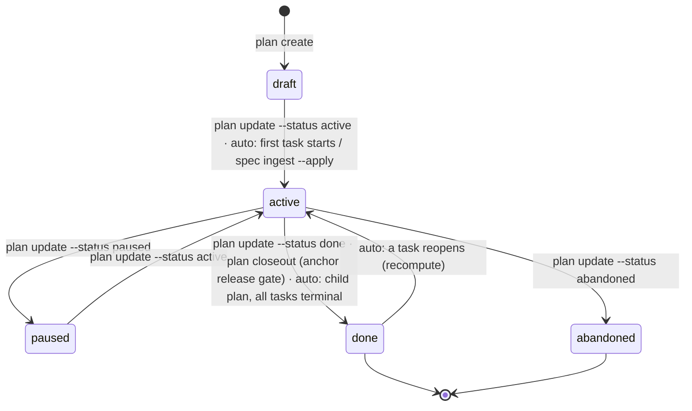
```mermaid
stateDiagram-v2
    [*] --> draft : plan create
    draft --> active : plan update --status active · auto: first task starts / spec ingest --apply
    active --> paused : plan update --status paused
    paused --> active : plan update --status active
    active --> done : plan update --status done · plan closeout (anchor release gate) · auto: child plan, all tasks terminal
    active --> abandoned : plan update --status abandoned
    done --> active : auto: a task reopens (recompute)
    done --> [*]
    abandoned --> [*]
```

| From | Legal targets | Source |
|---|---|---|
| `draft` | `active` | `transitions.cpp` plan arm |
| `active` | `paused`, `done`, `abandoned` | |
| `paused` | `active` | |
| `done`, `abandoned` | none for operator verbs | |

Notes:

- `plan update` has no `--force`. The only way out of `done` is the engine
  roll-up (a task on the plan leaves terminal status), never an operator verb.
- `plan update --status done|abandoned` with open descendants prints an
  advisory warning; it does not refuse.
- `paused` and `abandoned` are operator overrides: the roll-up in 4.1 returns
  early without touching them.
- `plan closeout` writes `done` directly after its hard gate passes (4.3),
  bypassing the anchor cap in the roll-up. That is the anchor release gate.

### 2.2 Plan step

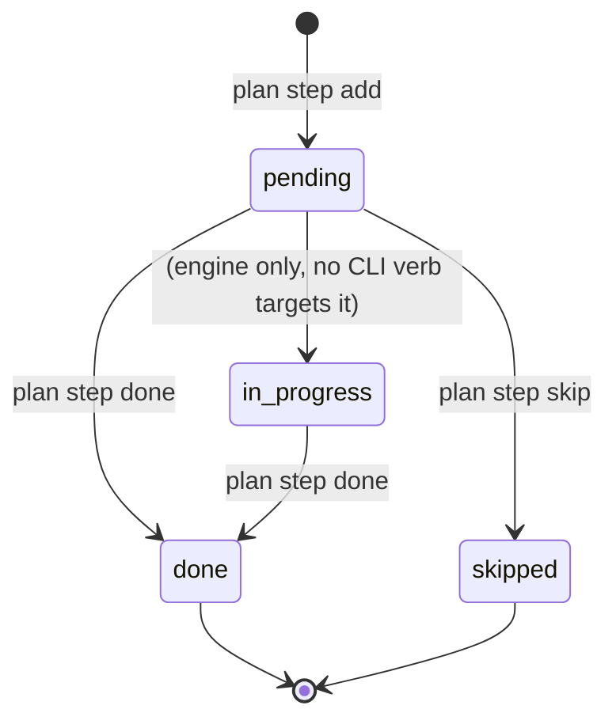
```mermaid
stateDiagram-v2
    [*] --> pending : plan step add
    pending --> in_progress : (engine only, no CLI verb targets it)
    pending --> done : plan step done
    in_progress --> done : plan step done
    pending --> skipped : plan step skip
    done --> [*]
    skipped --> [*]
```

The stored spelling of the in-flight state is `in-progress` (hyphen).
`skip` is legal only from `pending`; `done` is legal from `pending` or
`in-progress`. Source: `src/engine/planning/plan_step.cppm`.

### 2.3 Task

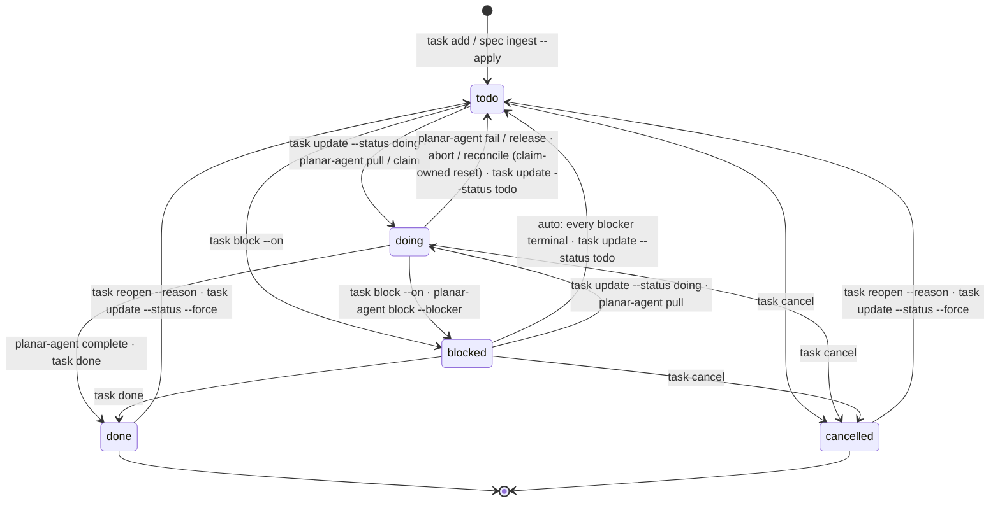
```mermaid
stateDiagram-v2
    [*] --> todo : task add / spec ingest --apply
    todo --> doing : task update --status doing · planar-agent pull / claim
    todo --> blocked : task block --on
    todo --> cancelled : task cancel
    doing --> todo : planar-agent fail / release · abort / reconcile (claim-owned reset) · task update --status todo
    doing --> blocked : task block --on · planar-agent block --blocker
    doing --> done : planar-agent complete · task done
    doing --> cancelled : task cancel
    blocked --> todo : auto: every blocker terminal · task update --status todo
    blocked --> doing : task update --status doing · planar-agent pull
    blocked --> done : task done
    blocked --> cancelled : task cancel
    done --> todo : task reopen --reason · task update --status --force
    cancelled --> todo : task reopen --reason · task update --status --force
    done --> [*]
    cancelled --> [*]
```

Verb to edge map (`src/cmd/planar/handlers/task/command.cpp`,
`src/engine/planning/task.cpp`):

| Verb | Edge | Guards and side effects |
|---|---|---|
| `task done [--force]` | any non-terminal → `done` | claim guard; matrix; clears unblocked dependents; plan recompute |
| `task cancel` | any non-terminal → `cancelled` | claim guard; **no `--force` flag**; clears dependents; recompute |
| `task block <id> --on <blocker> [--force]` | `todo`/`doing` → `blocked` | claim guard; matrix; writes `entity_links` `depends-on` edge |
| `task reopen --reason <r> [--status s] [--force]` | `done`/`cancelled` → `todo` (default) or `--status` | `--reason` refused if empty; writes `task_reopens` row; recompute |
| `task update --status <s> [--force] [--no-auto-promote]` | any matrix edge | claim guard only when `--status` present; `--force` bypasses matrix and claim guard; cross-scope guard runs here only |
| `planar-agent complete / fail / release / block` | see 3.1 | claim must be live; same transaction flips claim and task |

Guards:

- **Claim-atomic guard.** Every operator status flip refuses while an
  `agent_work_claims` row on the task is `active` with an unexpired lease.
  `--force` (where it exists) bypasses both the guard and the matrix. A
  failing claim lookup is itself a refusal (fail closed).
- **`blocked` is derived state.** The only verb that parks a task there is
  `block --on <blocker>`, and it writes the `depends-on` edge in the same
  transaction. Completing or cancelling the *last* non-terminal blocker flips
  the dependent `blocked → todo` automatically with the audit summary
  `unblocked: task <id> is terminal` (decision 1122). Partial clearance is a
  no-op.
- **`--no-auto-promote`** exists on `task add` and `task update` only.
  `done`, `cancel`, `block` and `reopen` always run the plan roll-up.

### 2.4 Question

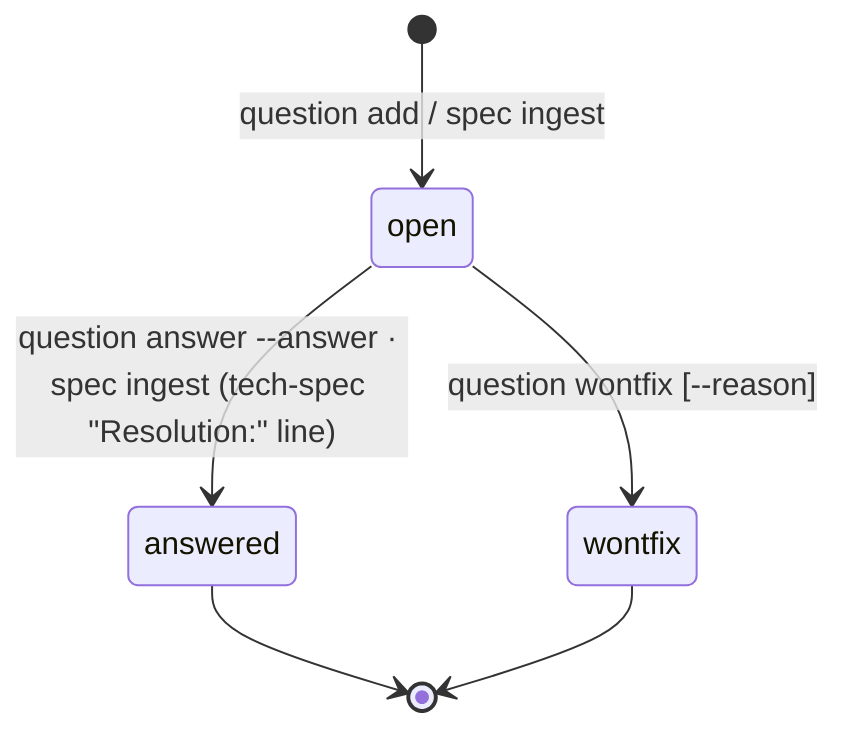
```mermaid
stateDiagram-v2
    [*] --> open : question add / spec ingest
    open --> answered : question answer --answer · spec ingest (tech-spec "Resolution:" line)
    open --> wontfix : question wontfix [--reason]
    answered --> [*]
    wontfix --> [*]
```

Both terminals are absolute: there is no `question reopen`. Re-answering an
`answered` question succeeds (identity move) and overwrites the answer. This
arm never reports `unknown_status`; every non-`open` source is
`IllegalTransition`.

### 2.5 Decision

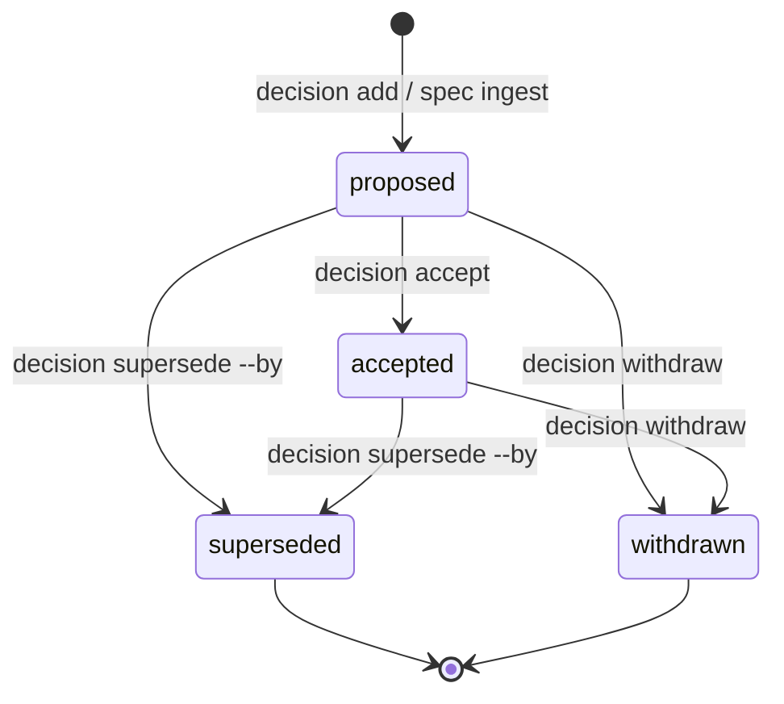
```mermaid
stateDiagram-v2
    [*] --> proposed : decision add / spec ingest
    proposed --> accepted : decision accept
    proposed --> superseded : decision supersede --by
    proposed --> withdrawn : decision withdraw
    accepted --> superseded : decision supersede --by
    accepted --> withdrawn : decision withdraw
    superseded --> [*]
    withdrawn --> [*]
```

Acceptance is not reversible. `supersede` also writes a `supersedes`
`entity_links` edge and refuses a duplicate edge separately from the
terminal refusal (`decision <id> is terminal; cannot supersede`).

### 2.6 Test scenario

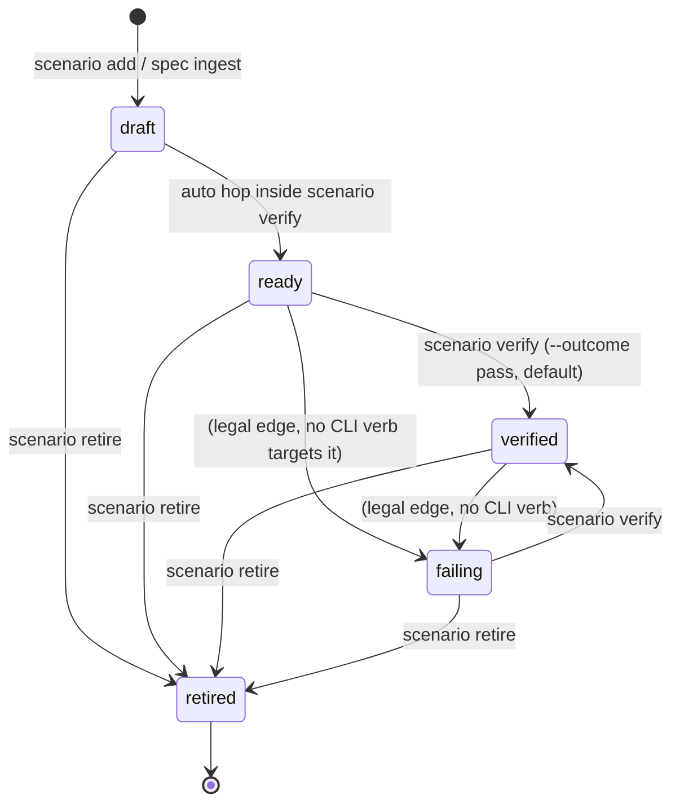
```mermaid
stateDiagram-v2
    [*] --> draft : scenario add / spec ingest
    draft --> ready : auto hop inside scenario verify
    draft --> retired : scenario retire
    ready --> verified : scenario verify (--outcome pass, default)
    ready --> failing : (legal edge, no CLI verb targets it)
    ready --> retired : scenario retire
    verified --> failing : (legal edge, no CLI verb)
    verified --> retired : scenario retire
    failing --> verified : scenario verify
    failing --> retired : scenario retire
    retired --> [*]
```

- There is **no `scenario ready` verb**. `verify` on a `draft` walks
  `draft → ready → verified` as two matrix-checked hops in one transaction,
  writing an intermediate audit row `ready: auto-transition via verify`.
- `verify --outcome fail|error|skipped` stamps `last_outcome` and
  `last_run_at` only and never consults the matrix, so a `retired` scenario
  accepts `--outcome skipped` but refuses the default `pass`.
- `last_outcome` value set: `pass`, `fail`, `error`, `skipped`.

### 2.7 Artifact

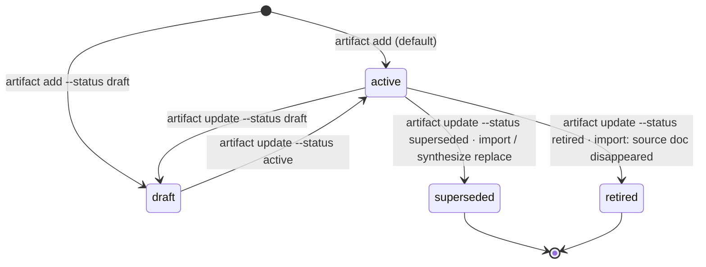
```mermaid
stateDiagram-v2
    [*] --> active : artifact add (default)
    [*] --> draft : artifact add --status draft
    draft --> active : artifact update --status active
    active --> draft : artifact update --status draft
    active --> superseded : artifact update --status superseded · import / synthesize replace
    active --> retired : artifact update --status retired · import: source doc disappeared
    superseded --> [*]
    retired --> [*]
```

The artifact arm is the one family whose second state can walk back to its
first (`active → draft`), and the one whose terminals are reachable only via
`active` (no `draft → superseded|retired`). All sixteen edges were
oracle-verified; see the comment block in `transitions.cppm`.

### 2.8 Annotation (retention-tier model, plan 692)

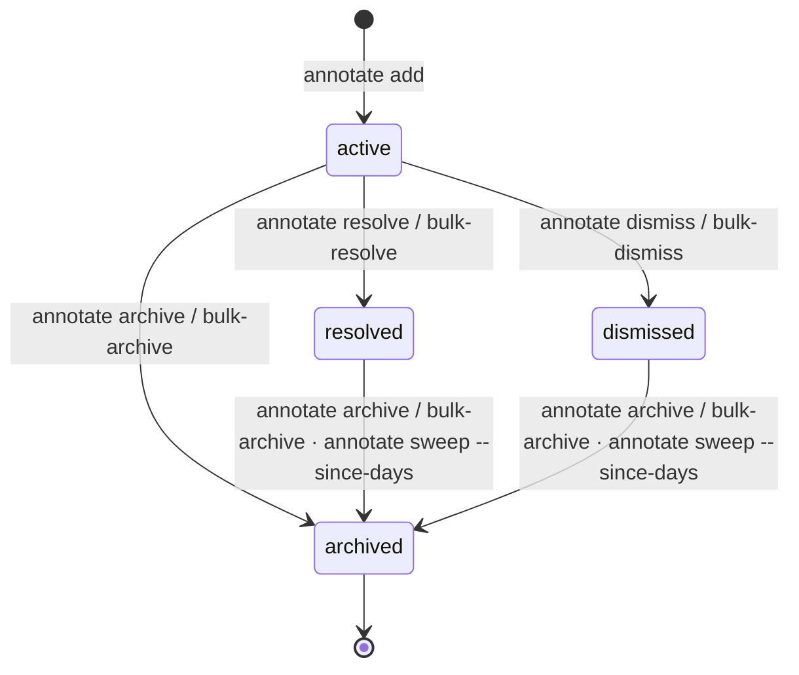
```mermaid
stateDiagram-v2
    [*] --> active : annotate add
    active --> resolved : annotate resolve / bulk-resolve
    active --> dismissed : annotate dismiss / bulk-dismiss
    active --> archived : annotate archive / bulk-archive
    resolved --> archived : annotate archive / bulk-archive · annotate sweep --since-days
    dismissed --> archived : annotate archive / bulk-archive · annotate sweep --since-days
    archived --> [*]
```

Outcome states never move laterally or back to `active`. `bulk-resolve` and
`bulk-dismiss` select only `active` rows; `bulk-archive` selects any
non-archived row. `sweep` archives file-anchored `resolved`/`dismissed`
rows older than `--since-days` (default 30; `0` means every eligible row).

### 2.9 Handoff

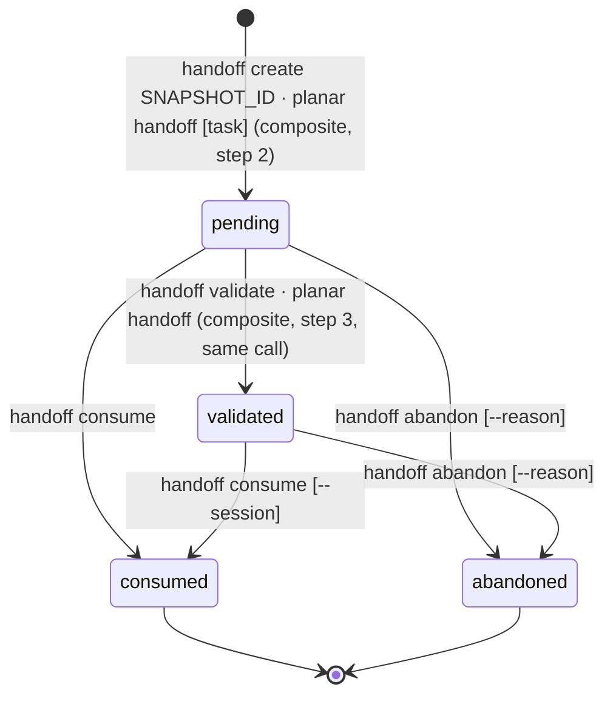
```mermaid
stateDiagram-v2
    [*] --> pending : handoff create SNAPSHOT_ID · planar handoff [task] (composite, step 2)
    pending --> validated : handoff validate · planar handoff (composite, step 3, same call)
    pending --> consumed : handoff consume
    pending --> abandoned : handoff abandon [--reason]
    validated --> consumed : handoff consume [--session]
    validated --> abandoned : handoff abandon [--reason]
    consumed --> [*]
    abandoned --> [*]
```

Validation is not reversible. `abandon` does not clear `validated_at` or
`consumed_at`, and `--reason` is read and discarded (no column stores it).
The full handoff and resume workflow is in 5.7.

### 2.10 Session

Sessions have **no status column**. A session is active while
`ended_at IS NULL`.

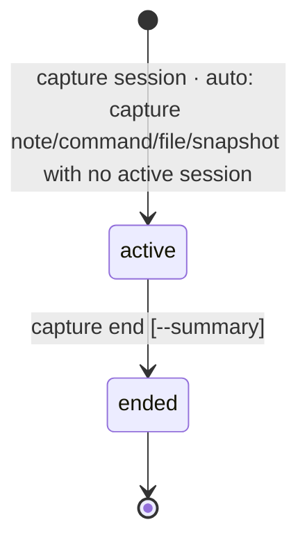
```mermaid
stateDiagram-v2
    [*] --> active : capture session · auto: capture note/command/file/snapshot with no active session
    active --> ended : capture end [--summary]
    ended --> [*]
```

`capture commits` and the composite `planar handoff` verb require a
pre-existing active session and refuse otherwise. `session_entries.prefix`
value set: `action`, `observation`, `decision`, `question`, `file`,
`command`, `note`, `error`, `read`.

---

## 3. Agent coordination (`planar-agent`)

### 3.1 Agent work claim

Value set from `migrations/00015_agent_activity.up.sql`: `active`,
`released`, `completed`, `aborted`, `stale`. A claim is **live** only when
`status = 'active' AND lease_expires_at >= now`; an expired lease keeps
`status = 'active'` until a sweep flips it.

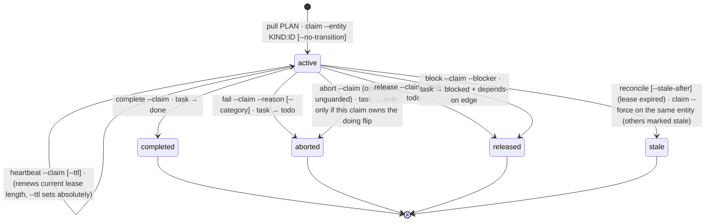
```mermaid
stateDiagram-v2
    [*] --> active : pull PLAN · claim --entity KIND:ID [--no-transition]
    active --> active : heartbeat --claim [--ttl] · (renews current lease length, --ttl sets absolutely)
    active --> completed : complete --claim · task → done
    active --> aborted : fail --claim --reason [--category] · task → todo
    active --> aborted : abort --claim (operator, unguarded) · task → todo only if this claim owns the doing flip
    active --> released : release --claim · task → todo
    active --> released : block --claim --blocker · task → blocked + depends-on edge
    active --> stale : reconcile [--stale-after] (lease expired) · claim --force on the same entity (others marked stale)
    completed --> [*]
    aborted --> [*]
    released --> [*]
    stale --> [*]
```

Each terminal verb runs one transaction
(`src/engine/runtime/agentatomic.cpp`): fetch claim → require live →
require `entity_kind = task` → `check_transition` → flip `tasks.status` →
close every open `agent_actions` row on the claim → flip claim status →
plan recompute → commit.

| Verb | `tasks.status` | claim | open actions closed with `outcome` |
|---|---|---|---|
| `complete` | `done` | `completed` | `ok` |
| `fail` | `todo` (+ `failure_category`) | `aborted` | `error` |
| `release` | `todo` | `released` | `aborted` |
| `block` | `blocked` | `released` | `aborted` |

`failure_category` value set: `usage_limit`, `context_limit`,
`output_limit`, `tool_failure`, `validation`, `unknown` (default).

Errors: `ClaimNotActive` when the liveness check fails (terminal, expired,
unknown token); `IllegalTransition` when the task is not in a state the
verb can move (for example `complete` on a `--no-transition` claim whose task
is still `todo`). Both exit 1 with the transaction rolled back.

TTL: default 600 s on `pull`, `claim` and `heartbeat --ttl`. A heartbeat
without `--ttl` renews the lease by its *current* length (task 6093); it does
not resurrect an already-expired lease.

### 3.2 The claim ritual

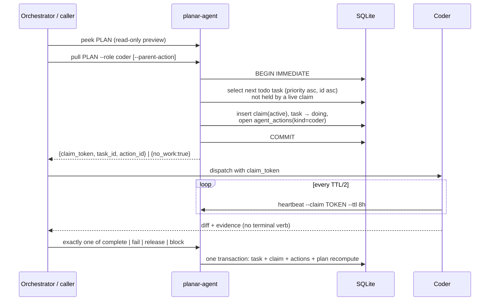
```mermaid
sequenceDiagram
    participant O as Orchestrator / caller
    participant A as planar-agent
    participant DB as SQLite
    participant C as Coder

    O->>A: peek PLAN (read-only preview)
    O->>A: pull PLAN --role coder [--parent-action]
    A->>DB: BEGIN IMMEDIATE
    A->>DB: select next todo task (priority asc, id asc)<br/>not held by a live claim
    A->>DB: insert claim(active), task → doing,<br/>open agent_actions(kind=coder)
    A->>DB: COMMIT
    A-->>O: {claim_token, task_id, action_id} | {no_work:true}
    O->>C: dispatch with claim_token
    loop every TTL/2
        C->>A: heartbeat --claim TOKEN --ttl 8h
    end
    C-->>O: diff + evidence (no terminal verb)
    O->>A: exactly one of complete | fail | release | block
    A->>DB: one transaction: task + claim + actions + plan recompute
```

Rules that follow from the code:

- `pull` selects from **one plan only** and does not walk child plans;
  `planar plan next` does. `pull` also does **not** consult `depends-on`
  edges; only the `next` recommendation strategy excludes tasks whose
  transitive blockers are not done.
- Never split a terminal verb into `planar task done` + `planar-agent
  release`: process death between the two strands the claim.
- If the process dies with no terminal verb, the lease expires, the task
  stays `doing`, and `reconcile` later marks the claim `stale` and resets
  the task to `todo` only when an action row proves that claim performed the
  `todo → doing` flip and no other live claim holds the task.

### 3.3 Agent action

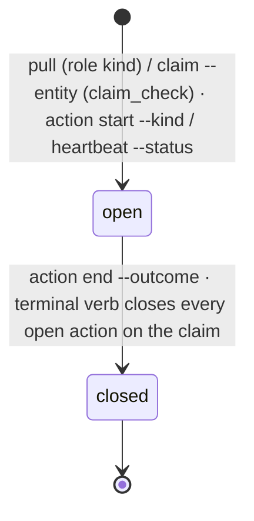
```mermaid
stateDiagram-v2
    [*] --> open : pull (role kind) / claim --entity (claim_check) · action start --kind / heartbeat --status
    open --> closed : action end --outcome · terminal verb closes every open action on the claim
    closed --> [*]
```

`action_kind` set: `planner`, `ingestor`, `coder`, `test_coder`,
`reviewer`, `ext_sync`, `ext_propagate`, `orchestrator`, `resume`,
`workbench_sync`, `spec_draft`, `claim_check`, `heartbeat`, `tool_call`,
`user_message`, `assistant_message`, `other`. `outcome` set: `ok`, `error`,
`aborted`, `timeout`. `parent_action_id` builds the orchestrator → coder
forest that `planar-watch tree` walks.

### 3.4 Workflow run and context records (context plane)

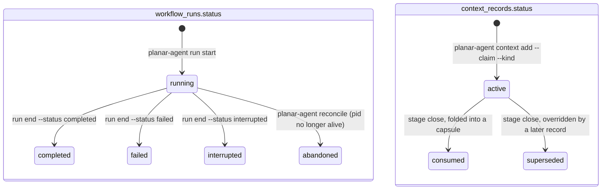
```mermaid
stateDiagram-v2
    state "workflow_runs.status" as R {
        [*] --> running : planar-agent run start
        running --> completed : run end --status completed
        running --> failed : run end --status failed
        running --> interrupted : run end --status interrupted
        running --> abandoned : planar-agent reconcile (pid no longer alive)
    }
    state "context_records.status" as X {
        [*] --> active : planar-agent context add --claim --kind
        active --> consumed : stage close, folded into a capsule
        active --> superseded : stage close, overridden by a later record
    }
```

`context_records.kind` set: `finding`, `risk`, `artifact`, `followup`,
`summary`, `capsule`. Raw records are never deleted; a `capsule` row's
`compiled_from` lists the ids it distilled. Claims carry nullable
`run_id`/`stage` so `context add` can stamp them server-side.

The separate `runs` table (`planar run start/event/finish`, `planar bench`)
is the measurement rig: its `status` is free text with default `running`,
and `finish` accepts any caller-supplied terminal string.

### 3.5 Routing dispatch authorization

Two-phase, immutable-evidence flow in `src/engine/routing/`:

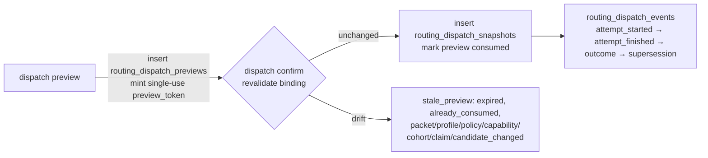
```mermaid
flowchart LR
    P[dispatch preview] -->|insert routing_dispatch_previews<br/>mint single-use preview_token| T{dispatch confirm<br/>revalidate binding}
    T -->|unchanged| S[insert routing_dispatch_snapshots<br/>mark preview consumed]
    T -->|drift| E[stale_preview: expired, already_consumed,<br/>packet/profile/policy/capability/<br/>cohort/claim/candidate_changed]
    S --> V[routing_dispatch_events<br/>attempt_started → attempt_finished → outcome → supersession]
```

Snapshot `terminal_state` set: `pending`, `completed`, `quality_failed`,
`spawn_failed`, `cancelled`, `aborted`, `candidate_mismatch`,
`missing_evidence`. `operator_decision`: `confirmed`, `overridden`.
`reviewer_disposition`: `required`, `approved`, `request_changes`,
`bypassed`, `not_reached`. Snapshots and events are trigger-protected
against update and delete. This machine is independent of the claim
machine; a preview only *carries* the claim token as one bound value.

### 3.6 Host queue entry

One row of `queue_entries` in `planar.db`, from `queue run` to its
`queue_history` row. The store's `state` column holds only `waiting` and
`running`; `terminating` is a `running` entry carrying the stop markers
(`terminating_since_mono`, `terminate_reason`), and each outcome is the
`outcome` of the history row that replaces the entry when it ends
(`queue_history.outcome` `CHECK`). The transitions are in
`src/engine/hostqueue/` (`poll.cpp`, `terminate.cpp`, `history.cpp`,
`queue.cpp`) and in the submitter's loop in
`src/cmd/planar-agent/handlers/queue/queue.cpp`.

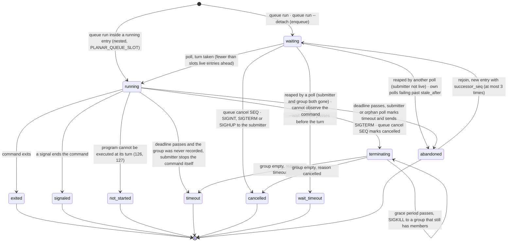
```mermaid
stateDiagram-v2
    [*] --> waiting : queue run · queue run --detach (enqueue)
    [*] --> running : queue run inside a running entry (nested, PLANAR_QUEUE_SLOT)
    waiting --> running : poll, turn taken (fewer than slots live entries ahead)
    waiting --> cancelled : queue cancel SEQ · SIGINT, SIGTERM or SIGHUP to the submitter
    waiting --> wait_timeout : --wait-timeout passes before the turn
    waiting --> abandoned : reaped by another poll (submitter not live) · own polls failing past stale_after
    abandoned --> waiting : rejoin, new entry with successor_seq (at most 3 times)
    running --> exited : command exits
    running --> signaled : a signal ends the command
    running --> not_started : program cannot be executed at its turn (126, 127)
    running --> terminating : deadline passes, submitter or orphan poll marks timeout and sends SIGTERM · queue cancel SEQ marks cancelled
    running --> timeout : deadline passes and the group was never recorded, submitter stops the command itself
    running --> abandoned : reaped by a poll (submitter and group both gone) · cannot observe the command
    terminating --> terminating : grace period passes, SIGKILL to a group that still has members
    terminating --> timeout : group empty, reason timeout
    terminating --> cancelled : group empty, reason cancelled
    exited --> [*]
    signaled --> [*]
    not_started --> [*]
    timeout --> [*]
    cancelled --> [*]
    wait_timeout --> [*]
    abandoned --> [*]
```

`waiting`, `running` and `terminating` are the live states; every other node
is an outcome, and ending an entry deletes its row and writes its one history
row in a single transaction, so an entry is never in both tables.

| Edge | Fired by | Source |
|---|---|---|
| `[*]` to `waiting` | The submitter's insert. A nested run (a queued command that calls `queue run`) skips the wait: its entry is inserted `running` with `parent_seq`, outside the slot count and the arrival order. | `enqueue`, `queue.cpp` |
| `waiting` to `running` | A poll that finds the entry among the first `slots` standing entries, nested ones not counted, after reaping the entries that are not live. It records the start time, the deadline and the run limit in one statement. | `poll` step 4, `poll.cpp` |
| `waiting` to `cancelled` | `queue cancel` removes the entry in one transaction that first checks it is still waiting, so a turn taken meanwhile cannot strand a command; a signal to the submitter removes its own entry and the submitter exits 125. | `cancel_waiting`, `terminate.cpp`; `interrupted`, handler |
| `waiting` to `wait_timeout` | The submitter's own check after a poll, so an entry whose turn has come at its limit runs. | handler wait loop |
| `waiting` or `running` to `abandoned` | Liveness fails: a waiting entry is live only while its submitter exists, its start time matches and it was refreshed within `stale_after`; a running entry is also live while its recorded group has members. A poll by any submitter reaps it. | `judge_liveness`, `poll` step 2 |
| `abandoned` to `waiting` | A waiting submitter whose entry went missing reads its history row, finds `abandoned` and inserts a new entry that keeps the original wait deadline. `successor_seq` on the old row names the new one, and `queue status` follows the chain. A fourth reaping exits 125. | `rejoin`, `history.cpp` |
| `running` to `exited`, `signaled` | The submitter observes its command end. `signaled` records the signal, and the submitter exits 128 plus it. A command that dies of a stopping signal ends as `timeout` or `cancelled`, never `signaled`. | `end_entry`, handler |
| `running` to `not_started` | The command vanished or lost its execute permission while the entry waited. The exit code recorded is 127 or 126. | handler |
| `running` to `terminating` | `begin_terminate` commits the marker, then sends SIGTERM to the recorded group. The submitter does this at its own deadline; a poll by another submitter does it for an overdue orphan; `queue cancel` does it with reason `cancelled` and the canceller recorded. | `poll` step 3, `begin_terminate` |
| `terminating` to itself | `advance_terminations` sends SIGKILL once the entry has been terminating for `[queue] grace`. The entry keeps its slot. | `advance_terminations` |
| `terminating` to `timeout`, `cancelled` | The group is empty (or its id was reused): the entry ends with the outcome its reason names. The submitter exits 124 for `timeout` and 125 for `cancelled`. A poll reaps a terminating entry whose submitter is gone the same way. | `advance_terminations`, `stopped_end` in `poll.cpp` |
| `running` to `timeout` | No group was recorded, so no other process can judge or signal one: the submitter stops the command itself and ends the entry once the command's first process exits. | handler, `local_timeout` |

A submitter whose running entry is reaped while it is alive does not rejoin
and does not run the command again. It keeps supervising, still stops the
command at its deadline, and exits with the command's status while the
history row says `abandoned`. The limits this leaves are listed in
[cli-reference.md](cli-reference.md#known-limits).

---

## 4. Engine roll-ups (derived transitions)

### 4.1 Plan auto-promotion

Runs inside every task write (`recompute_status`,
`src/engine/planning/plan.cpp`). Input is the plan's **own** task
aggregate; child plans never roll up into their parent.

| Current plan | Task aggregate | Target |
|---|---|---|
| any | zero tasks | no change |
| `draft` | all terminal (`todo = doing = blocked = 0`) | anchor: `active`; child: `done` |
| `draft` | any `doing` or `blocked` | `active` |
| `draft` | otherwise (only `todo`) | no change |
| `active` | all terminal | anchor: no change; child: `done` |
| `done` | not all terminal | `active` |
| `paused`, `abandoned` | any | returns before evaluation |

`is_anchor` means `parent_plan_id IS NULL`. Anchors close only through
`plan update --status done` or `plan closeout`. Each flip writes an
`audit_log` row with summary
`recompute plan <id>: <from> → <to>; tasks todo=… doing=… blocked=… done=… cancelled=…`
(see 7 for the stale `plan_status:` claim). `plan recompute-status --all`
walks only open-status plans so a terminal plan is never resurrected by a
bulk sweep.

### 4.2 Dependency unblocking

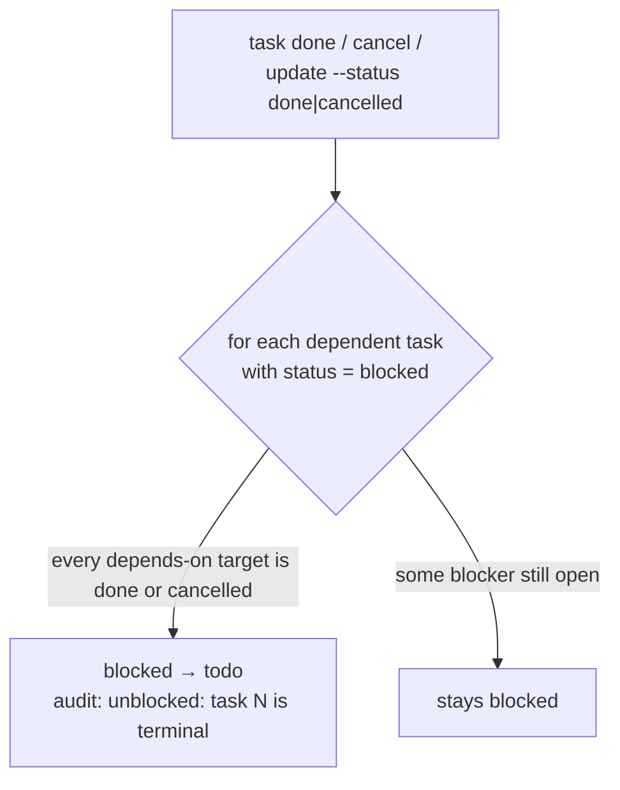
```mermaid
flowchart TD
    A["task done / cancel /<br/>update --status done|cancelled"] --> B{for each dependent task<br/>with status = blocked}
    B -->|every depends-on target is done or cancelled| C[blocked → todo<br/>audit: unblocked: task N is terminal]
    B -->|some blocker still open| D[stays blocked]
```

### 4.3 Closeout gate

`plan closeout <id> [--dry-run] [--check-merge]`
(`src/engine/planning/closeout.cppm`):

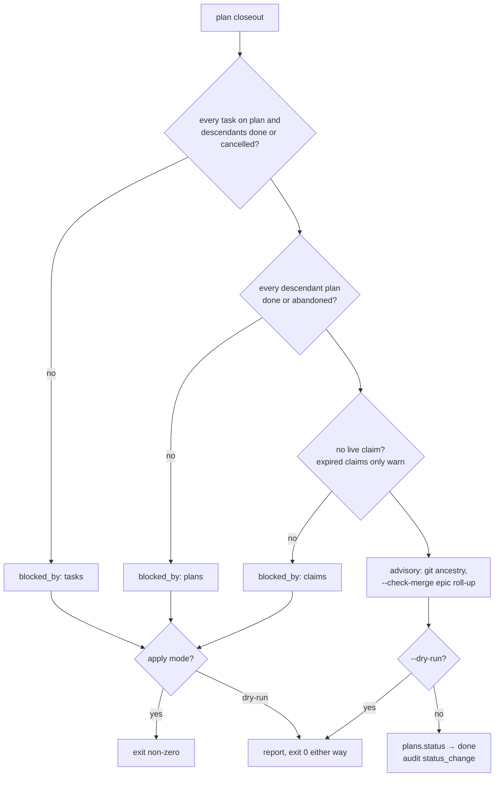
```mermaid
flowchart TD
    S[plan closeout] --> G1{every task on plan and<br/>descendants done or cancelled?}
    G1 -->|no| B[blocked_by: tasks]
    G1 --> G2{every descendant plan<br/>done or abandoned?}
    G2 -->|no| B2[blocked_by: plans]
    G2 --> G3{no live claim?<br/>expired claims only warn}
    G3 -->|no| B3[blocked_by: claims]
    G3 --> ADV[advisory: git ancestry,<br/>--check-merge epic roll-up]
    ADV --> M{--dry-run?}
    M -->|yes| R0[report, exit 0 either way]
    M -->|no| W[plans.status → done<br/>audit status_change]
    B --> X{apply mode?}
    B2 --> X
    B3 --> X
    X -->|yes| NZ[exit non-zero]
    X -->|dry-run| R0
```

### 4.4 Resume readiness

Two rules, checked in order, used by `planar resume validate`, the
composite `handoff` verb (advisory) and `planar health`:

1. `next_action` is non-empty (byte length; whitespace passes).
2. At least one `context_snapshots` row has this `task_id` (a session-level
   snapshot with NULL `task_id` does not count).

Task status is not checked: a `done` task can be `resumable: true`.

### 4.5 Health

`overall` is two-valued: `ok` or `degraded`. It moves one way.

```
degraded = !db_ok || !integrity_ok || not_resumable_tasks > 0 || stale_handoffs > 0
        || installed projection manifest is legacy/invalid/unsupported
        || any managed projection row is stale/missing
```

`stale_handoffs` counts `pending` handoffs older than 24 h.
`inflight_tasks` are `doing` and `blocked`. Recovery routing is in 5.8.

---

## 5. Workflows

### 5.1 The delivery lifecycle (orchestrator)

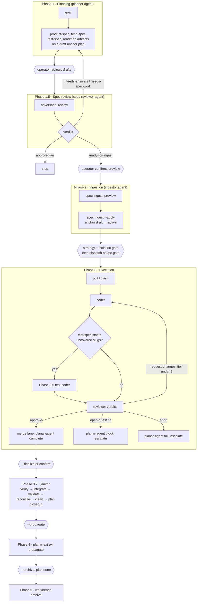
```mermaid
flowchart TD
    subgraph P1["Phase 1 · Planning (planner agent)"]
        A1[goal] --> A2[product-spec, tech-spec,<br/>test-spec, roadmap artifacts<br/>on a draft anchor plan]
    end
    A2 --> G1{{operator reviews drafts}}
    G1 --> P15
    subgraph P15["Phase 1.5 · Spec review (spec-reviewer agent)"]
        B1[adversarial review] --> B2{verdict}
    end
    B2 -->|needs-answers / needs-spec-work| A2
    B2 -->|abort-replan| STOP1[stop]
    B2 -->|ready-for-ingest| G2{{operator confirms preview}}
    G2 --> P2
    subgraph P2["Phase 2 · Ingestion (ingestor agent)"]
        C1[spec ingest, preview] --> C2[spec ingest --apply<br/>anchor draft → active]
    end
    C2 --> G3{{strategy + isolation gate<br/>then dispatch-shape gate}}
    G3 --> P3
    subgraph P3["Phase 3 · Execution"]
        D1[pull / claim] --> D2[coder] --> D25{test-spec status<br/>uncovered slugs?}
        D25 -->|yes| D3[Phase 3.5 test-coder] --> D4
        D25 -->|no| D4[reviewer verdict]
        D4 -->|request-changes, iter under 5| D2
        D4 -->|approve| D5[merge lane, planar-agent complete]
        D4 -->|open-question| D6[planar-agent block, escalate]
        D4 -->|abort| D7[planar-agent fail, escalate]
    end
    D5 --> G4{{--finalize or confirm}}
    G4 --> P37[Phase 3.7 · janitor<br/>verify → integrate → validate →<br/>reconcile → clean → plan closeout]
    P37 --> G5{{--propagate}}
    G5 --> P4[Phase 4 · planar-ext ext propagate]
    P4 --> G6{{--archive, plan done}}
    G6 --> P5[Phase 5 · workbench archive]
```

Phase selection keys off the anchor plan status: `draft` without artifacts
→ Phase 1; `draft` reviewed → Phase 2; `active`/`paused` → Phase 3 (plus
3.7 and 4 on request); `done` → offer Phase 5. Double-bordered nodes
are operator gates; the orchestrator never crosses one silently.

Reviewer verdicts and what each triggers (`agents/planar-reviewer.md`):

| Verdict | Terminal verb | Then |
|---|---|---|
| `approve` | `planar-agent complete` (after fan-in for worktree lanes) | next cycle; plan roll-up closes child plans |
| `request-changes` | none; heartbeat the claim | re-spawn coder; at iteration 5 collapses to forced `approve` or `abort` |
| `open-question` | `planar-agent block` | escalate to operator |
| `abort` | `planar-agent fail` | halt cycle (whole queue under barrel-deferred), escalate with WIP |

Janitor result contract: `closed`, `blocked-with-reasons`, `abort`. Its
preferred closeout path is
`planar-execute run workflows/finalize_closeout.lua --phase closeout`,
falling back to `planar plan closeout --dry-run` then apply.

### 5.2 Spec ingest

Only `spec ingest` exists as a binary verb; drafting and review are skills.
Inputs are the anchor's `tech_spec`, `roadmap` and `test_spec` artifacts,
read back from the workbench feature directory.

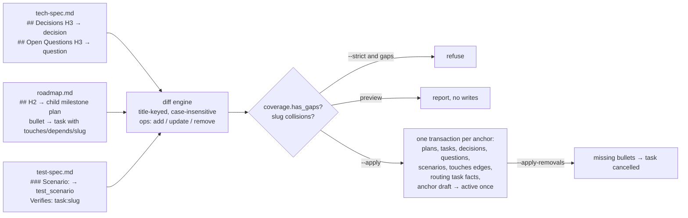
```mermaid
flowchart LR
    T[tech-spec.md<br/>## Decisions H3 → decision<br/>## Open Questions H3 → question] --> D
    R[roadmap.md<br/>## H2 → child milestone plan<br/>bullet → task with touches/depends/slug] --> D
    S[test-spec.md<br/>### Scenario: → test_scenario<br/>Verifies: task:slug] --> D
    D[diff engine<br/>title-keyed, case-insensitive<br/>ops: add / update / remove] --> C{coverage.has_gaps?<br/>slug collisions?}
    C -->|--strict and gaps| REF[refuse]
    C -->|preview| OUT[report, no writes]
    C -->|--apply| TX[one transaction per anchor:<br/>plans, tasks, decisions, questions,<br/>scenarios, touches edges,<br/>routing task facts,<br/>anchor draft → active once]
    TX -->|--apply-removals| RM[missing bullets → task cancelled]
```

Preservation rules: a task body is overwritten only when it still
byte-matches a Planar-generated body; a slug is back-filled only when
empty; provenance citations are always restaged; a colliding slug is
warned in preview and fails apply with `SlugConflict` because `tasks.slug`
is globally unique. Ingest does not touch the workbench filesystem; run
`workbench push` afterwards.

### 5.3 Workbench sync

Layout under `$PLANAR_WORKBENCH_ROOT/<assoc>/<plan-key>-<slug>/`:
`README.md` (anchor), `<id>-<slug>.md` artifacts at the feature root,
`plans/`, `tasks/<repo|cross>/`, `decisions/`, `questions/`, `scenarios/`,
and a `.sync` mirror of `workbench_sync_state`. There is no `workbench init`;
the first `push` materializes the tree.

One classification pass serves `status`, `pull`, `push` and `sync`; only
the applied classes differ.

```mermaid
flowchart TD
    F[file + manifest row] --> H{fs hash ≠ content_hash?}
    H -->|no| DBC{entity updated_at ≠ db_updated_at?}
    H -->|yes| DBC2{entity updated_at ≠ db_updated_at?}
    DBC -->|no| NOOP[no_op]
    DBC -->|yes| D2F[db_to_fs<br/>applied by push, sync]
    DBC2 -->|no| F2D[fs_to_db<br/>applied by pull, sync]
    DBC2 -->|yes, bytes differ| CONF[conflict → sync_events<br/>scope=workbench, every mode]
    DBC2 -->|yes, bytes converged| NOOP
    NM[no manifest row] --> NM1{on disk?}
    NM1 -->|no| D2F
    NM1 -->|yes, identical to render| NOOP
    NM1 -->|yes, differs| F2D
    NEW[new file, no entity] --> NEW1{front matter entity_kind = task?}
    NEW1 -->|yes| CREATE[new_on_fs → task add<br/>applied by pull, sync]
    NEW1 -->|no| LEAVE[left alone]
    BAD[unparseable] --> MAL[malformed: never applied,<br/>run exits non-zero]
    CONF --> RES[workbench resolve EVENT --prefer fs / db]
```

Terminal filter (`push`, `restore`, `gc`; `pull` never filters): mode
`failures` (default) excludes `tasks.cancelled`, `plans.abandoned`,
`decisions.superseded|withdrawn`, `questions.wontfix`,
`test_scenarios.retired`, `artifacts.superseded|retired`; mode `all` also
excludes `tasks.done`, `questions.answered`, `test_scenarios.verified`. The
anchor plan is always exempt.

Archive and restore: `workbench archive <plan>` deletes the on-disk tree
and its manifest rows; the DB is untouched, and there is no archive store.
`workbench restore <plan>` re-materializes from the DB through the terminal
filter. "Archived" is purely "the tree does not exist".

### 5.4 External sync (`planar-ext`)

Tables: `external_systems` (`kind`: `jira`, `github-issues`,
`gitlab-issues`, `linear`; only the first two have adapters),
`external_links` (`link_role`: `mirror`, `parent`, `child`, `reference`;
`sync_direction`: `read-only`, `write-back`, `two-way`;
`last_sync_status`: `never`, `ok`, `conflict`, `error`), `sync_events`
(`direction`: `pull`, `push`; `outcome` below).

```mermaid
stateDiagram-v2
    [*] --> never : ext create --from / ext propagate
    never --> ok : sync pull / push (ok or noop)
    never --> conflict : sync pull (two-way, both sides moved)
    never --> error : adapter failure
    ok --> conflict : sync pull
    ok --> error : adapter failure
    ok --> ok : sync pull / push
    conflict --> ok : sync resolve --keep local|remote
    conflict --> conflict : sync pull again
    error --> ok : next successful sync
```

Pull, conflict detection and resolution:

```mermaid
sequenceDiagram
    participant Op as Operator / agent
    participant X as planar-ext
    participant Ad as adapter (Jira / GitHub)
    participant DB as SQLite (RW: external_links, external_systems, sync_events)
    participant P as planar

    Op->>X: sync pull LINK
    X->>Ad: pull(external_id)
    Ad-->>X: remote {title, status, version}
    alt write-back link
        X->>DB: sync_events noop
    else two-way with baseline
        Note over X: per field: remote_changed = remote ≠ baseline<br/>local_changed = local ≠ baseline<br/>conflict = both changed AND remote ≠ local
        alt conflict
            X->>DB: sync_events conflict + evidence token, link → conflict
            X-->>Op: exit sync_conflict
        else clean
            X->>DB: sync_events ok, baseline ← current, link → ok
            X-->>Op: emits remote_title / remote_status (never applied, decision 996)
            Op->>P: planar KIND update … (after verification)
        end
    end
    Op->>X: sync resolve EVENT --keep local|remote --evidence-token --expected-local-updated-at
    Note over X: guards: token matches, event is latest, link still conflict,<br/>local updated_at unchanged, fresh adapter pull equals evidence
    alt keep local
        X->>Ad: push(local title/status)
    else keep remote
        Note over X: no push, no local write, baseline reset so next pull re-emits
    end
    X->>DB: sync_events ok "resolved=SIDE", link → ok
```

`sync_events.outcome` set: `ok`, `conflict`, `error`, `noop` (written by
pull/push/resolve); `strategy-abandoned` (`ext propagate --restrategize`),
`counterpart-missing` (`ext propagate --verify-counterparts`);
`resolved-fs`, `resolved-db`, `partial`, `success`, `failure` belong to the
workbench scope. `planar-ext` enforces its write surface with a
`sqlite3_set_authorizer` allowlist and never applies migrations.

### 5.5 Feature propagation (`planar-ext ext propagate <plan>`)

```mermaid
flowchart TD
    S[ext propagate plan] --> ST{select_strategy}
    ST -->|jira| JE[jira-epic: generic tree walk]
    ST -->|github, single repo| GP[github-parent-issue]
    ST -->|github-projects-v2| NO[refused, decision 1001]
    GP --> P0[probe sub-issue REST support]
    P0 -->|unsupported| ERR[sub_issue_unsupported<br/>hint: --github-strategy tracking-issue]
    P0 --> P1[1. anchor plan → parent issue<br/>cache strategy + parent in config_json]
    P1 --> P2[2. each child plan → sub-issue<br/>then its tasks → sub-issues]
    P2 --> P3[3. anchor's direct tasks → sub-issues]
    P3 --> P4[4. decisions → comments on parent, best effort]
    JE --> W[walk_tree: anchor, children, tasks<br/>same propagate-one core per entity]
    P1 & P2 & P3 & W --> ID{mirror link already exists?}
    ID -->|yes| SKIP[op=skipped, no POST]
    ID -->|no| POST[render template → create_remote → insert mirror link]
```

Template kinds by role: Jira `epic` / `story` / `sub-task`; GitHub
`parent-issue` / `issue` / `sub-task`. `--restrategize` deletes the
subtree's mirror links and writes `strategy-abandoned` events; remote
counterparts are never deleted.

### 5.6 Import and synthesize

Both stage an LLM hand-off through a fingerprint-keyed cache under
`~/.planar/cache/` and converge on the same downstream pipeline
(workbench review → `spec ingest`).

```mermaid
flowchart LR
    I[planar import repo] --> SC[deterministic scan:<br/>AGENTS.md / CLAUDE.md / *.md, tree summary, fingerprint]
    SC -->|no --interpret| OUT[report only]
    SC -->|--interpret| CH{cache/FP.json exists?}
    CH -->|no| PEND[write _pending.json, vendor skill runs LLM, re-invoke]
    CH -->|yes| AP[--apply: child plans per phase, tasks,<br/>artifacts reconciled by source path,<br/>decisions superseded by title,<br/>--apply-removals → cancelled / abandoned]
    SY[planar synthesize repo] --> SC2[scan docs + source areas + tests + CI] --> CH
```

Synthesize additionally requires that a proposed task with `status ≠ todo`
cite a `code_evidence` path that exists. Original docs are kept as
`kind=research` artifacts.

### 5.7 Handoff and resume

```mermaid
sequenceDiagram
    participant A1 as Agent A (ending)
    participant P as planar
    participant A2 as Agent B (fresh, any vendor)

    A1->>P: capture session --vendor … (must exist)
    A1->>P: handoff TASK_ID --note …
    Note over P: 1 snapshot next_action → context_snapshots<br/>2 handoffs row pending (worktree from live claim)<br/>3 handoff validate → validated<br/>4 session note<br/>5 resumability check (advisory only)
    A2->>P: resume validate TASK_ID --json
    P-->>A2: resumable + failures[] with remediation commands
    A2->>P: planar resume TASK_ID
    P-->>A2: 8-section packet (identity, state, plan position,<br/>operational plane, activity, decisions, questions, artifacts)
    A2->>P: handoff consume ID --session NEW
    A2->>P: planar-agent claim --entity task:ID --no-transition (task already doing)
```

### 5.8 Health and doctor

```mermaid
flowchart TD
    H[planar health --json] --> O{overall}
    O -->|ok| DONE[nothing to do]
    O -->|degraded| C{which contributor?}
    C -->|integrity_ok = false| STOP[stop, recovery path, no reconciliation first]
    C -->|schema_current = false| DOC[recovery path, never hand-write migrations]
    C -->|expired claims| R1[planar-agent reconcile --dry-run --json] --> R2{{operator approves}} --> R3[planar-agent reconcile]
    C -->|stale_handoffs > 0| H1[handoff list --status pending] --> H2{{operator confirms}} --> H3[handoff abandon --reason]
    C -->|not_resumable_tasks > 0| T1[audit handoff-readiness;<br/>resume validate ID] --> T2{plan state}
    T2 -->|plan done/abandoned| T3[task cancel]
    T2 -->|plan active, weeks stale| T4[reset to todo]
    T2 -->|under 48 h old| T5[leave alone]
    C -->|projection stale/missing/legacy| RI[./install.sh --prefix PLANAR_HOME]
    R3 & H3 & T3 & T4 --> RE[re-run planar health]
```

`planar health` is read-only; the recovery reference (`skills/planar/references/recovery.md`) is the guided-write companion.
Genuinely active or blocked work can keep `overall = degraded` by design.

### 5.9 Introspect, triage, report

```mermaid
flowchart LR
    I1[planar report --json --days N] --> I2[redacted signal:<br/>failure-cluster, retry-pattern,<br/>abandoned-workflow, gap-feature]
    I2 --> I3{{preview, --apply confirm}}
    I3 --> I4[question add / task add on the<br/>association's planar-feedback plan, title-deduped]
    I4 --> T1{{planar-feedback-triager preview, confirm}}
    T1 --> T2["feedback triage set task:N|question:N<br/>--severity --disposition --reproduction"]
    T2 --> R1{{issue-report preview, confirm}}
    R1 --> R2[gh issue create] --> R3[external_links linkback]
    R3 --> T3[triage set --disposition reported-external]
```

Triage value sets (`feedback_triage` table): severity `info`, `low`,
`medium`, `high`, `critical`; disposition `untriaged`,
`needs-reproduction`, `accepted`, `retained-question`, `dismissed`,
`reported-external`, `duplicate`; reproduction `not-run`, `reproduced`,
`not-reproduced`, `inconclusive`. `duplicate` requires `duplicate_of` and
the chain is cycle-checked. A finding outside the `planar-feedback` plan is
refused as `different_feedback_plan`.

### 5.10 Deterministic workflow run (`planar-execute`)

```mermaid
flowchart LR
    C[caller: LLM harness, janitor,<br/>planar workflow run name] --> E[planar-execute run wf.lua --phase p --args json]
    E --> L{load + init}
    L -->|init_failed / load_failed / phase_missing| X1[exit 1]
    L --> PH[call phase function]
    PH -->|flow.fail| X2[phase_failed, exit 1]
    PH -->|flow.result table| OUT[JSON on stdout, exit 0]
    PH -. host calls .-> HF["cli.* (planar, planar-agent, planar-watch only)<br/>git.* (-C worktree)<br/>fs.* (sandbox root)<br/>flow.* / ctx.*"]
```

Each invocation is one stateless phase; there is no run record or
checkpoint inside `planar-execute`. Resumption means the caller invokes the
next `--phase` using Planar state it reads through `cli.*`. The
twenty-five-entry host manifest is frozen and compile-time disjoint from a
spawn-shaped denylist (`agent`, `parallel`, `spawn`, `claude`, `codex`,
`model`, …). `planar workflow run <name>` only resolves the file and execs
this binary.

---

## 6. Scope resolution (applies to every write above)

```mermaid
flowchart TD
    W[write verb] --> F{--scope given?}
    F -->|yes| U["use verbatim: global | slug | assoc:slug | repo:slug"]
    F -->|no| M{cwd is both an org root<br/>and a member repo root?}
    M -->|yes| AMB[refuse: ambiguous, name both choices, exit 5]
    M -->|under a member repo in an org| REPO[that repo scope]
    M -->|otherwise| D[derive_from_cwd:<br/>longest project root_path prefix]
    D --> N{memberships}
    N -->|0| UNSET[unset: project_unassociated]
    N -->|1| ONE[that association]
    N -->|2+| UNSET2[unset: project_multiple_associations]
    U & REPO & ONE --> G{guarded verb?<br/>spec ingest --apply, feedback triage set,<br/>audit publish-decision, decision accept/withdraw,<br/>task update, closure compute, sync push/pull/resolve}
    G -->|no| WRITE[write]
    G -->|yes| CMP{operator scope covers entity scope?<br/>assoc:org covers repo:member since decision 1121}
    CMP -->|yes| WRITE
    CMP -->|no| REF[scope_mismatch, exit 5, no bypass]
```

Read verbs use a different rule (most-specific candidate wins; an org
expands to the whole workspace; an empty set means refuse, not
"unfiltered"). See [concepts.md § Scope](concepts.md#scope).

---

## 7. Where older prose disagrees with the binary

Found while measuring this page. Each is a documentation bug, not a code
bug, unless noted.

| Claim | Where | What the code does |
|---|---|---|
| Plan status flips write a `session_entries` note beginning `plan_status: <id>`, recoverable with `audit trail --grep "^plan_status:"` | `docs/concepts.md` § Plan (**fixed at task 6825** — now describes the `audit_log` row), `agents/methodology.md` § Plan-status invariant (since fixed) | The C++ roll-up writes an `audit_log` `status_change` row with a free-text summary; no `plan_status:` sentinel is produced anywhere in `src/` |
| `planar health` `overall` is one of `ok`, `degraded`, `critical` | the retired health skill (since removed; fixed — now names `ok` and `degraded`) | Two values only, `ok` and `degraded` (`src/engine/health/health.cpp`) |
| Whole-tree `ext propagate <plan>` is not yet implemented | the retired propagate skill (since removed); `docs/cli-reference.md` § `planar-ext ext propagate`, its `workbench publish` and `link --propagate` cross-references (**fixed at task 6825**) | Both the `github-parent-issue` arm and the generic tree-walk arm (task 6451) are wired in `src/cmd/planar-ext/handlers/ext/propagate.cpp`; only `github-projects-v2` refuses (decision 1001) |
| `planar models list\|refresh\|routing\|apply\|candidates` exist, and `models evals` takes only `--json` | `docs/cli-reference.md` § Domain `models`, `docs/concepts.md` § Model routing, `docs/workflows.md` Recipe 25, `docs/skill-reference.md` § Role values on flags (**all fixed at task 6825**) | The `models` group's subcommands are exactly `evals`, `resolve`, `experiments`, `outcomes`, `registry`; `evals` declares ten cohort flags (`src/cmd/planar/handlers/models/evals.cppm`). The binary's own `planar models --help` group description still narrates the removed family — a binary-side drift, not fixed here |
| Workbench terminal filter's primary module is `src/engine/workbench/terminal.zig` | `docs/concepts.md` § Workbench (**fixed at task 6926** — now cites `src/engine/workbench/terminal.cppm`) | `src/engine/workbench/terminal.cppm` |
| `closure compute` is deferred with its dependencies | header comment in `src/engine/closure/store.cppm` | `compute.cpp` implements the tree-sitter extraction and is wired to `planar closure compute` |
| `derive_from_cwd` redirects a git-worktree cwd to its parent repo | Zig-era behaviour | Not ported; the module header names it as a residual gap |

---

## 8. Source index

| Machine | Matrix / rule | Value set |
|---|---|---|
| plan, task, question, decision, scenario, artifact, annotation, handoff | `src/engine/planning/transitions.cpp` | `migrations/00002_planning.up.sql`, `00003_work_items.up.sql`, `00005_sessions.up.sql`, `00012_annotations.up.sql` |
| plan step | `src/engine/planning/plan_step.cppm` | `00003_work_items.up.sql` |
| plan auto-promotion | `compute_target`, `src/engine/planning/plan.cpp` | |
| dependency unblock | `clear_unblocked_dependents`, `src/engine/planning/task.cpp` | `00033_rename_blocks_to_depends_on.up.sql` |
| closeout gate | `src/engine/planning/closeout.cppm` | |
| agent claim, action | `src/engine/runtime/agentactivity.cpp`, `agentatomic.cpp` | `00015_agent_activity.up.sql`, `00029_agent_failure_categories.up.sql` |
| workflow run, context record | `src/engine/runtime/workflowruns.cppm` | `00022_workflow_context_plane.up.sql` |
| host queue entry | `src/engine/hostqueue/{poll,terminate,history,queue}.cpp`, `src/cmd/planar-agent/handlers/queue/queue.cpp` | `00040_host_queue.up.sql` |
| routing dispatch | `src/engine/routing/routing.cppm` | `00030_adaptive_routing_evidence.up.sql`, `00031_dispatch_confirmation_tokens.up.sql` |
| resume readiness | `src/engine/runtime/resumecheck.cppm` | |
| health | `src/engine/health/health.cpp` | |
| workbench sync | `src/engine/workbench/sync.cppm`, `terminal.cppm` | `00007_workbench.up.sql` |
| spec ingest | `src/engine/ingest/{parse,diff,coverage,materialize}.cppm` | |
| external link, sync event | `src/engine/external/sync.cpp`, `link.cpp` | `00006_external.up.sql`, `00027_external_sync_baseline.up.sql` |
| feedback triage | `src/engine/planning/feedback_triage.cppm` | `00028_feedback_triage.up.sql` |
| scope | `src/engine/identity/scope.cppm` | |
| planar-execute | `src/engine/execute/manifest.cpp`, `src/cmd/planar-execute/handlers/run/engine.cppm` | |
