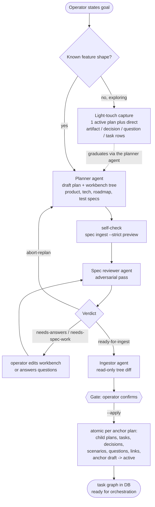
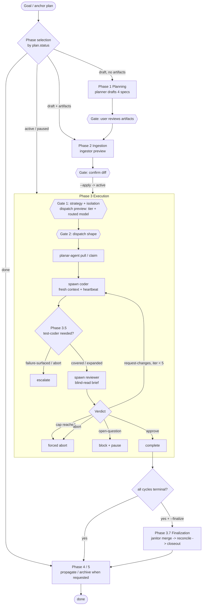
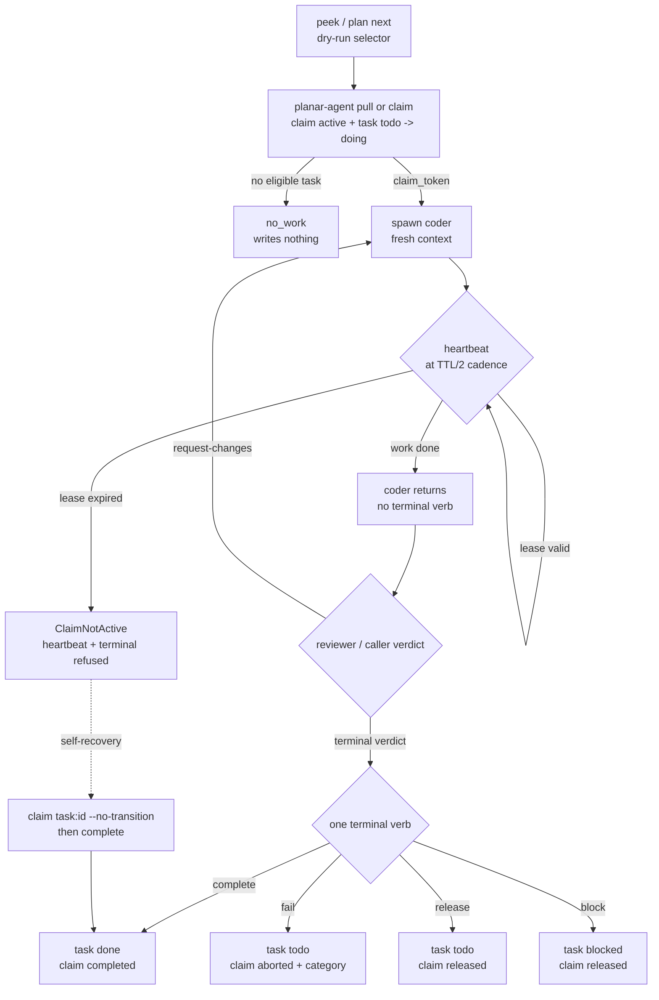

# Planar Operations

How a unit of work moves from a goal to merged code through Planar's agents
and the five-binary boundary. This is the operational spine: the moving parts
that the reference docs describe statically, drawn as the flows they actually
run.

Three flows carry most work:

1. **The spec pipeline** turns a goal into a structured task graph
   (draft -> review -> ingest).
2. **The orchestration lifecycle** turns that graph into merged, reviewed code
   across six phases.
3. **The claim ritual** is the atomic coordination primitive every
   code-writing dispatch rides on.

Each section leads with a diagram, then the contract, then pointers into
[`concepts.md`](concepts.md), [`architecture.md`](architecture.md),
[`workflows.md`](workflows.md), and `agents/methodology.md` (the
coordination contract). Nothing here introduces new behavior; it summarizes
the existing contract.

---

## 1. The Spec Pipeline

A new feature is drafted by the **planner**, adversarially reviewed by the
**spec-reviewer**, then decomposed by the **ingestor** into plans, tasks,
decisions, scenarios, questions, and links. Every write is preview-first and
operator-gated; the anchor plan does not become `active` until ingest applies.



**Draft.** The `planar-planner` agent creates the anchor plan in `draft`, lays down the
workbench tree, and authors `product-spec.md`, `tech-spec.md`, `roadmap.md`,
and `test-spec.md`. Each file is registered as an artifact and mirrored to the
workbench. The planner also extracts `## Open questions` into first-class
question rows and runs a read-only strict ingest self-check before handing back.

**Review.** The `planar-spec-reviewer` agent runs between planner and ingestor. It checks
intent fit, feature gaps, hazards, open questions, roadmap readiness, and
test coverage. Its verdict is one of `ready-for-ingest`, `needs-answers`,
`needs-spec-work`, or `abort-replan`. It never runs `spec ingest --apply`.

**Ingest.** `planar spec ingest` without `--apply`, which the `planar-ingestor` agent drives, is a read-only preview. It
reads `roadmap.md`, `tech-spec.md`, and `test-spec.md`, computes additions,
updates, proposed removals, slug coverage, and orphan scenarios, then prints a
tree-shaped diff. `--apply` commits atomically per anchor plan: derived rows
and the `draft -> active` flip all commit together or roll back together.

Two annotations are load-bearing:

- Roadmap work-item bullets may carry `[touches: ...]`, whose entries take
  three forms:

  | Entry | Records | Use |
  |-------|---------|-----|
  | `<repo-slug>` | `entity_links(touches, task → repo)` | the task touches the whole repo |
  | `<repo-slug>:<path>` | a `task_touch_paths` row plus the implied repo edge | the task touches one file, repo named explicitly |
  | `<path>` | same, against the anchor association's sole member repo | the common single-repo case |

  **Prefer the path forms.** A whole-repo touch collides with *any* same-repo
  touch under parallel-eligibility rule 2, so a plan whose tasks carry only
  repo edges is no more parallel-eligible than one that declares nothing.
  Path declarations are also the seeds closure extraction reads.

  A bare path resolves only when the anchor's association has exactly one
  member repo; with two there is no principled choice, and the entry is
  reported rather than guessed. An entry naming an unknown repo
  (`typo:src/x.cpp`) is likewise reported, never re-read as a bare path —
  falling back would attach the declaration to the wrong tree while looking
  like it worked. Unresolved entries are counted and warned about at the end
  of `spec ingest --apply`.

  `[slug: ...]` pins the task's stable slug.
- A tech-spec `## Open Questions` item whose first non-blank body line begins
  with the case-sensitive `Resolution:` token is answered during apply. New
  questions are created and answered in the same apply; existing matching
  open questions are flipped to `answered`.

**Light-touch bypass.** When the feature shape is not ready for specs, start
with one `active` plan and direct `artifact`, `decision`, `question`, and
`task add` rows. When the work matures, the `planar-planner` agent can read that captured
material and graduate it into the spec pipeline. See
[`light-touch.md`](light-touch.md).

Detail: [`workflows.md` Recipe 1](workflows.md#recipe-1--start-a-new-feature),
[Plan](concepts.md#plan), [Scenario](concepts.md#scenario), and
[Artifact](concepts.md#artifact).

---

## 2. The Orchestration Lifecycle

The orchestrator is the top-level dispatcher. It selects phases from the
anchor plan's status and drives a feature through planning, ingestion,
execution, optional finalization, and optional propagation/archive.
Planning and ingestion are hard-gated;
execution runs a reviewer loop capped at five iterations.

The orchestrator, coder, reviewer, test-coder, and janitor roles that drive
this lifecycle live in this repo's `agents/`, alongside their companion
methodology, doctrine, and model-tier-routing docs. Planar itself
drives the primitive these roles compose: the `planar-agent` claim ritual
(§3 below).



**Phases 1-2** are the spec pipeline above. The orchestrator surfaces drafted
artifacts and ingest diffs; it never auto-advances those gates.

**Phase 3** has two operator gates. Gate 1 recommends a strategy (`classic`,
`barrel-deferred`, `barrel-bypass`, or `parallel-fanout`) and isolation mode
(`pwd` or `worktree` where applicable), then shows the dispatch preview. The
preview includes each task's model tier and routed-model candidate. Gate 2
selects the dispatch shape nested under that strategy.

**Phase 3.5** runs after coder output when the cycle's task slugs intersect
`planar test-spec status <plan> --json` uncovered slugs. This fires across all
dispatch shapes; `barrel-bypass` skips the reviewer, not the coverage gate. A
`failure-surfaced` or `abort` test-coder result halts the cycle and escalates.

**Reviewer loop.** A reviewer returns exactly one verdict:

| Verdict | Terminal path | Effect |
|---|---|---|
| `approve` | `planar-agent complete` | task -> done; next cycle |
| `request-changes` before iteration 5 | none | same claim stays live; coder respawns |
| `open-question` | `planar-agent block` | task -> blocked; pause and surface |
| `abort` | `planar-agent fail` | task -> todo; halt and escalate |

At iteration 5, `request-changes` is invalid and routes to forced abort.
Under `barrel-bypass` there is no reviewer, so that cap does not apply.

**Phase 3.7** is explicit (`--finalize` or interactive confirmation). The
janitor, not the coder and not the orchestrator directly, runs merge
verification, Planar reconciliation, branch/worktree cleanup, and
`planar plan closeout`.

**Phases 4-5** are explicit: `--propagate` creates external counterparts and
`--archive` archives the workbench tree. The database retains the feature.

Detail: [`workflows.md` Recipe 2](workflows.md#recipe-2--run-the-orchestrator)
and `agents/methodology.md`.

---

## 3. The Claim Ritual

Every code-writing dispatch acquires a lease on `planar-agent`, heartbeats to
keep it live, and ends with exactly one atomic terminal verb. The terminal
verbs update claim state, task state, action state, and plan roll-up in one
transaction. Agents and skills must never split `planar task done` and
`planar-agent release`.



**Acquire.** `planar-agent pull <plan>` picks the next eligible task and, in a
single transaction, opens an active claim, flips `todo -> doing`, and writes
the top-level action row. For hand-picked work, `planar-agent claim --entity
task:<id>` claims a specific task; by default it also performs the
`todo -> doing` transition. `--no-transition` keeps the primitive claim-only
behavior.

**Heartbeat.** The holder calls `planar-agent heartbeat --claim <token>` at
least every TTL/2. Once the lease expires, heartbeat and terminal verbs are
refused with `ClaimNotActive`; a dead lease is not revived by heartbeat.

**Terminal ownership.** Under orchestrated dispatch, the coder heartbeats and
returns without firing a terminal verb; the orchestrator owns exactly one of
`complete`, `fail`, `release`, or `block`. Under direct-claim or
barrel-bypass-style caller-owned dispatch, the caller owns the terminal verb.

**Recovery.** If a holder loses a lease but the task is still `doing`, it can
self-recover with `planar-agent claim --entity task:<id> --no-transition`, then
complete. Operator recovery uses `planar-agent reconcile --dry-run` first, then
`reconcile`, `abort --claim <token>`, or force takeover as appropriate. Recovery
never mutates a live, unexpired claim.

Detail: [`concepts.md` §Claim-owned task state and recovery](concepts.md#claim-owned-task-state-and-recovery)
and `agents/methodology.md` § Coordination claims.

---

## 4. Model Routing

Model choice is config-driven. `[models.<vendor>]` maps tiers to scalar model
ids or ordered candidate lists, `[routing.<vendor>.<tier>]` maps work types
(`schema`, `engine`, `architectural`, `cli`, `feature`, `mechanical`) to a
candidate inside the tier, `[roles]` maps agent roles to tiers, and
`[role_vendors]` can route a role to a non-default vendor.

The orchestrator's Phase 3 preview classifies each task's work type and calls
the shared resolver to show both the tier and routed candidate. The operator
may override either before confirming. The confirmed `{tier, candidate,
work_type}` triple is persisted in the cycle's dispatch note as
`model_choice`.

`planar models evals` later mines those dispatch notes, terminal claim status,
and test-coder action outcomes into a per-`(work_type, candidate)` scorecard.
It is read-only: recommendations are previews, not config writes.

Detail: [`concepts.md` §Model routing](concepts.md#model-routing),
and
[`cli-reference.md` §Domain: models](cli-reference.md#domain-models); each
verb's `--help` carries the flags, examples and exit codes.

---

## 5. The Host Build and Test Queue

Builds and tests on one machine go through a single queue, so agents in
different projects do not compile or run suites at the same time. The queue is
`planar-agent queue`; it has no daemon, because the process that submits a
command is the process that runs it. The states an entry moves through are the
diagram in [`lifecycles.md` §3.6](lifecycles.md#36-host-queue-entry), the verbs
and exit codes are in [`cli-reference.md` §Queue verbs](cli-reference.md#queue-verbs),
and the rule agents follow is printed by `planar-agent queue rule`.

**Where it lives.** The queue's state is three tables in `planar.db`
(`queue_entries`, `queue_history` and `queue_schema`), in the file `PLANAR_DB`
names, else `~/.planar/planar.db`. There is no second database. Queue verbs
never create or migrate `planar.db`: run `planar init` first. A queue verb
refuses a `planar.db` that is behind its binary (exit 125, remedy `planar
init`) and keeps working against one that is ahead as long as the queue's own
compatibility marker admits the binary, so agents keep queueing builds and tests
while a newer build migrates the shared file. Claims keep the exact-version
rule, so `queue run --claim` renewals fail against an ahead database; during a
migration cycle submit with the binary that migrated the file. The details are
in [`architecture.md` §The host queue's tables](architecture.md#the-host-queues-tables)
and [`cli-reference.md` §Queue verbs](cli-reference.md#queue-verbs). Output of a
detached run (`queue run --detach`) is written to `<seq>.log` in `queue-logs/`
beside the database (`<stem>.queue-logs/` for a database file not named
`planar.db`), one file per entry, and is deleted with the history row that
names it. Sequence numbers start above 1,000,000. Rolling the queue back or
restoring a backup rewinds that counter; see the recipe in
[`migrations/README.md` §Host-queue rollback recovery](../migrations/README.md).

**Settings.** The `[queue]` table of `~/.planar/config.toml` sets `slots` (how
many commands run at once, default 1), `poll_interval`, `stale_after`, `grace`
(SIGTERM to SIGKILL) and `history_days` (how long history and logs are kept,
default 30). Ranges and units are in
[`cli-reference.md`](cli-reference.md#the-queue-table). The file is read at each
poll, so an edit applies to waiting submitters without a restart, and
`planar config validate` refuses a bad value. A command's run limit is 30
minutes unless its submitter passes `--timeout`.

**Watching.** `planar-watch queue` lists every running and waiting entry, in
order, with its place in line, how long it has waited and run, who submitted it
and whether it is still live. An entry marked `NOT-LIVE` has lost its submitter
and is reaped by the next submitter's poll; the viewer never changes anything.
`planar-watch queue history [--since <duration>]` lists entries that have
ended, with the outcome, exit code or signal, and who cancelled or replaced
them. Both take `--json`. One entry's full record is `planar-agent queue status
<seq>`.

**Waiting for a detached gate.** Submit with `planar-agent queue run --detach
--timeout 2h --vendor <vendor> --role <role> --claim <token> -- <command>` and
save the first output line, its ticket sequence. The command's run limit here
is two hours after it starts; `--claim` lets the submitter renew a
caller-supervised task claim while it waits and runs. Then observe that ticket:

```sh
planar-agent queue wait <seq> --timeout 3h --json
```

The three-hour observation budget can cover an expected hour of backlog plus
two hours of runtime. The separate `queue run --wait-timeout`, if supplied,
limits the entry's time waiting for a slot. The observer's default is `30m`
and an explicit positive budget may be at most `24h`; it does not change
either submitted limit or renew the claim. The wait result's `wait_reason`
describes **why observation stopped**, while `status.outcome` describes a
**recorded job end**. Read both before judging the gate: `completed` with
`exited` and exit code 0 is a pass; other completed outcomes need their
recorded code or signal handled as a gate result. Exit 124 or 125 alone is
ambiguous because the child can return either code itself. The log path in
`status.log_path` is for output; a blank log does not prove completion. See
[`queue wait` in the CLI reference](cli-reference.md#waiting-for-a-logical-ticket-queue-wait)
for every outcome and error code.

If a harness needs shorter turns, use a finite slice such as `queue wait
<seq> --timeout 10m --json`, do independent work, and wait again on the **same
ticket**. `timed_out` and `interrupted` stop only the observer; the detached
command may still be queued or running. `stalled`, missing history, and read
errors also give no completion verdict. Inspect the ticket and queue health
before deciding what to do. Never resubmit or start a conflicting build just
because observation stopped, and never run a command directly after the queue
refuses it. Avoid an outer loop with no finite bound: each wait slice must
return control for an explicit decision.

**Cancelling.** `planar-agent queue cancel <seq>` removes a waiting entry, or
stops a running one (SIGTERM to its command's process group, SIGKILL after the
grace period) and returns when the group is empty. Any caller that can open the
store may cancel any entry; the canceller's vendor, role and process id are
recorded and shown in `queue status` and in history. Pass `--vendor` and
`--role` so the record names who acted.

**Uptake.** The queue only helps if agents use it. Every `queue run` records
the submitter's `--vendor` and `--role` (or `PLANAR_VENDOR` and `PLANAR_ROLE`),
so `planar-watch queue history --since 7d --json` shows which vendors and roles
queue their builds, how long they wait, how often a command times out and how
often entries end `abandoned`. An entry with no vendor or role was submitted by
an agent or script that did not say who it is.

**Preservation and file modes.** `planar-uninstall` (`~/.planar/bin/planar-uninstall`,
also run by `install.sh --uninstall`) keeps and names every data path, `planar.db`
(with its `-wal` and `-shm`) and `queue-logs/` among them, and the retired old
queue database; the full list is in
[INSTALL.md § Preserved paths](../INSTALL.md#preserved-paths). `planar-uninstall --purge`
removes them too, except a relocated one, which it names and leaves; there is no
`--force` (see [INSTALL.md § Uninstall](../INSTALL.md#uninstall)). (`install.sh --prebuilt` moves the retired queue database and its old logs into `~/.planar/retired/<date>/` instead of removing them; see [INSTALL.md § Prebuilt install](../INSTALL.md#prebuilt-install---prebuilt).) A live entry stores the submitter's task
claim token in the clear (`queue_entries.claim_token`, written when `queue run`
is given `--claim`; the history row does not keep it), and a claim token
authorises heartbeats and terminal verbs on that claim. `planar.db` holds claim
tokens too. So the files are owner-only:

- `~/.planar` (`PLANAR_HOME`) is `0700`. `install.sh` makes it so, and tightens
  an existing install in place: `planar.db` and its sidecars become `0600`.
- `queue-logs/` is created `0700` and its logs `0600`. A log directory that
  already exists must be owned by you and not writable by group or others, or a
  detached run refuses.
- A `PLANAR_DB` outside the install root is yours: `install.sh` changes the
  modes of the database directly under the install root only. It does create
  a missing database, or migrate a behind one, at the resolved path (`PLANAR_DB`
  when set) with the installed `planar init --skip-project --allow-no-repo`,
  and refuses, changing nothing, a database ahead of the release it installs
  ([INSTALL.md](../INSTALL.md#ownership-recovery-and-the-order-of-an-install)).
- An install root shared by several users (a `--prefix` such as `/opt/planar`
  that more than one account runs from) is unsupported under the `0700` rule:
  only the owner can open the database. Run one install per user.
- If `install.sh` cannot change a mode (a file you can write but do not own),
  it prints a warning and carries on; fix the mode by hand.

**When something looks wrong.** A `waiting` entry that never advances and shows
`NOT-LIVE` is an orphan; poll again, and a later submitter reaps it. A command
past its run limit with no submitter polling is stopped by the next poll or by
`queue cancel`. Both are accepted limits, listed with the others in
[`cli-reference.md` §Known limits](cli-reference.md#known-limits). Exit 125 from
`queue run` before it issues a ticket means the queue refused; agents stop and
report it and never run the command directly. Exit 125 from `queue wait` may
instead be a recorded child exit, cancellation, wait timeout, stalled
observation or observer error; inspect `wait_reason` and `status.outcome`.

On an older queue-capable install without `queue wait`, discover support once
from the compact schema or leaf help. Short commands, or scripts that can wait
for the whole job, may use foreground `queue run`. For a long command under an
agent harness, keep the detached ticket and use a finite, error-checking JSON
`queue status` observer with a fixed overall deadline and bounded status
subprocesses. Treat `state: ended` only through its recorded `outcome`; an
abandoned row without a successor and missing successor history remain
uncertain. On timeout or interruption, stop only the observer and keep the
ticket for a later check. The fallback must clean up only its own status
helpers, never the queued job, submitter, log or claim. Queue present but
refusing is not an absent-queue fallback.

---

## 6. Release Gate Evidence

A release publishes only bundles whose gates passed on the exact archive being
uploaded. Three scripts share one evidence file per archive,
`planar-<platform>.tar.gz.gates.json`, beside the archive:

- `scripts/dist.sh` (`make dist`, `make linux-dist`) writes `format_version: 1`:
  the archive name, its `sha256`, the bundled `release.json` as `release`, and
  `gates.portable` (`result`, `matched_count`, `staged_binaries`). Format 1 is
  assembly evidence and never authorizes publication.
- `scripts/release-gates.sh --platform <macos-arm64|linux-x86_64> <dir>` checks
  the format 1 record against the archive's SHA-256 and `release.json`, refuses a
  portable gate that did not pass or matched zero tests, extracts the archive and
  runs the clean-host gates on its binaries. It then rewrites the file as
  `format_version: 2`: `archive`, `sha256` (recomputed after the gates ran),
  `platform`, `release`, `recorded_at` and `gates`. Each gate records `result`,
  `matched_count`, `expected_count`, and its log under
  `<dir>/planar-<platform>.gate-logs/`.
  - `smoke`, both platforms: `scripts/release-smoke.sh` runs `version --json` on
    the four version-bearing binaries (release and sha must match
    `release.json`), `planar-execute --help`, `init` and `health --json` (current
    schema equal to `release.json`), seven checks in a scratch HOME and
    database. macOS runs it on a macOS arm64 host under `env -i` with a
    system-only PATH; Linux runs it in a bare `debian:bookworm-slim` linux/amd64
    container with no network (`PLANAR_GATE_RUNTIME_IMAGE` overrides the image).
    The macOS smoke gate is a PATH and environment test: the developer toolchain
    stays installed on that host, so it cannot show that the binaries never load
    it. The assembly step proves that instead: `scripts/dist.sh` runs
    `scripts/portable-check.py --toolchain-prefix` over the staged binaries and
    refuses a binary whose load commands or library dependencies name the
    toolchain prefix, carry a runtime search path, or link anything beyond the
    system libraries.
  - `ca_debian` (trusted through `/etc/ssl/certs`, refused with the CA removed)
    and `ca_redhat` (trusted through `/etc/pki/tls/certs/ca-bundle.crt`), Linux
    only, through `scripts/test-portable-tls.py`. The fixture image is the
    Dockerfile's `dist-toolchain` stage unless `PLANAR_GATE_TOOLCHAIN_IMAGE`
    names one.
  A failed gate is recorded as `result: "fail"` and the script exits 1.
- `scripts/release-publish.sh [--dry-run] <tag> <dir>...` requires format 2 for
  both platforms, with the recorded `sha256` and `release` equal to the archive
  as it is now, and `portable` and `smoke` passed (and `ca_debian` and
  `ca_redhat` on Linux). The publisher, not the evidence, holds the size of a
  complete run of each gate: `portable` 2, `smoke` 7, `ca_debian` 2 and
  `ca_redhat` 1. It refuses, as missing checks, a gate whose `matched_count` is
  below that size; a `smoke`, `ca_debian` or `ca_redhat` record with no
  `expected_count`, or with an `expected_count` below the size or different
  from `matched_count`; and CA records whose `cases` are not exactly
  `["debian", "removed"]` and `["redhat"]`. The refusal names the platform, the
  gate and both counts. `portable` records no `expected_count`; its size is
  checked against `matched_count` alone. The same checks run with and without
  `--dry-run`.

Rebuilding an archive writes format 1 again, and any change to an archive's
bytes breaks its recorded checksum, so either one requires a new gate run.
`make release-cut TAG=vX.Y.Z [DRY_RUN=1]` runs the whole sequence on a macOS
arm64 host (only `DRY_RUN=1` is a dry run; any other non-empty value, such as
`DRY_RUN=0`, is refused before anything runs): tag and clean-checkout
preflight, `make dist`, macOS gates, `make linux-dist`, Linux gates and the
publisher, with outputs under `build/release-cut/<tag>/<platform>/` and the
staged assets under `dist/release/<tag>/`. The steps to run it are in
[Cutting a release](#cutting-a-release).

`.github/workflows/release.yml` is the CI path for the same contract. It runs
only on a pushed stable `vMAJOR.MINOR.PATCH` tag, with `contents: read` in every
job except the publisher. The `macos-arm64` job (`make dist`) and the
`linux-x86_64` job (`make linux-dist`, the Docker `dist` stage) each build from
the checked-out tag commit, verify it with `scripts/release-publish.sh
--preflight`, run `scripts/release-gates.sh` for their platform and only then
upload the archive, its `.gates.json`, `get-planar.sh` and the gate logs. The
`publish` job `needs` both, downloads each platform into its own directory and
runs `scripts/release-publish.sh`, the only step that calls `gh release`; it
re-validates the evidence exactly as `make release-cut` does, so a failed,
skipped or missing gate on either platform publishes nothing. Releases are cut
locally until hosted CI returns (decision 1337);
`scripts/release-workflow.test.py` (ctest label `release_workflow`) lints the
workflow and runs its steps against fakes.
`scripts/release-workflow-crosscheck.py` is a manual check, outside ctest, that
compares the reader with PyYAML and runs `actionlint`; it fails when either
tool is missing.

### Cutting a release

A release is a stable annotated tag, two portable bundles built from that tag's
commit, and the five public assets: both `planar-<platform>.tar.gz` bundles,
the merged `SHA256SUMS`, `VERSION` and the standalone `get-planar.sh`. Under
decision 1337 the maintainer cuts it locally with `make release-cut` until
hosted CI returns; `.github/workflows/release.yml` is the CI path for the same
contract. The gates, the evidence format and the publisher's checks are the
ones in [Release Gate Evidence](#6-release-gate-evidence); this recipe does not
repeat them.

Requirements:

- A macOS arm64 host. The target refuses any other host. Docker builds the
  Linux x86_64 bundle (`make linux-dist`; amd64 emulation on Apple silicon).
- A `gh` on `PATH` recent enough to support `gh release create
  --notes-from-tag`, authenticated for the repository. The publisher takes the
  release notes from the tag annotation. A dry run does not need `gh`.
- `HEAD` at the tag's commit, and a clean working tree. The preflight resolves
  the tag to a full commit SHA and refuses any other `HEAD` or a dirty tree.

Steps:

1. Create an **annotated** stable tag on the commit to release. The tag grammar
   is `vMAJOR.MINOR.PATCH`; a lightweight tag is refused, and the annotation
   becomes the release notes.

   ```sh
   git tag -a vX.Y.Z
   git checkout vX.Y.Z   # or leave HEAD on the tagged commit
   ```

   The cut never creates or pushes a tag.
2. Rehearse. Every build and gate runs, and the publisher validates the whole
   asset set and prints the `gh release create` command it would run, without
   running it:

   ```sh
   make release-cut TAG=vX.Y.Z DRY_RUN=1
   ```

   Only `DRY_RUN=1` is a dry run; any other non-empty value is refused before
   anything runs.
3. Publish:

   ```sh
   make release-cut TAG=vX.Y.Z
   ```

   This runs the same sequence and then calls `gh release create <tag>
   --verify-tag --title <tag> --notes-from-tag` with the five assets. `gh`
   aborts `--verify-tag` when the tag is not on the remote, so push the tag
   (`git push origin vX.Y.Z`) before the real run; the dry run needs only the
   local tag. A failed or missing gate on either platform publishes nothing.
   Cut a tag one way only: `release.yml` also runs on a pushed stable tag
   whenever hosted CI is available.
4. Check the release: `curl -fsSL
   https://github.com/rdrsss/planar/releases/latest/download/VERSION` prints the
   tag, and the [bootstrap](../INSTALL.md#install) installs it.

Outputs: each platform's archive, `.gates.json` and gate logs land in
`build/release-cut/<tag>/<platform>/`, and the staged assets in
`dist/release/<tag>/`. Rebuilding an archive invalidates its gate evidence, so
rerun the whole target rather than a single step.

## See Also

- [Architecture](architecture.md) — storage model, schema contract, binary
  boundary, workbench, adapters.
- [Concepts](concepts.md) — the entity and gate mental model.
- [Workflows](workflows.md) — step-by-step operator recipes.
- `agents/methodology.md` — authoritative
  agent-coordination contract.
