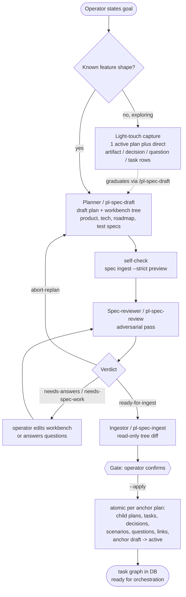
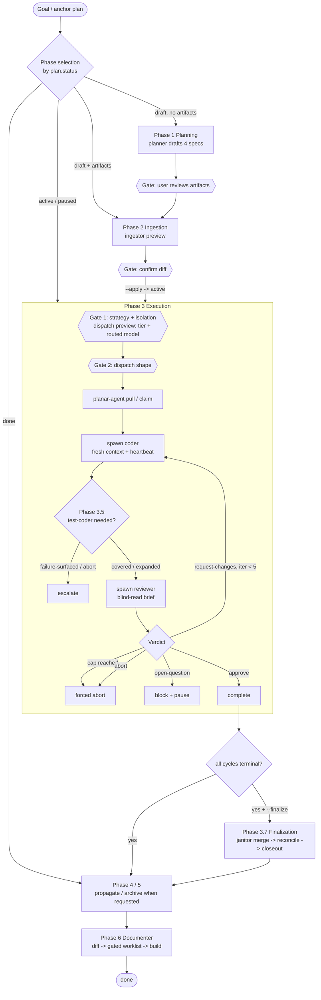
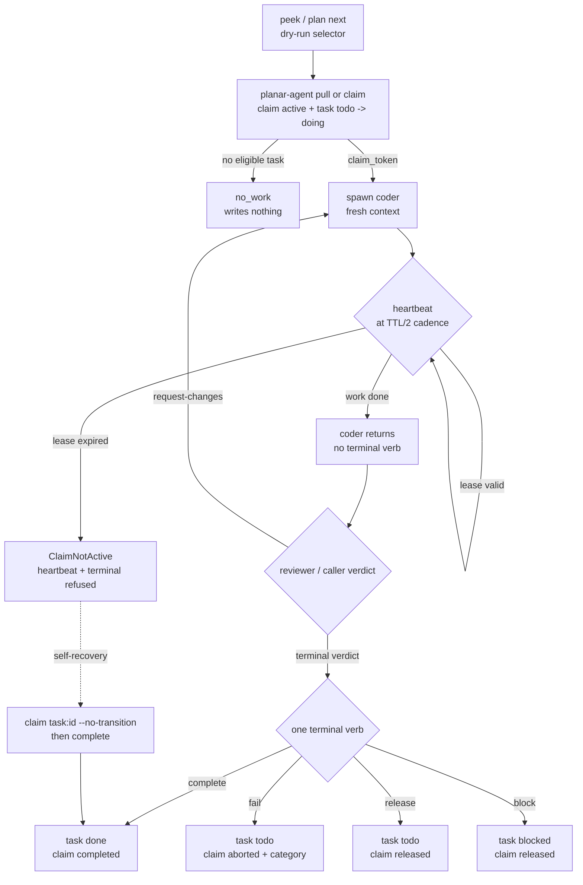

# Planar Operations

How a unit of work moves from a goal to merged code through Planar's agents
and the five-binary boundary. This is the operational spine: the moving parts
that the reference docs describe statically, drawn as the flows they actually
run.

Three flows carry most work:

1. **The spec pipeline** turns a goal into a structured task graph
   (draft -> review -> ingest).
2. **The orchestration lifecycle** turns that graph into merged, reviewed code
   across seven phases.
3. **The claim ritual** is the atomic coordination primitive every
   code-writing dispatch rides on.

Each section leads with a diagram, then the contract, then pointers into
[`concepts.md`](concepts.md), [`architecture.md`](architecture.md),
[`workflows.md`](workflows.md), and `agents/methodology.md` (the
coordination contract). Nothing here introduces new behavior; it summarizes
the existing contract.

---

## 1. The Spec Pipeline

A new feature is drafted by the **planner**, adversarially reviewed by the
**spec-reviewer**, then decomposed by the **ingestor** into plans, tasks,
decisions, scenarios, questions, and links. Every write is preview-first and
operator-gated; the anchor plan does not become `active` until ingest applies.

**Draft.** `/pl-spec-draft` creates the anchor plan in `draft`, lays down the
workbench tree, and authors `product-spec.md`, `tech-spec.md`, `roadmap.md`,
and `test-spec.md`. Each file is registered as an artifact and mirrored to the
workbench. The planner also extracts `## Open questions` into first-class
question rows and runs a read-only strict ingest self-check before handing back.

**Review.** `/pl-spec-review` runs between planner and ingestor. It checks
intent fit, feature gaps, hazards, open questions, roadmap readiness, and
test coverage. Its verdict is one of `ready-for-ingest`, `needs-answers`,
`needs-spec-work`, or `abort-replan`. It never runs `spec ingest --apply`.

**Ingest.** `/pl-spec-ingest` without `--apply` is a read-only preview. It
reads `roadmap.md`, `tech-spec.md`, and `test-spec.md`, computes additions,
updates, proposed removals, slug coverage, and orphan scenarios, then prints a
tree-shaped diff. `--apply` commits atomically per anchor plan: derived rows
and the `draft -> active` flip all commit together or roll back together.

Two annotations are load-bearing:

- Roadmap work-item bullets may carry `[touches: ...]`, whose entries take
  three forms:

  | Entry | Records | Use |
  |-------|---------|-----|
  | `<repo-slug>` | `entity_links(touches, task → repo)` | the task touches the whole repo |
  | `<repo-slug>:<path>` | a `task_touch_paths` row plus the implied repo edge | the task touches one file, repo named explicitly |
  | `<path>` | same, against the anchor association's sole member repo | the common single-repo case |

  **Prefer the path forms.** A whole-repo touch collides with *any* same-repo
  touch under parallel-eligibility rule 2, so a plan whose tasks carry only
  repo edges is no more parallel-eligible than one that declares nothing.
  Path declarations are also the seeds closure extraction reads.

  A bare path resolves only when the anchor's association has exactly one
  member repo; with two there is no principled choice, and the entry is
  reported rather than guessed. An entry naming an unknown repo
  (`typo:src/x.cpp`) is likewise reported, never re-read as a bare path —
  falling back would attach the declaration to the wrong tree while looking
  like it worked. Unresolved entries are counted and warned about at the end
  of `spec ingest --apply`.

  `[slug: ...]` pins the task's stable slug.
- A tech-spec `## Open Questions` item whose first non-blank body line begins
  with the case-sensitive `Resolution:` token is answered during apply. New
  questions are created and answered in the same apply; existing matching
  open questions are flipped to `answered`.

**Light-touch bypass.** When the feature shape is not ready for specs, start
with one `active` plan and direct `artifact`, `decision`, `question`, and
`task add` rows. When the work matures, `/pl-spec-draft` can read that captured
material and graduate it into the spec pipeline. See
[`light-touch.md`](light-touch.md).

Detail: [`workflows.md` Recipe 1](workflows.md#recipe-1--start-a-new-feature),
[Plan](concepts.md#plan), [Scenario](concepts.md#scenario), and
[Artifact](concepts.md#artifact).

---

## 2. The Orchestration Lifecycle

The orchestrator is the top-level dispatcher. It selects phases from the
anchor plan's status and drives a feature through planning, ingestion,
execution, optional finalization, optional propagation/archive, and the
default-on documentation pass. Planning and ingestion are hard-gated;
execution runs a reviewer loop capped at five iterations.

The orchestrator, coder, reviewer, test-coder, and janitor roles that drive
this lifecycle live in this repo's `agents/` (raised to armarium at plan 929,
returned at the armarium reintegration), alongside their companion
methodology, doctrine, and model-tier-routing docs. The documenter and
doc-author roles referenced in Phase 6 live in tabularium (the stack's
standalone documentation tool, which owns the manifest database they operate;
moved there at the doc-cluster transfer, planar plan 933). Planar itself
drives the primitives these roles compose: the `planar-agent` claim ritual
(§3 below), `tabularium diff`, and the doc manifest gates.

**Phases 1-2** are the spec pipeline above. The orchestrator surfaces drafted
artifacts and ingest diffs; it never auto-advances those gates.

**Phase 3** has two operator gates. Gate 1 recommends a strategy (`classic`,
`barrel-deferred`, `barrel-bypass`, or `parallel-fanout`) and isolation mode
(`pwd` or `worktree` where applicable), then shows the dispatch preview. The
preview includes each task's model tier and routed-model candidate. Gate 2
selects the dispatch shape nested under that strategy.

**Phase 3.5** runs after coder output when the cycle's task slugs intersect
`planar test-spec status <plan> --json` uncovered slugs. This fires across all
dispatch shapes; `barrel-bypass` skips the reviewer, not the coverage gate. A
`failure-surfaced` or `abort` test-coder result halts the cycle and escalates.

**Reviewer loop.** A reviewer returns exactly one verdict:

| Verdict | Terminal path | Effect |
|---|---|---|
| `approve` | `planar-agent complete` | task -> done; next cycle |
| `request-changes` before iteration 5 | none | same claim stays live; coder respawns |
| `open-question` | `planar-agent block` | task -> blocked; pause and surface |
| `abort` | `planar-agent fail` | task -> todo; halt and escalate |

At iteration 5, `request-changes` is invalid and routes to forced abort.
Under `barrel-bypass` there is no reviewer, so that cap does not apply.

**Phase 3.7** is explicit (`--finalize` or interactive confirmation). The
janitor, not the coder and not the orchestrator directly, runs merge
verification, Planar reconciliation, branch/worktree cleanup, and
`planar plan closeout`.

**Phases 4-5** are explicit: `--propagate` creates external counterparts and
`--archive` archives the workbench tree. The database retains the feature.

**Phase 6** is default-on unless `--no-docs` is supplied. The orchestrator runs
`tabularium diff`, dispatches the documenter to propose a worklist
(`extend-cover`, `create-doc`, `nodoc`, `defer`), gates each row with the
operator, and then runs the caller-owned doc manifest gates. The documenter
proposes; doc-author writes only approved prose rows.

Detail: [`workflows.md` Recipe 2](workflows.md#recipe-2--run-the-orchestrator)
and `agents/methodology.md`.

---

## 3. The Claim Ritual

Every code-writing dispatch acquires a lease on `planar-agent`, heartbeats to
keep it live, and ends with exactly one atomic terminal verb. The terminal
verbs update claim state, task state, action state, and plan roll-up in one
transaction. Agents and skills must never split `planar task done` and
`planar-agent release`.

**Acquire.** `planar-agent pull <plan>` picks the next eligible task and, in a
single transaction, opens an active claim, flips `todo -> doing`, and writes
the top-level action row. For hand-picked work, `planar-agent claim --entity
task:<id>` claims a specific task; by default it also performs the
`todo -> doing` transition. `--no-transition` keeps the primitive claim-only
behavior.

**Heartbeat.** The holder calls `planar-agent heartbeat --claim <token>` at
least every TTL/2. Once the lease expires, heartbeat and terminal verbs are
refused with `ClaimNotActive`; a dead lease is not revived by heartbeat.

**Terminal ownership.** Under orchestrated dispatch, the coder heartbeats and
returns without firing a terminal verb; the orchestrator owns exactly one of
`complete`, `fail`, `release`, or `block`. Under direct-claim or
barrel-bypass-style caller-owned dispatch, the caller owns the terminal verb.

**Recovery.** If a holder loses a lease but the task is still `doing`, it can
self-recover with `planar-agent claim --entity task:<id> --no-transition`, then
complete. Operator recovery uses `planar-agent reconcile --dry-run` first, then
`reconcile`, `abort --claim <token>`, or force takeover as appropriate. Recovery
never mutates a live, unexpired claim.

Detail: [`concepts.md` §Claim-owned task state and recovery](concepts.md#claim-owned-task-state-and-recovery)
and `agents/methodology.md` § Coordination claims.

---

## 4. Model Routing

Model choice is config-driven. `[models.<vendor>]` maps tiers to scalar model
ids or ordered candidate lists, `[routing.<vendor>.<tier>]` maps work types
(`schema`, `engine`, `architectural`, `cli`, `feature`, `mechanical`) to a
candidate inside the tier, `[roles]` maps agent roles to tiers, and
`[role_vendors]` can route a role to a non-default vendor.

The orchestrator's Phase 3 preview classifies each task's work type and calls
the shared resolver to show both the tier and routed candidate. The operator
may override either before confirming. The confirmed `{tier, candidate,
work_type}` triple is persisted in the cycle's dispatch note as
`model_choice`.

`planar models evals` later mines those dispatch notes, terminal claim status,
and test-coder action outcomes into a per-`(work_type, candidate)` scorecard.
It is read-only: recommendations are previews, not config writes.

Detail: [`concepts.md` §Model routing](concepts.md#model-routing),
[`cli-reference.md` §Domain: models](cli-reference.md#domain-models), and
the [`pl-models-config`](../skills/src/pl-models-config.md) skill.

---

## 5. The Host Build and Test Queue

Builds and tests on one machine go through a single queue, so agents in
different projects do not compile or run suites at the same time. The queue is
`planar-agent queue`; it has no daemon, because the process that submits a
command is the process that runs it. The states an entry moves through are the
diagram in [`lifecycles.md` §3.6](lifecycles.md#36-host-queue-entry), the verbs
and exit codes are in [`cli-reference.md` §Queue verbs](cli-reference.md#queue-verbs),
and the rule agents follow is printed by `planar-agent queue rule`.

**Where it lives.** The queue's state is the agent database, `~/.planar/agent.db`
(`PLANAR_AGENT_DB` moves it; `PLANAR_DB` does not). It is a separate file from
`planar.db`, so the queue keeps working when the main schema is locked, and
the planning verbs never open it. Output of a detached run
(`queue run --detach`) is written to `queue-logs/<seq>.log` in the directory
that holds `agent.db`, one file per entry, and is deleted with the history row
that names it.

**Settings.** The `[queue]` table of `~/.planar/config.toml` sets `slots` (how
many commands run at once, default 1), `poll_interval`, `stale_after`, `grace`
(SIGTERM to SIGKILL) and `history_days` (how long history and logs are kept,
default 30). Ranges and units are in
[`cli-reference.md`](cli-reference.md#the-queue-table). The file is read at each
poll, so an edit applies to waiting submitters without a restart, and
`planar config validate` refuses a bad value. A command's run limit is 30
minutes unless its submitter passes `--timeout`.

**Watching.** `planar-watch queue` lists every running and waiting entry, in
order, with its place in line, how long it has waited and run, who submitted it
and whether it is still live. An entry marked `NOT-LIVE` has lost its submitter
and is reaped by the next submitter's poll; the viewer never changes anything.
`planar-watch queue history [--since <duration>]` lists entries that have
ended, with the outcome, exit code or signal, and who cancelled or replaced
them. Both take `--json`. One entry's full record is `planar-agent queue status
<seq>`.

**Cancelling.** `planar-agent queue cancel <seq>` removes a waiting entry, or
stops a running one (SIGTERM to its command's process group, SIGKILL after the
grace period) and returns when the group is empty. Any caller that can open the
store may cancel any entry; the canceller's vendor, role and process id are
recorded and shown in `queue status` and in history. Pass `--vendor` and
`--role` so the record names who acted.

**Uptake.** The queue only helps if agents use it. Every `queue run` records
the submitter's `--vendor` and `--role` (or `PLANAR_VENDOR` and `PLANAR_ROLE`),
so `planar-watch queue history --since 7d --json` shows which vendors and roles
queue their builds, how long they wait, how often a command times out and how
often entries end `abandoned`. An entry with no vendor or role was submitted by
an agent or script that did not say who it is.

**Preservation and file modes.** `install.sh --uninstall` keeps `agent.db` and
`queue-logs/` as it keeps `planar.db`; remove them by hand when you want them
gone. A live entry stores the submitter's task claim token in the clear
(`queue_entries.claim_token`, written when `queue run` is given `--claim`; the
history row does not keep it), and a claim token authorises heartbeats and
terminal verbs on that claim. `planar.db` holds claim tokens too. So the files
are owner-only (decision 1210):

- `agent.db` is created `0600`, and so are its `-wal` and `-shm` (SQLite gives
  them the main file's mode), whatever the umask.
- `~/.planar` (`PLANAR_HOME`) is `0700`. `install.sh` makes it so, and
  tightens an existing install in place: `planar.db` and `agent.db`, with their
  sidecars, become `0600`. `planar-agent` also ensures `~/.planar` `0700` the
  first time it opens `agent.db` at the default location, if you own it.
- `queue-logs/` is created `0700` and its logs `0600`, as before.
- A directory you name through `PLANAR_AGENT_DB` is yours: Planar creates the
  directories that are missing `0700`, but never changes the mode of one that
  exists, and `install.sh` only touches the databases directly under the
  install root. If you point `PLANAR_AGENT_DB` into a shared directory, the
  store file is still `0600`, but restrict the directory yourself.
- An `agent.db` that already existed keeps its mode when a binary opens it; run
  `./install.sh` again, or `chmod 600 ~/.planar/agent.db*`, to tighten it.
  `install.sh --uninstall` keeps the databases and their modes.

**When something looks wrong.** A `waiting` entry that never advances and shows
`NOT-LIVE` is an orphan; poll again, and a later submitter reaps it. A command
past its run limit with no submitter polling is stopped by the next poll or by
`queue cancel`. Both are accepted limits, listed with the others in
[`cli-reference.md` §Known limits](cli-reference.md#known-limits). Exit 125 from
a queue verb means the queue refused; agents stop and report it and never run
the command directly.

---

## See Also

- [Architecture](architecture.md) — storage model, schema contract, binary
  boundary, workbench, adapters.
- [Concepts](concepts.md) — the entity and gate mental model.
- [Workflows](workflows.md) — step-by-step operator recipes.
- `agents/methodology.md` — authoritative
  agent-coordination contract.
