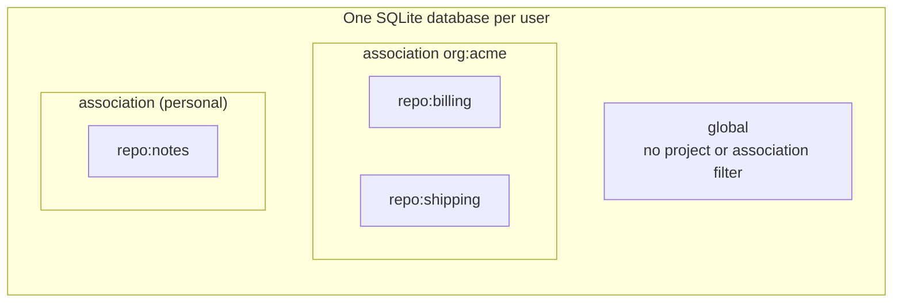
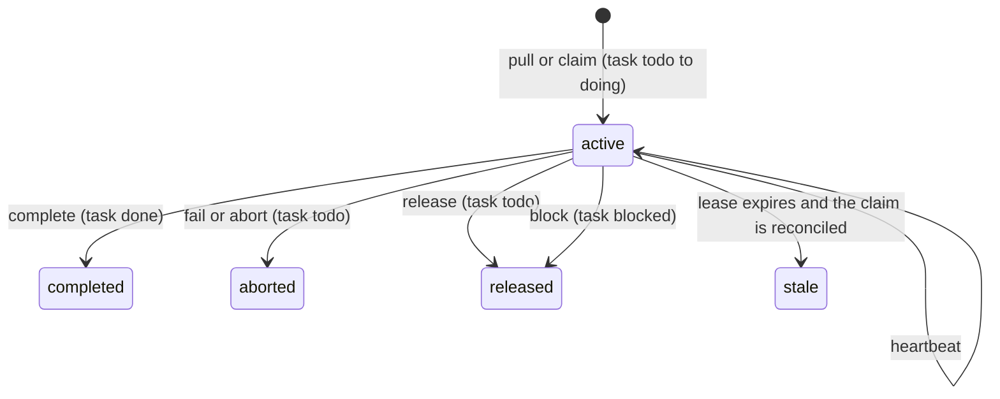
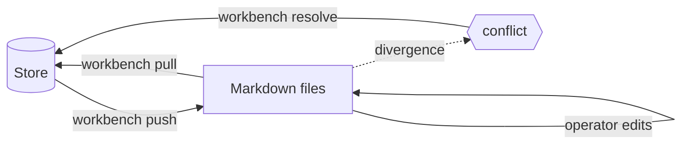
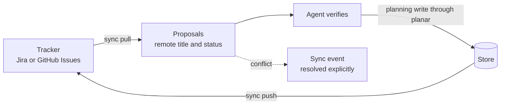
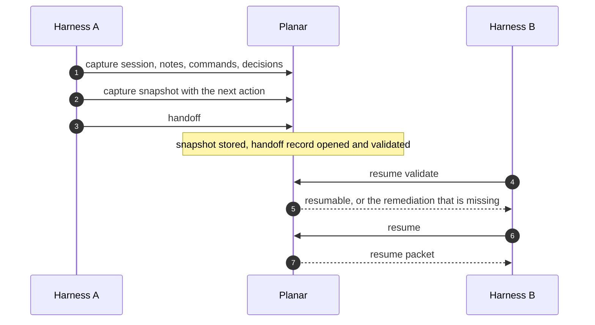
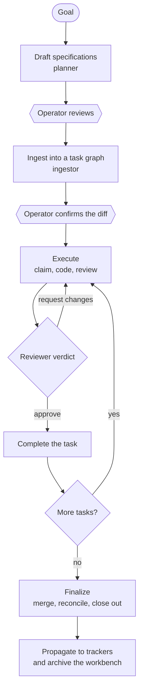

# Overview

This document explains what Planar is, the problem it addresses, and how an
agent uses it across a long-running piece of work. It is conceptual. The
[concepts](concepts.md) document defines each term precisely,
[operations](operations.md) and [lifecycles](lifecycles.md) draw the flows in
full, and the [CLI reference](cli-reference.md) lists every command.

## 1. The problem

An agent harness hosts a model, gives it tools, and manages a context window.
Work that is longer than one context window, or that involves more than one
agent, exposes three limitations of that arrangement.

**State is held in the conversation.** Decisions, the reasons for them, and the
next intended step exist only as text in a context window. Compaction discards
detail, a session ends, and a different harness or provider has none of it.
Whatever continues the work must reconstruct what the previous agent knew.

**Ownership is implicit.** Two agents given overlapping goals do not know about
each other. Nothing records which agent is working on which task, so work is
duplicated or overwritten, and an agent that crashes leaves its work in an
unknown state.

**Records diverge.** Plans written for agents, task lists kept by an operator,
and tickets in an issue tracker are separate records of the same intent. They
drift apart unless something reconciles them, and an automatic reconciliation
that overwrites local intent with remote state is worse than none.

## 2. The context plane

Planar's response is to move the state out of the conversation and into a
durable store that every participant reads and writes through one protocol. We
call the store, together with the protocol, a *context plane*. It has four
defining properties.

1. **Durable.** State is written to a local SQLite database. It survives the
   end of any process.
2. **Addressed by scope, not by process.** An entity belongs to a repository, an
   association of repositories, or the global scope. Any agent working in that
   scope sees it, whichever harness or provider it runs under.
3. **Versioned by schema.** The database schema is defined by ordered
   migrations. Each participant verifies the schema version before it reads or
   writes, so participants built at different times can still agree on what the
   data means.
4. **Mediated by a small set of binaries.** Writes go through command-line
   programs, each of which can write only to a defined set of tables. The
   boundary is the set of verbs a binary registers, not a runtime permission
   check.

Planar does not run models and does not supervise agents. It records and
coordinates the work of agents that do. A harness participates by running
Planar's commands.

### 2.1 Scope

There are three scope kinds. `repo:<slug>` is a registered project, `assoc:<slug>`
is a named association of projects (an organization, a client, an ad-hoc
grouping, or a personal collection), and `global` applies no filter. A project
may belong to more than one association. Scope is a function of the `--scope`
flag, the working directory, and the schema alone; there is no ambient
per-process state to forget, which is what allows a fresh process to resolve the
same scope as the one before it.

## 3. Three synchronization planes

The store is kept consistent with three other things: other agents, the
operator's own editing, and external trackers. Each has its own mechanism.

### 3.1 Coordination: claims

Concurrent agents are serialized on a task by a *claim*, a lease that is held by
one agent at a time. An agent acquires a claim when it picks up a task, renews
it periodically while it works, and ends it with exactly one terminal operation.

The terminal operations update the claim, the task, and the action record in a
single transaction, so a task never records itself as done while its claim is
still open. An agent that stops renewing its lease does not block the task: the
claim expires after its time-to-live, and the task can be claimed again. A lease
that has expired is not revived by a late heartbeat. The full contract is in
[operations](operations.md#3-the-claim-ritual).

### 3.2 Drafting: the workbench

Planning artifacts such as specifications, roadmaps, and test scenarios are
easiest to review as Markdown. The *workbench* is a directory of Markdown files
that is kept in sync with the store in both directions.

Pushing projects the store to files. The operator edits the files, and pulling
ingests the edits. If the files and the store have diverged, the divergence is
recorded as a conflict that must be resolved explicitly; neither side wins
silently. Archiving removes the files, and the store retains every entity.

### 3.3 Operational: external trackers

Organizations track work in systems such as Jira and GitHub Issues. Planar links
a local entity to a remote ticket through an explicit *link* record and
exchanges changes on request.

The operational binary does not write remote values into planning entities.
A pull produces *proposals*; an agent verifies them and makes the planning write
through the operator binary. Conflicts are recorded as events and resolved by an
explicit decision. Synchronization happens only when it is requested, and no
background process polls the remote.

## 4. Handoff and resumption

The central requirement of a context plane is *from-zero resumption*: an agent
with no memory of the previous session, possibly under a different harness and
provider, must be able to continue an in-flight task from the store alone.

During work, an agent records a *session* of notes, commands, and decisions, and
captures *snapshots* that name the next intended action. A handoff atomically
stores a snapshot, opens a handoff record, and validates it. The receiving agent
checks that the task is resumable and then reads the resume packet, which
contains the task state, recent session entries, open questions, decisions made,
and the next action. A blocked task must carry a next action; otherwise
validation refuses to produce a resume packet for it.

Within one multi-stage workflow, the same idea applies at a smaller scale.
Workers add structured *context records* (findings, risks, follow-ups, and
summaries) tagged by stage, and a later stage reads them back. At the end of a
stage the records are compiled into a single summary record and are marked
consumed or superseded; they are never deleted. Session entries are a narrative
record of what happened, and context records are working memory for passing
information between stages. The two are distinct on purpose.

## 5. Long-haul workflows

Planar's bundled agent roles compose these mechanisms into a delivery loop for a
single feature. The loop is documented in [operations](operations.md); the
outline is as follows.

Drafting and ingestion each end at an operator gate, and the orchestrator never
advances past one on its own. Execution runs each task under a claim with a
fresh coder, followed by a reviewer whose verdict maps to one terminal
operation. A reviewer loop is bounded, and a task that does not converge is
aborted and surfaced instead of retried indefinitely. Because every step reads
and writes the store, the loop can be interrupted and resumed at any point, by
a different agent if necessary.

On a machine shared by several agents, builds and tests are submitted to a
host-wide queue so that they do not run concurrently and starve one another.
The queue state is kept in the same database.

## 6. Relationship to agent harnesses

A harness is the program that hosts a model: it manages the context window,
exposes tools, and executes the model's tool calls. Planar sits beside it.

| Responsibility | Harness | Planar |
|---|---|---|
| Runs a model and executes its tool calls | yes | no |
| Manages the context window | yes | no |
| Holds project state that is shared across sessions, agents, and providers | not in general | yes |
| Arbitrates which agent owns a task | no | yes |
| Retains its state after a session ends | the transcript, at most | yes |

A harness needs only to run commands and read their output. Planar provides
rendered skills and slash commands for Claude Code, Codex, Copilot, and Gemini,
and vendor-neutral role specifications for any other. Planar also includes a
deterministic workflow engine, `planar-execute`. It runs a scripted workflow
over a fixed set of host functions, holds no database handle, and exposes no
function that starts a model; it is invoked by a caller and is not itself a
harness.

## 7. Where to read next

| Question | Document |
|---|---|
| What does each term mean exactly? | [Concepts](concepts.md) |
| How do I install it and take the first steps? | [INSTALL.md](../INSTALL.md), [Getting started](getting-started.md) |
| How does work move from a goal to merged code? | [Operations](operations.md) |
| What are all the state machines? | [Lifecycles](lifecycles.md) |
| How is it built? | [Architecture](architecture.md) |
| What does each command do? | [CLI reference](cli-reference.md) |
